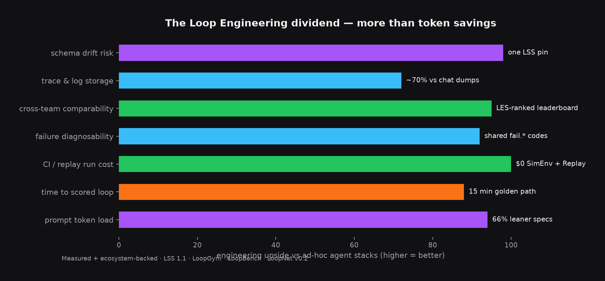
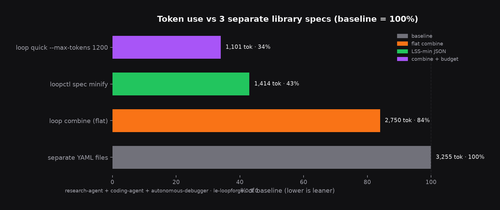
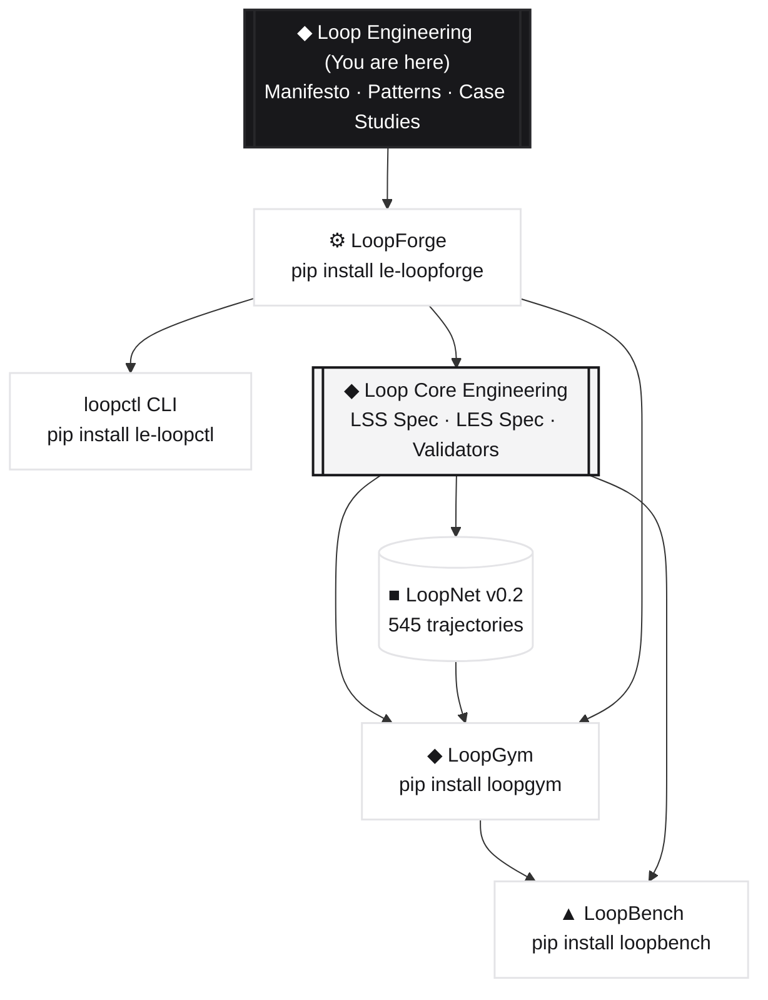

<div align="center">


# Loop Engineering

### *The engineering discipline of systems that self-improve through feedback.*

Closed feedback loops — observe, act, evaluate, update, repeat — made structured, mathematical, **benchmarkable**, and fully engineerable.

<br>

[](LICENSE)
[](https://github.com/KanakMalpani/Loop-Engineering/actions/workflows/validate-loop-library.yml)
[](https://github.com/KanakMalpani/Loop-Core-Engineering)
[](https://github.com/KanakMalpani/Loop-Core-Engineering/blob/main/specs/les-1.0.md)
[](https://kanakmalpani.github.io/LoopBench/)

<br>

[**Read the Manifesto**](manifesto/MANIFESTO.md) · [**Explore Patterns**](patterns/README.md) · [**Run the Stack**](#the-published-stack) · [**Onboarding Paths**](#where-to-start)

</div>

---

## 🚀 The Paradigm Shift

| Era | Focus | Optimized Unit | Cognitive Ceiling |
| :--- | :--- | :--- | :--- |
| **2020–2023** | Prompt Engineering | Single turn, in-context cues | No closure, state loss |
| **2023–2024** | Context Engineering | Static retrieval-augmented memory | Unchanged parameters, no iteration |
| **2024–2025** | Agent Engineering | Autonomous delegation & tools | No systemic evaluation, feedback-blind |
| **2025+** | **Loop Engineering** | **Closed dynamical feedback loops** | **Unbounded, self-directed systems** |

> **The Hierarchy of Optimization:**
> * Prompt engineering optimizes a *single interaction*.
> * Agent engineering optimizes an *autonomous actor*.
> * **Loop engineering optimizes the *entire closed system* to get better over time through feedback.**

---

## The Loop Engineering dividend

Prompt engineering optimizes a turn. Agent engineering optimizes an actor. **Loop engineering optimizes the whole closed system** — cheaper to run, faster to ship, impossible to hand-wave, and built to get better every iteration.

<div align="center">
  
</div>

| Benefit | What you get | Why teams care |
| :--- | :--- | :--- |
| **Lean context** | Combine + minify + budget specs down to **34%** of raw YAML | More room for actual work in the window — not boilerplate |
| **Minutes, not weeks** | Golden path → valid LSS → scored loop in **~15 minutes** | Stop reinventing loop config every sprint |
| **Zero-dollar CI** | SimEnv + ReplayEnv run **545** LoopNet trajectories with **$0** API spend | Catch regressions before they hit prod invoices |
| **Shared failure language** | `fail.*` taxonomy across data, runtime, and bench | Post-mortems that actually transfer between teams |
| **Public receipts** | LoopBench **19** tasks · **4** suites · LES-ranked leaderboard | "It worked in the demo" is no longer a career strategy |
| **Production visibility** | LTF traces ~**70%** leaner than raw chat dumps | SREs see iteration quality, not megabytes of prompts |
| **One spec layer** | Pin `lss@1.1.0` once — LoopGym, LoopBench, LoopNet agree | Zero schema drift across five repos |
| **Harness freedom** | Claude Code, Cursor, LangGraph, CrewAI, Codex, Aider… | Keep your agent stack — add closure on top |

> **The pitch in one line:** ship loops that **cost less per turn**, **score on a leaderboard**, **replay for free**, **fail with names**, and **compound improvement** — not another prompt doc lost in Notion.

### Leaner specs (measured)

Ship one flat spec instead of dragging multiple YAML files into context. Measured with `le-loopforge` 0.5.0 on the research → code → debug library trio.

<div align="center">
  
  <p><sub>Baseline = 3 separate library specs (3,255 est. tokens). Lower is leaner.</sub></p>
</div>

| Path | Command | Tokens | vs baseline |
| :--- | :--- | ---: | ---: |
| Separate library YAMLs | load 3 files into context | 3,255 | 100% |
| Flat combine | `loop combine --library research-agent,coding-agent,autonomous-debugger` | 2,750 | **84%** |
| LSS-min JSON | `loopctl spec minify combined.yaml` | 1,414 | **43%** |
| Budgeted combine | `loop quick --max-tokens 1200 --library …` | 1,101 | **34%** |

Same LSS structure. Same evaluators. Same termination contracts. **Just less noise between your agent and the job.**

---

## ⚡ Quick Start: 30-Second Setup

Get the entire Loop Engineering toolchain installed instantly.

```bash
pip install "le-loop-stack>=0.4.0"
```

### Run your first scored, compressed loop:
```bash
# Scaffold a loop spec from an English intent
loopforge intent "Create a code-repair loop with a test-runner evaluator" -o mapped.yaml --suggest-level

# Minify it into LSS-min JSON (saves 40–60% of prompt context space)
loopctl spec minify mapped.yaml --json

# Estimate tokens & score its structural LES
loopctl score --spec mapped.yaml --json
```

---

## 🧩 Core Ecosystem Pillars

| Pillar | Focus Area | Key Artifacts |
| :--- | :--- | :--- |
| **Theory** | Foundational conceptual rigor | [13 Fundamentals](fundamentals/README.md) · [6-Level Taxonomy](taxonomy/README.md) · [14 Design Patterns](patterns/README.md) |
| **Method** | Closed-loop lifecycle governance | [D-D-M-I-S Framework](framework/README.md) *(Design, Diagnose, Measure, Improve, Scale)* |
| **Standards** | Interoperable specification models | [LSS 1.1 (Composition blocks)](standards/LSS-1.0.md) · [LES 1.0 (Loop Effectiveness Score)](scoring/LES-1.0.md) |
| **Evidence** | Real-world validation & history | [Case Studies](case-studies/README.md) *(AlphaGo, Toyota TPS, PR pipelines, coding agents)* |
| **Runtime** | Execution, scoring, and benchmarks | Dataset registries, replay sandboxes, and the public scorecard |

This repository serves as the narrative and theoretical home for the loop engineering movement. Machine-readable specifications and governance rules live in the canonical [**Loop Core Engineering**](https://github.com/KanakMalpani/Loop-Core-Engineering) repository.

---

## 📦 The Published Stack

Everything below is live, synchronized, and published across GitHub and PyPI. Version registry: [ECOSYSTEM_VERSIONS.md](ECOSYSTEM_VERSIONS.md).



| Repository | Focus | Purpose & Links |
| :--- | :--- | :--- |
| **LoopForge** | Creation | Scaffold valid LSS specs from patterns · [loopforge/](loopforge/) · `pip install le-loopforge` · [loopctl](loopctl/) · [Golden Path](contributions/GOLDEN_PATH.md) |
| **Loop Core Engineering** | Specs & Governance | The constitutional foundation, schemas, and validators · [GitHub →](https://github.com/KanakMalpani/Loop-Core-Engineering) |
| **LoopNet** | Dataset | Ground truth loop executions and trajectories · [GitHub →](https://github.com/KanakMalpani/loopnet) · [Hugging Face →](https://huggingface.co/datasets/KanakMalpani/loopnet-v0.2) |
| **LoopGym** | Runtime | Sandboxed simulation environment to run and replay loops · [GitHub →](https://github.com/KanakMalpani/LoopGym) · `pip install loopgym` |
| **LoopBench** | Benchmarks | Continuous, public community scoreboard · [GitHub →](https://github.com/KanakMalpani/LoopBench) · `pip install loopbench` |

*   ◆ **Complete Install Map:** [ECOSYSTEM.md](https://github.com/KanakMalpani/Loop-Core-Engineering/blob/main/ECOSYSTEM.md)
*   ◆ **Ecosystem Governance:** [CANONICAL-SOURCE.md](standards/CANONICAL-SOURCE.md)
*   ◆ **PyPI Registry Naming Rules:** [PYPI_NAMING.md](contributions/PYPI_NAMING.md)

---

## 📐 The Loop, Formally

Every loop is structured as a closed dynamical system:

```text
       Observe
          │
          ▼
        Decide
          │
          ▼
         Act
          │
          ▼
       Evaluate
          │
          ▼
     Update State
          │
          └───────────(repeat)───────────► [Observe]
```

Mathematically formalized as:
$$\mathcal{L} = (S, A, O, T, E, M, \tau)$$

Where:
*   $\mathbf{S}$ : State space of the system
*   $\mathbf{A}$ : Action space of the loop workers
*   $\mathbf{O}$ : Observation space (feedback signals)
*   $\mathbf{T}$ : Transition functions ($S \times A \to S$)
*   $\mathbf{E}$ : Evaluator models (generates scores & rewards)
*   $\mathbf{M}$ : Memory representation (episodic & parameter state)
*   $\mathbf{\tau}$ : Termination conditions & criteria

→ Detailed breakdown: [What is a loop?](fundamentals/01-what-is-a-loop.md)

### Declaring Loops in LSS (Loop Specification Schema)

LSS provides a declarative, machine-readable format to define the architecture, inputs, and constraints of any loop.

```yaml
loop_name: code-repair-loop
version: "1.1"
objective: "Fix failing tests with minimal diff"
workers:
  - role: implementer
evaluators:
  - type: test_suite
termination_conditions:
  - type: all_tests_pass
  - type: max_iterations
    value: 10
```

→ [LSS 1.1 Specification](https://github.com/KanakMalpani/Loop-Core-Engineering/blob/main/specs/lss-1.1.md)

---

## 🔌 Building with Agent Harnesses

You do not need to replace your existing agent stack. Map your existing agent loop, monitor its trajectories, and benchmark its performance in minutes.

| Harness / Platform | Integration Guide | Target Framework |
| :--- | :--- | :--- |
| **Claude Code** | [integrate/CLAUDE_CODE.md](contributions/integrate/CLAUDE_CODE.md) | Anthropic CLI agent |
| **OpenAI Codex** | [integrate/CODEX.md](contributions/integrate/CODEX.md) | Codex code models |
| **LangGraph** | [examples/integrate-langgraph/](examples/integrate-langgraph/) | LangChain Graphs |
| **CrewAI** | [examples/integrate-crewai/](examples/integrate-crewai/) | Role-playing Multi-agent swarms |
| **Cursor** | [integrate/CURSOR.md](contributions/integrate/CURSOR.md) | Cursor IDE Composer & Agent |
| **OpenAI Agents SDK**| [integrate/OPENAI_AGENTS.md](contributions/integrate/OPENAI_AGENTS.md) | OpenAI Swarm/Agents |
| **Aider** | [integrate/AIDER.md](contributions/integrate/AIDER.md) | CLI git-integrated coding agent |
| **Gemini CLI** | [integrate/GEMINI_CLI.md](contributions/integrate/GEMINI_CLI.md) | Google Generative AI |

→ [View Full Integration Hub](contributions/integrate/README.md)

---

## 🧭 Onboarding Paths

| Profile | Recommended Onboarding Path | Expected Time |
| :--- | :--- | :--- |
| **The Theorist** | [Manifesto](manifesto/MANIFESTO.md) → [Fundamentals](fundamentals/README.md) | ~2 hours |
| **The Builder** | [Golden Path v6](contributions/GOLDEN_PATH.md) → `pip install le-loop-stack` → [Integration Hub](contributions/integrate/README.md) | ~15 min |
| **The Practitioner** | [Loop Playground](contributions/LOOP_PLAYGROUND.md) → [Live Leaderboard](https://kanakmalpani.github.io/LoopBench/) | ~30 min |
| **The Researcher** | [Paper Series](research/PAPER_SERIES.md) → [LoopNet v0.2](research/LOOPNET.md) → [Case Studies](case-studies/README.md) | ~1 day |
| **The Architect** | [D-D-M-I-S Framework](framework/README.md) → [LES scoring](scoring/LES-1.0.md) | ~2 hours |

---

## 🏢 Repository Architecture

| Path | Purpose | Key Artifacts |
| :--- | :--- | :--- |
| [`manifesto/`](manifesto/) | Founding Principles | The philosophy and paradigm of loop engineering |
| [`fundamentals/`](fundamentals/) | Core Theory | 13-topic detailed theoretical foundation of self-improving systems |
| [`taxonomy/`](taxonomy/) | Classification | Six-level loop classification taxonomy |
| [`patterns/`](patterns/) | Design Patterns | 14 engineering patterns described as reusable LSS specs |
| [`framework/`](framework/) | Methodology | D-D-M-I-S procedural guide for building and deploying loops |
| [`case-studies/`](case-studies/) | Historical Evidence | Analyses of AlphaGo, Toyota TPS, GitHub PR engines, and coding loops |
| [`loop-library/`](loop-library/) | Spec Library | Production-grade reference loop YAML files |
| [`loopforge/`](loopforge/) | Creation Tools | Interactive scaffolding tools to map intents to LSS specs |
| [`implementations/`](implementations/) | Code Examples | Minimal reference implementations in Python, LangGraph, and CrewAI |
| [`research/`](research/) | Research Frontier | Active open problems, roadmaps, and paper series |

---

## 📚 Reference Loop Library

A preview of pre-declared loops available in [`loop-library/`](loop-library/):

| Reference Spec | Level | Intent / Target Use Case |
| :--- | :--- | :--- |
| [Research Agent](loop-library/research-agent.yaml) | Level 2 | Literature review & multi-source synthesis |
| [Coding Agent](loop-library/coding-agent.yaml) | Level 3 | Autonomous software feature implementation |
| [Autonomous Debugger](loop-library/autonomous-debugger.yaml) | Level 3 | Test-driven localized software repair |
| [Code → Debug (nested)](loop-library/compositions/code-debug-repair.yaml) | Level 4 | Coding loop with nested recursive debugging |
| [Scenario Swarm (parallel)](loop-library/compositions/scenario-swarm-rehearsal.yaml) | Level 4 | SWARM decision rehearsal: 3 parallel perspectives with a unified merged forecast |
| [Startup Validator](loop-library/startup-validator.yaml) | Level 2 | PMF hypothesis verification and fast lean iterations |

→ [Browse the Full Spec Library](loop-library/README.md) · [Master Checklist](../00-planning/MASTER_CHECKLIST.md) · [Next Steps](../00-planning/NEXT_STEPS.md)

---

## 🛠️ Ecosystem Toolchain

Unified tools to speed up loop design, execution, validation, and benchmarking.

| Tool | Purpose | Source / Usage |
| :--- | :--- | :--- |
| **`loopctl`** | Unified CLI tool | [`tools/loopctl.py`](tools/loopctl.py) · Validate, score, level, and diagram LSS specs |
| **`loopforge`** | Spec generator | [`loopforge/`](loopforge/) · Scaffold complete LSS YAML files from text-based intents |
| **`loop_validator`** | Schema validator | [`tools/loop_validator.py`](tools/loop_validator.py) · Local LSS schema verification |
| **`daily_checkin`** | Automated reporter | [`scripts/daily_checkin.py`](scripts/daily_checkin.py) · Continuous deployment checks |
| **`loop_diagram_generator`** | Visualizer | [`tools/loop_diagram_generator.py`](tools/loop_diagram_generator.py) · Auto-generate clean Mermaid diagrams from LSS YAML |

---

## 🤝 Join the Community

We welcome contributions to LSS specs, new agent harnesses, case studies, benchmarks, and core tooling.

*   ◆ [**Loop Playground**](contributions/LOOP_PLAYGROUND.md) — Create and test your first loop in the sandbox.
*   ◆ [**Community Spotlight**](docs/community/spotlight/) — Highlighted community loops and implementations.
*   ◆ [**Reproduction Challenge**](https://github.com/KanakMalpani/Loop-Engineering/discussions/10) — Replicate verified benchmark scores.
*   ◆ [**Contributor Guidelines**](contributions/CONTRIBUTING.md) · [**Governance Model**](contributions/GOVERNANCE.md) · [**Reproduction Manual**](contributions/REPRODUCE.md)

---

## 📝 Citation

```bibtex
@misc{loop-engineering-2026,
  title={Loop Engineering: The Discipline of Self-Improving Systems},
  author={Loop Engineering Community},
  year={2026},
  url={https://github.com/KanakMalpani/Loop-Engineering}
}
```

<div align="center">

**Feedback is the fundamental unit of intelligence.**  
Loop Engineering makes it engineerable.

<br>

<sub>MIT License</sub>

</div>
