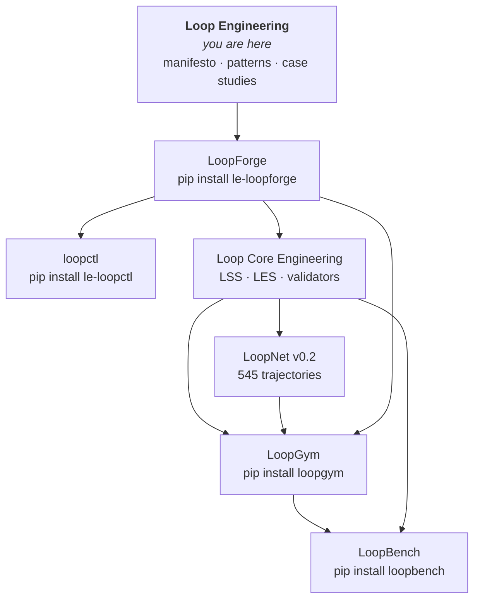

<div align="center">

# Loop Engineering

**The discipline of designing systems that continuously improve through feedback.**

Not prompt tricks. Not single agents. **Closed loops** — observe, act, evaluate, update, repeat — made measurable, comparable, and engineerable.

<br>

[](LICENSE)
[](https://github.com/KanakMalpani/Loop-Engineering/actions/workflows/validate-loop-library.yml)
[](https://github.com/KanakMalpani/Loop-Core-Engineering)
[](https://github.com/KanakMalpani/Loop-Core-Engineering/blob/main/specs/les-1.0.md)

<br>

[**Read the manifesto**](manifesto/MANIFESTO.md) · [**Install the stack**](#the-published-stack) · [**Learning paths**](#where-to-start)

</div>

---

## The shift

| Era | What got optimized | The ceiling |
|-----|-------------------|-------------|
| 2020–2023 | Prompt engineering | Single turn — no closure |
| 2023–2024 | Context engineering | Static information — no iteration |
| 2024–2025 | Agent engineering | Autonomous actors — no system-level improvement |
| **2025+** | **Loop engineering** | **Self-improving systems at scale** |

> Prompt engineering optimizes a single interaction.  
> Agent engineering optimizes autonomous actors.  
> **Loop engineering optimizes systems that get better through feedback.**

**North star:** Loop Engineering is the **default stack** to declare, run, score, and integrate feedback loops — Claude Code, Codex, LangGraph, CrewAI, Cursor, and more. → [contributions/NORTH_STAR.md](contributions/NORTH_STAR.md)

**Quick install:** `pip install "le-loop-stack>=0.1.0"`

---

## What Loop Engineering offers

| Pillar | What you get |
|--------|--------------|
| **Theory** | [13 fundamentals](fundamentals/README.md), [6-level taxonomy](taxonomy/README.md), [14 patterns](patterns/README.md) |
| **Method** | [D-D-M-I-S framework](framework/README.md) — Design, Diagnose, Measure, Improve, Scale |
| **Standards** | [LSS 1.0](standards/LSS-1.0.md) — declare loops in YAML · [LES 1.0](scoring/LES-1.0.md) — score them on 8 dimensions |
| **Evidence** | [Case studies](case-studies/README.md) — AlphaGo, GitHub PRs, Toyota, coding agents |
| **Runnable stack** | Specs, dataset, runtime, and public benchmarks — all open source |

This repo is the **narrative home**: manifesto, patterns, case studies, and learning paths.  
Machine-readable specs live in [**Loop Core Engineering**](https://github.com/KanakMalpani/Loop-Core-Engineering) — the canonical source.

---

## The published stack

Everything below is **live on GitHub and PyPI**. Version registry: [ECOSYSTEM_VERSIONS.md](ECOSYSTEM_VERSIONS.md).



| Repository | One line | Link |
|------------|----------|------|
| **LoopForge** | Creation — scaffold valid LSS specs from patterns | [loopforge/](loopforge/) · `pip install le-loopforge` · [loopctl](loopctl/) · [Golden Path](contributions/GOLDEN_PATH.md) |
| **Loop Core Engineering** | Specs & governance — the constitution | [GitHub →](https://github.com/KanakMalpani/Loop-Core-Engineering) |
| **LoopNet** | Dataset — ground truth for loops | [GitHub →](https://github.com/KanakMalpani/loopnet) · [Hugging Face →](https://huggingface.co/datasets/KanakMalpani/loopnet-v0.2) |
| **LoopGym** | Runtime — run loops in sim, live, or replay | [GitHub →](https://github.com/KanakMalpani/LoopGym) · `pip install loopgym` |
| **LoopBench** | Benchmarks — public scoreboard | [GitHub →](https://github.com/KanakMalpani/LoopBench) · `pip install loopbench` |

Full install map: [**ECOSYSTEM.md**](https://github.com/KanakMalpani/Loop-Core-Engineering/blob/main/ECOSYSTEM.md) · Canonical source policy: [**CANONICAL-SOURCE.md**](standards/CANONICAL-SOURCE.md) · PyPI names: [**PYPI_NAMING.md**](contributions/PYPI_NAMING.md)

---

## The loop, formally

Every loop is a closed dynamical system:

```
observe → decide → act → evaluate → update state → repeat
```

Formalized as **L = (S, A, O, T, E, M, τ)** — state, actions, observations, transitions, evaluators, memory, termination.

→ [What is a loop?](fundamentals/01-what-is-a-loop.md)

**Declare it in LSS:**

```yaml
loop_name: code-repair-loop
version: "1.0"
objective: "Fix failing tests with minimal diff"
workers:
  - role: implementer
evaluators:
  - type: test_suite
termination_conditions:
  - type: all_tests_pass
  - type: max_iterations
    value: 10
```

→ [LSS 1.0 (canonical)](https://github.com/KanakMalpani/Loop-Core-Engineering/blob/main/specs/lss-1.0.md)

---

## Building with agent harnesses

Map your existing agent — **no runtime swap required**. Install once, score in minutes.

| Harness | Guide |
|---------|-------|
| Claude Code | [integrate/CLAUDE_CODE.md](contributions/integrate/CLAUDE_CODE.md) |
| OpenAI Codex | [integrate/CODEX.md](contributions/integrate/CODEX.md) |
| LangGraph | [examples/integrate-langgraph/](examples/integrate-langgraph/) |
| CrewAI | [examples/integrate-crewai/](examples/integrate-crewai/) |
| Cursor | [integrate/CURSOR.md](contributions/integrate/CURSOR.md) |
| OpenAI Agents SDK | [integrate/OPENAI_AGENTS.md](contributions/integrate/OPENAI_AGENTS.md) |
| Aider | [integrate/AIDER.md](contributions/integrate/AIDER.md) |
| Gemini CLI | [integrate/GEMINI_CLI.md](contributions/integrate/GEMINI_CLI.md) |

Full hub: [contributions/integrate/README.md](contributions/integrate/README.md)

```bash
pip install "le-loop-stack>=0.1.0"
loopforge intent "YOUR LOOP IN ENGLISH" -o mapped.yaml --suggest-level
loopctl score --spec mapped.yaml --json
```

---

## Where to start

| You are… | Path | Time |
|----------|------|------|
| **Curious** | [Manifesto](manifesto/MANIFESTO.md) → [Fundamentals](fundamentals/README.md) | ~2 hours |
| **Building** | [Golden Path v3](contributions/GOLDEN_PATH.md) → `pip install le-loop-stack` → [integrate hub](contributions/integrate/README.md) | ~15 min |
| **Researching** | [Paper series](research/PAPER_SERIES.md) → [LoopNet v0.2](research/LOOPNET.md) → [Case studies](case-studies/README.md) | ~1 day |
| **Leading a team** | [D-D-M-I-S framework](framework/README.md) → [LES scoring](scoring/LES-1.0.md) | ~2 hours |

---

## Inside this repo

| Section | Contents |
|---------|----------|
| [`manifesto/`](manifesto/) | Founding principles |
| [`fundamentals/`](fundamentals/) | 13-topic theoretical foundation |
| [`taxonomy/`](taxonomy/) | Six-level loop classification |
| [`patterns/`](patterns/) | 14 design patterns with LSS specs |
| [`framework/`](framework/) | D-D-M-I-S methodology |
| [`case-studies/`](case-studies/) | AlphaGo, GitHub PRs, Toyota, coding agents |
| [`loop-library/`](loop-library/) | Production-ready loop YAML |
| [`loopforge/`](loopforge/) | Scaffold LSS specs from patterns |
| [`implementations/`](implementations/) | Python, LangGraph, CrewAI examples |
| [`research/`](research/) | Open problems and roadmap |

---

## Loop library preview

| Loop | Level | Use case |
|------|-------|----------|
| [Research Agent](loop-library/research-agent.yaml) | 2 | Literature synthesis |
| [Coding Agent](loop-library/coding-agent.yaml) | 3 | Feature implementation |
| [Autonomous Debugger](loop-library/autonomous-debugger.yaml) | 3 | Test-driven repair |
| [Code → Debug (nested)](loop-library/compositions/code-debug-repair.yaml) | 4 | Coding loop with inner repair |
| [Scenario Swarm (parallel)](loop-library/compositions/scenario-swarm-rehearsal.yaml) | 4 | Decision rehearsal — 3 lenses, merged forecast |
| [Startup Validator](loop-library/startup-validator.yaml) | 2 | PMF experiments |

→ [Full library](loop-library/README.md) · [Master checklist](All%20about%20loops/MASTER_CHECKLIST.md) · [Next steps](All%20about%20loops/NEXT_STEPS.md)

---

## Tools

| Tool | Purpose |
|------|---------|
| [`loopctl.py`](../tools/loopctl.py) | Unified CLI — validate, score, diagram, level |
| [`loopforge`](../loopforge/) | Scaffold LSS YAML from patterns (`python -m loopforge`) |
| [`loop_validator.py`](tools/loop_validator.py) | LSS validation (prefer [canonical validator](https://github.com/KanakMalpani/Loop-Core-Engineering/tree/main/tools)) |
| [`daily_checkin.py`](scripts/daily_checkin.py) | Daily health check ([log](docs/checkins/latest.md)) |
| [`loop_diagram_generator.py`](tools/loop_diagram_generator.py) | Mermaid from LSS |

---

## Contributing

New patterns, case studies, implementations, and benchmark results welcome.

→ [CONTRIBUTING.md](contributions/CONTRIBUTING.md) · [GOVERNANCE.md](contributions/GOVERNANCE.md) · [**Reproduction challenge**](https://github.com/KanakMalpani/Loop-Engineering/discussions/10) · [REPRODUCE.md](contributions/REPRODUCE.md)

---

## Citation

```bibtex
@misc{loop-engineering-2026,
  title={Loop Engineering: The Discipline of Self-Improving Systems},
  author={Loop Engineering Community},
  year={2026},
  url={https://github.com/KanakMalpani/Loop-Engineering}
}
```

<div align="center">

**Feedback is the fundamental unit of intelligence.**  
Loop Engineering makes it engineerable.

<br>

<sub>MIT License</sub>

</div>
