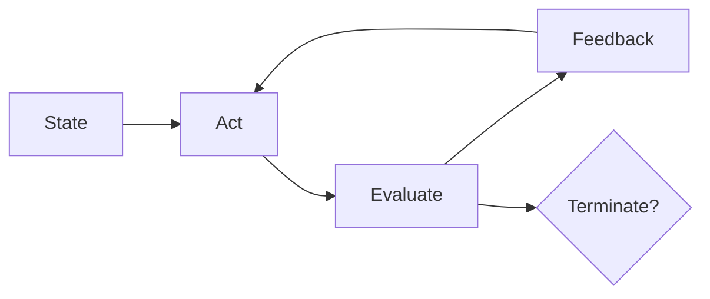

# Case Study Template

Map a real system to the Loop Engineering tuple and score it structurally where possible.

---

## System

**Name:**  
**Domain:**  
**Reference:** (URL, paper, or internal doc)

---

## Tuple mapping

| Component | Real-world instantiation |
|-----------|-------------------------|
| **S** (state/memory) | |
| **A** (workers/actors) | |
| **O** (evaluators/oracles) | |
| **T** (termination) | |
| **E** (feedback channels) | |
| **M** (metrics) | |
| **τ** (budget/safety) | |

**Taxonomy level:** 1–6 (see [taxonomy/README.md](../taxonomy/README.md))

**Primary pattern(s):** (see [patterns/README.md](../patterns/README.md))

---

## LoopForge mapping (required for new submissions)

| Step | Command / artifact |
|------|-------------------|
| Pattern pick | From [patterns/README.md](../patterns/README.md) or `loopforge intent "..."` |
| Scaffold | `loopforge new`, `loopforge fork`, or `loopforge intent` |
| Validate | `loopctl validate <spec>.yaml` |
| Structural LES | `loopctl score --spec <spec>.yaml --json` |
| Trace (if run) | Loop Trace 1.0 JSON + `loopctl observed trace.json` |

Document which LoopForge command produced the LSS spec and any manual edits to worker roles or evaluators.

---

## Loop diagram

Replace with system-specific diagram.

---

## LES snapshot (optional)

| Dimension | Score (0–1) | Notes |
|-----------|-------------|-------|
| Effectiveness | | |
| Speed | | |
| Cost | | |
| Robustness | | |
| Scalability | | |
| Safety | | |
| Adaptability | | |
| Autonomy | | |

Structural estimate: `python tools/les_calculator.py --spec <lss-if-available>`

---

## Lessons for Loop Engineering

1.  
2.  
3.  

---

## Submission

File a **Case study** issue using [.github/ISSUE_TEMPLATE/case-study.md](../.github/ISSUE_TEMPLATE/case-study.md) or open a PR adding `case-studies/<name>.md`.
