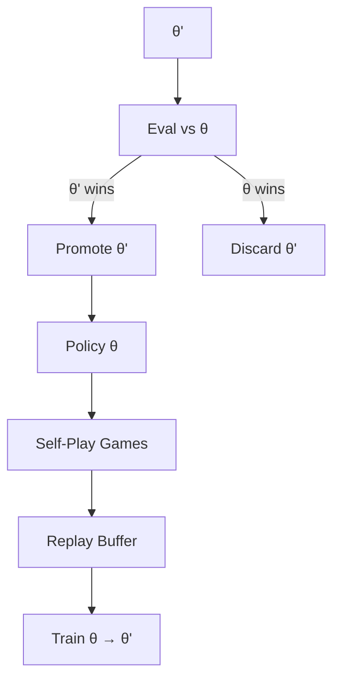

# Case Study: AlphaGo Self-Play

**Domain:** Game-playing reinforcement learning  
**Era:** 2015–2018 (AlphaGo → AlphaZero lineage)  
**Taxonomy Level:** 4 (Evolutionary)  
**Primary Goal Function:** Win rate against prior policy version

---

## Tuple mapping

| Component | Instantiation |
|-----------|---------------|
| **S** | Board position θ, MCTS tree, replay buffer (see §2) |
| **A** | Self-play rollout, gradient update, champion eval match |
| **O** | Win/loss/draw; value head error |
| **T** | Promote θ′ when eval win rate exceeds threshold |
| **E** | Game outcome → training loss; eval → promote/discard |
| **M** | Network weights θ, replay buffer |
| **τ** | Training steps, eval plateau, compute budget |

Full detail in §2 Loop Architecture.

---

## 1. System Overview

AlphaGo demonstrated that a **closed feedback loop without human game data** (in the AlphaZero extension) could exceed human champion performance in Go, chess, and shogi. The core insight for Loop Engineering: **the environment plus evaluator generate unlimited training signal** when the system plays against itself and selects improved policies.

Self-play is the canonical **evolutionary loop**: a population of policy variants competes; an evaluator (game outcome) selects survivors; memory (weights) carries forward improvements.

---

## 2. Loop Architecture

| Component | AlphaGo / AlphaZero Mapping |
|-----------|----------------------------|
| **S** | Board position, MCTS search tree statistics, current network weights θ, replay buffer |
| **A** | Move selection (MCTS + policy prior), self-play game generation, gradient update step |
| **O** | Game outcome (win/loss/draw), value estimates, policy visit counts |
| **T** | Play move → update tree → end game → store trajectory → update θ via SGD |
| **E** | Game result + optional komi; AlphaZero adds pure win signal without human labels |
| **M** | Neural network weights (procedural), replay buffer (episodic), opening book (AlphaGo only, later deprecated) |
| **τ** | Fixed training iterations OR plateau in eval vs. prior champion |



**Dual loops:**

1. **Micro-loop:** MCTS within a single move (search feedback)
2. **Macro-loop:** Self-play → train → evaluate → promote (evolutionary feedback)

Loop Engineering treats the **macro-loop** as the primary L subject; MCTS is internal policy refinement.

---

## 3. Feedback Mechanisms

### 3.1 Self-Play as Generator

Each game produces (state, policy target, value target) tuples. The opponent is the **same policy**, ensuring difficulty scales with capability—automatic curriculum.

### 3.2 Evaluator Gate

Promotion requires beating the prior version at >55% win rate (typical threshold). This prevents **catastrophic regression** from noisy gradient steps—a hard E gate analogous to CI on pull requests.

### 3.3 MCTS Feedback (Inner Loop)

Simulation outcomes backpropagate visit counts and value estimates, refining move selection within a single position. This is **in-iteration feedback** distinct from cross-game learning.

### 3.4 League / Opponent Diversity (AlphaGo Original)

Early AlphaGo mixed self-play with games vs. human experts and prior bots. Diversity in opponents improved robustness against non-self-play distributions.

---

## 4. Optimization Strategy

| Strategy | Description | LES Impact |
|----------|-------------|------------|
| **Policy iteration** | Alternate data generation and weight updates | Effectiveness ↑ |
| **Promotion gate** | Only deploy policies that beat predecessor | Robustness ↑, Safety ↑ |
| **Replay buffer** | Stabilize SGD across heterogeneous games | Effectiveness ↑ |
| **MCTS planning** | Reduce sample complexity per quality unit | Cost ↓ (compute amortized) |
| **Zero human data** (AlphaZero) | Remove label bottleneck | Scalability ↑ |
| **Distributed self-play** | Parallel games on TPU fleet | Speed ↑, Scalability ↑ |

The system optimizes **expected win rate under self-play distribution**. Known gap: policies can overfit to self-play style (see failure modes).

---

## 5. Memory Systems

| Type | Content | Role |
|------|---------|------|
| **Procedural (θ)** | ConvNet / ResNet weights for policy and value heads | Primary learned memory |
| **Episodic (buffer)** | Recent self-play trajectories | Training stability |
| **Working (MCTS tree)** | Per-position search stats | Discarded after move |
| **Semantic (none explicit)** | No external knowledge base | Purely emergent from play |

**Key property:** Memory compresses millions of games into fixed-size θ. The loop **distills** experience rather than retrieving raw games at inference—a pattern relevant to agent context compression.

---

## 6. Success Factors

1. **Perfect simulator** — Go rules are cheap to evaluate; E is noiseless aside from komi.
2. **Clear scalar outcome** — Win/loss is unambiguous G.
3. **Automatic opponent strength** — Self-play tracks the frontier.
4. **Promotion gate** — Prevents regression cycles.
5. **Massive parallelization** — Converts wall-clock to iteration count.
6. **MCTS + learned prior** — Combines search (System 2) with intuition (System 1).

---

## 7. Failure Modes

| Failure | Description | Consequence |
|---------|-------------|-------------|
| **Self-play collapse** | Policy exploits blind spots both sides share | High self-play E, fails vs. humans/other engines |
| **Plateau** | Diminishing gradient signal near optimum | Training stalls; needs exploration noise |
| **Compute cliff** | Self-play requires fleet scale | Prohibitive cost for small teams |
| **Distribution shift** | Real opponents play differently | AlphaGo needed human games initially |
| **Reward hacking (draws)** | Optimizing for draw in uncertain positions | Stylistic cowardice; rule tweaks needed |
| **Catastrophic forgetting** | Aggressive updates erase prior strengths | Mitigated by replay + promotion gate |

---

## 8. LES Evaluation (Retrospective Estimate)

**Goal function G:** Win rate vs. prior champion policy on held-out eval games.  
**G_0:** ~0.50 (random init) → **G_final:** ~0.95+ vs. prior best after training  
**Environment:** Perfect rules engine; zero external safety risk in digital domain.

### Category Scores

| Category | N (normalized) | Weight | Weighted |
|----------|----------------|--------|----------|
| Effectiveness | 0.98 | 0.20 | 0.196 |
| Speed | 0.85 | 0.15 | 0.128 |
| Cost | 0.45 | 0.12 | 0.054 |
| Robustness | 0.82 | 0.13 | 0.107 |
| Scalability | 0.92 | 0.10 | 0.092 |
| Safety | 0.99 | 0.12 | 0.119 |
| Adaptability | 0.88 | 0.10 | 0.088 |
| Autonomy | 0.97 | 0.08 | 0.078 |

### Composite LES

```
LES = 0.196 + 0.128 + 0.054 + 0.107 + 0.092 + 0.119 + 0.088 + 0.078
    = 0.86
```

**Reported LES: 0.86**

Single-instance exemption applied for Scalability (one game tree per match); parallel training scale scored separately.

### Diagnostics

| Diagnostic | Value |
|------------|-------|
| Convergence rate | Monotonic near-log improvement early; plateau late |
| Iteration efficiency | Extremely high per game; millions of games consumed |
| Cost per iteration | High absolute ($ millions TPU); moderate ΔG per $ at scale |
| Regression count | Near zero post-gate (discarded policies not deployed) |
| Termination reason | eval champion surpassed (goal_met) |

### Historical Progression

| Milestone | Loop Change | G Impact |
|-----------|-------------|----------|
| Fan Hui match (2015) | SL + RL + MCTS | Beat pro |
| Lee Sedol (2016) | Self-play scale-up | Superhuman |
| AlphaZero (2017) | Remove human SL | Generalize to chess/shogi |
| Engine integration | Promotion gate standard | Production RL pattern |

### Engineering Takeaways

- **Self-play E** is the gold standard when simulation is cheap and outcomes are scalar.
- **Promotion gates** are mandatory for any evolutionary loop in production.
- **Cost** is the limiting dimension—LES 0.86 despite 0.45 on cost reflects effectiveness dominance.
- **Loop Library analog:** evolutionary patterns in [scientific-discovery-agent.yaml](../loop-library/scientific-discovery-agent.yaml)

---

## References

- Silver et al., AlphaGo / AlphaZero papers (Nature, 2016–2018)
- Loop Engineering taxonomy Level 4
