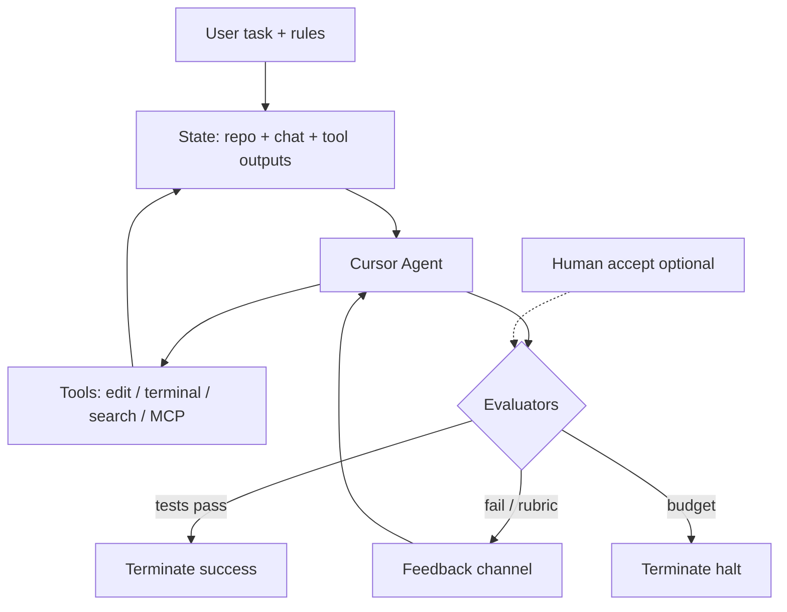

# Case Study: Cursor Agent Loop

**Domain:** AI agent harness (IDE-integrated)  
**Loop Type:** Tool-driven reflective coding loop  
**LES (structural):** 74.5 — via [coding-agent.yaml](../loop-library/coding-agent.yaml) proxy  
**Primary Sources:** Cursor product docs, practitioner harness patterns, [autonomous-coding-agents.md](./autonomous-coding-agents.md)

**Related LSS:** [coding-agent.yaml](../loop-library/coding-agent.yaml) · [autonomous-debugger.yaml](../loop-library/autonomous-debugger.yaml)  
**Bridge:** [BRIDGE_AGENT_HARNESSES.md](../contributions/BRIDGE_AGENT_HARNESSES.md)

---

## Tuple mapping

| Component | Cursor Agent instantiation |
|-----------|---------------------------|
| **S** | Workspace root, open files, @-mentions, terminal output, git diff, prior chat turns |
| **A** | Agent worker: plan → tool calls (edit, terminal, search, MCP) → iterate |
| **O** | Test/linter results, user accept/reject, optional review subagents (Bugbot) |
| **T** | Task complete signal, user stop, max tool rounds, context limit |
| **E** | Tool stderr/stdout, edit diffs, test failures → next agent turn |
| **M** | Chat transcript, file edit history, tool call log (session-scoped) |
| **τ** | Context window, model tier, sandbox permissions, user rules |

**Taxonomy level:** 3 (multi-tool reflective loop); Level 4 when subagents run in parallel.

**Primary pattern(s):** [verification-loop](../patterns/verification-loop.md), [critique-loop](../patterns/critique-loop.md), [human-in-the-loop](../patterns/human-in-the-loop.md) (optional accept gate)

---

## Loop diagram



---

## Architecture (one iteration)

| Stage | Cursor behavior |
|-------|-----------------|
| **Observe** | Read files, grep, terminal output, linter diagnostics |
| **Decide** | Choose next file edit, command, or declare done |
| **Act** | Apply patch, run shell, call MCP server |
| **Evaluate** | Parse test exit code; user may accept/reject diff |
| **Update** | Append tool results to chat state; trim context if needed |

Nested variant: parent chat spawns **subagents** (Task tool) — maps to LSS 1.1 `composition.type: nested` with outer = orchestrator, inner = specialist loops.

Parallel variant: multiple subagents on independent subtasks — maps to `composition.type: parallel` with merge at parent (see [scenario-swarm-rehearsal](../loop-library/compositions/scenario-swarm-rehearsal.yaml) as portable spec).

---

## LSS mapping

| Cursor concept | LSS field |
|----------------|-----------|
| `.cursor/rules`, AGENTS.md | `workers[].role` + `safety_constraints` |
| Tool permissions | `workers[].tools` / sandbox policy |
| `@codebase` context | `memory` + `inputs` |
| Test command in loop | `evaluators[]` type `test_suite` or `command_exit` |
| Max iterations | `termination_conditions.max_iterations` |
| Stop on cost | `cost_limits.cumulative_usd` |

Closest library specs:

```bash
python tools/loop_validator.py loop-library/coding-agent.yaml
python tools/loop_validator.py loop-library/autonomous-debugger.yaml
```

---

## LES snapshot

Structural estimate from `coding-agent.yaml` (proxy for Cursor-style harness):

| Dimension | Score (0–1) | Notes |
|-----------|-------------|-------|
| Effectiveness | 1.00 | Strong when verify signals exist (tests, types) |
| Speed | 0.55 | Multi-turn tool latency |
| Cost | 0.61 | Token + tool rounds per task |
| Robustness | 0.90 | Retries + diverse tools |
| Scalability | 0.75 | Subagent parallelization possible |
| Safety | 0.67 | Rules + sandbox; user still gatekeeps merge |
| Adaptability | 0.60 | Session memory only unless memory-augmented |
| Autonomy | 0.71 | High with auto-run; lower with accept-each-edit |

**Composite LES:** 74.5

```bash
python tools/les_calculator.py --spec loop-library/coding-agent.yaml --json
```

---

## Feedback mechanisms

| Signal | Fidelity | Latency |
|--------|----------|---------|
| Unit test pass/fail | 0.95 | 1–30s |
| Type checker / linter | 0.90 | 1–10s |
| User reject on diff | 0.95 | Immediate |
| LLM self-critique | 0.60 | 5–15s |

Cursor's loop quality tracks **verify-driven** tasks (same family as LB-CR-1). Weakness: optimizing for visible tests, not unmeasured behavior.

---

## Benchmark hook

Reproduce and score a Cursor-mapped spec on LoopBench:

```bash
pip install loopbench loopgym
loopbench run --task LB-CR-1 \
  --spec loop-library/autonomous-debugger.yaml \
  --seeds 0,1,2,3,4 -o results.json
```

Maintainer baseline LES **86.7** — beat it via [good-first #4](../contributions/GOOD_FIRST_ISSUES.md). Guide: [BEAT_LB-CR-1.md](../contributions/BEAT_LB-CR-1.md).

---

## Lessons for Loop Engineering

1. **Cursor is already a loop** — naming it with LSS makes harness behavior portable, comparable, and benchmarkable.
2. **Verify signals dominate LES** — agents with test suites score higher on effectiveness and robustness than chat-only loops.
3. **Subagents = composition** — Cursor Task/subagent patterns are the adoption on-ramp for LSS 1.1 nested/parallel blocks.

---

## Submission

External contributors: extend this study with your own LES_obs from LoopBench and open a PR. Closes [good-first #8](https://github.com/KanakMalpani/Loop-Engineering/issues/8).
