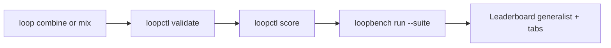

# Golden Path v6 — Combine, Mix, Suite in 15 Minutes

**Intent-first onboarding** for practitioners who already run agents (Claude Code, Codex, Cursor, LangGraph, CrewAI) or want the fastest path to a scored LSS spec.

**North star:** [NORTH_STAR.md](./NORTH_STAR.md) · **Target:** combined flat spec + suite benchmark + score in ~15 min (PyPI-only)

**Benchmark + leaderboard:** [LOOP_PLAYGROUND.md](./LOOP_PLAYGROUND.md) — rank on **generalist** + **suite tabs**.

When finished, post on [Discussion #10](https://github.com/KanakMalpani/Loop-Engineering/discussions/10).

---

## Overview (v6 — combine + token-efficient defaults)



| Step | Time | Outcome |
|------|------|---------|
| 0 — Setup | 2 min | `pip install "le-loop-stack>=0.4.0"` |
| 1 — Combine | 3 min | Single flat LSS from library, recipe, or patterns |
| 2 — Validate + score | 3 min | Schema pass + structural LES |
| 3 — Suite benchmark | 5 min | `loopbench run --suite suite-repair …` |
| 4 — Submit | 2 min | JSON with `suite_scores` + `grand_composite` |

**Default behavior (v6):** `mix` and `combine` **flatten** child loops into **one YAML file** and **compact** output to save tokens in agent prompts. Use `--no-flatten` only when you need LSS 1.1 child refs for audit.

---

## One command paths

### Recipe mix (fastest named blend)

```bash
pip install "le-loop-stack>=0.4.0"

loop mix dev-agent --intent "Fix failing tests from CI" --json
loopctl bench suite suite-repair --spec mixed.yaml -o results.json
```

### Library combine (merge proven templates)

```bash
loop combine --library research-agent,autonomous-debugger \
  --intent "Research sources then fix failing tests" -o pipeline.yaml --json
# JSON includes: spec path, suite hint, bench_cmd, les, tokens
```

### Pipeline with recipe + suite hint

```bash
loopctl pipeline --recipe dev-agent --intent "Repair CI" --suite suite-repair --compact --json
```

### Python API (agents / notebooks)

```python
from loopforge import LoopChain, estimate_tokens

spec, meta = (
    LoopChain("repair-pipeline", "Fix CI failures")
    .then_fork("autonomous-debugger")
    .then_fork("coding-agent")
    .build(flatten=True, compact=True)
)
print(meta["estimated_tokens"], estimate_tokens(spec))
```

**Recipes:** `loopctl mix list` — `dev-agent`, `research-pipeline`, `swarm-review`, `safe-repair`, `full-stack`, `cursor-repair`, `dspy-compile`

**Suites:** `loopbench suite list` — `suite-repair`, `suite-agent`, `suite-knowledge`, `suite-rigor`

**Legacy v4/v5 paths** still work:

```bash
loop quick "Fix failing tests from CI" --agent aider
loop quick "Research then verify" --library research-agent,autonomous-debugger --json
loopctl pipeline --intent "YOUR LOOP IN ENGLISH" -o my-loop.yaml --agent langgraph --compact --json
```

---

## Step 0 — Setup

**Recommended (one line):**

```bash
pip install "le-loop-stack>=0.4.0"
loopctl combine --library research-agent,coding-agent --intent "smoke" -o /tmp/smoke.yaml --json
loopctl mix list
loopbench suite list
loopforge list-patterns
```

**Manual pins** (if you need granular control):

```bash
pip install "le-loopforge>=0.5.0" "le-loopctl>=0.5.0" "loopgym>=0.1.2" "loopbench>=0.2.0"
```

Optional extras: `pip install "le-loop-stack[bench,langgraph,crewai]"`

PyPI names: [PYPI_NAMING.md](./PYPI_NAMING.md) · Integration hub: [integrate/README.md](./integrate/README.md)

---

## Step 1 — Combine or declare

### Combine library loops (token-efficient)

```bash
loop combine --library research-agent,writing-assistant -m sequential -o research-write.yaml --json
loopforge combine --library coding-agent,autonomous-debugger -o debug.yaml --print-yaml
```

| Flag | Effect |
|------|--------|
| default | Flat single file + compact YAML (~fewer tokens) |
| `--no-flatten` | LSS 1.1 composition with child refs (more audit, more tokens) |
| `--no-compact` | Verbose YAML |
| `--json` | Minimal JSON: `spec`, `tokens`, `bench_cmd`, `les` |

### Zero-compose path (pre-merged flat specs)

Skip runtime merge — use checked-in flat compositions:

```bash
loopctl validate loop-library/compositions/flat/debug-repair-flat.yaml
loopbench run --suite suite-repair --spec loop-library/compositions/flat/debug-repair-flat.yaml --seeds 0,1,2,3,4 -o results.json
```

See [`loop-library/compositions/flat/`](../loop-library/compositions/flat/README.md).

### Mix from recipe or patterns

```bash
loopforge mix dev-agent -o agent.yaml          # flatten + compact by default
loopforge mix --list
loopctl mix swarm-review --intent "Parallel review branches" --json
```

### Single-loop intent

```bash
loopforge intent "Summarize user feedback into actionable themes" -o my-loop.yaml --suggest-level
```

Composition via intent (LSS 1.1):

```bash
loopforge intent "Parallel research and coding branches then synthesize" -o composed.yaml --suggest-level
loopctl validate composed.yaml --lss 1.1
```

---

## Step 2 — Validate and score

```bash
loopctl validate my-loop.yaml
loopctl score --spec my-loop.yaml --json > my-les.json
```

---

## Step 3 — Export and run (PyPI-native)

```bash
loopforge export --spec my-loop.yaml --target langgraph --out ./my-export/
loopforge export --format minjson --spec my-loop.yaml --out ./my-loop.min.json
loopctl spec minify my-loop.yaml -o my-loop.min.json
pip install loopgym
python my-export/run.py --json --trace trace.json
```

Integration packs:

| Harness | Export target | Guide |
|---------|---------------|-------|
| Claude Code | (map in IDE) | [integrate/CLAUDE_CODE.md](./integrate/CLAUDE_CODE.md) |
| OpenAI Codex | (map + score) | [integrate/CODEX.md](./integrate/CODEX.md) |
| OpenAI Agents SDK | `openai_agents` | [integrate/OPENAI_AGENTS.md](./integrate/OPENAI_AGENTS.md) |
| LangGraph | `langgraph` | [integrate-langgraph](../examples/integrate-langgraph/) |
| CrewAI | `crewai` | [integrate-crewai](../examples/integrate-crewai/) |
| Aider | (map + score) | [integrate/AIDER.md](./integrate/AIDER.md) |
| Gemini CLI | (map + score) | [integrate/GEMINI_CLI.md](./integrate/GEMINI_CLI.md) |
| Cursor | (map in IDE) | [integrate/CURSOR.md](./integrate/CURSOR.md) |
| Generic | `generic` | LoopGym SimEnv fallback |

---

## Step 4 — Trace and observed LES

```bash
loopctl trace validate trace.json
loopctl observed trace.json --spec my-loop.yaml --json
```

---

## Step 5 — Report

Use [TEMPLATE-trace-native.md](../docs/reproduction-reports/TEMPLATE-trace-native.md) on Discussion #10.

---

## Pattern-first path (optional)

```bash
loopforge new --pattern reflection --name my-loop --objective "..." -o my-loop.yaml --suggest-level
```

See [LOOP_FORGE.md](../00-planning/LOOP_FORGE.md).

---

## Next steps

| Goal | Link |
|------|------|
| Practitioner exam v0.2 | [exam-v0.2.md](../education/practitioner/exam-v0.2.md) |
| LoopBench row | [EXTERNAL_SUBMISSIONS.md](./EXTERNAL_SUBMISSIONS.md) |
| Full reproduction | [REPRODUCE.md](./REPRODUCE.md) |
