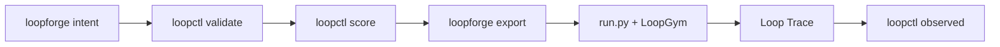

# Golden Path v2 — Integrate Your Loop in 15 Minutes

**Intent-first onboarding** for practitioners who already run agents (Cursor, LangGraph, CrewAI) or want the fastest path to a scored LSS spec.

**North star:** [NORTH_STAR.md](./NORTH_STAR.md) · **Target:** validated spec + export stub in ~15 min

When finished, post on [Discussion #10](https://github.com/KanakMalpani/Loop-Engineering/discussions/10).

---

## Overview



| Step | Time | Outcome |
|------|------|---------|
| 0 — Setup | 3 min | PyPI stack installed |
| 1 — Declare | 5 min | Valid LSS YAML from English intent |
| 2 — Validate + score | 3 min | Schema pass + LES JSON |
| 3 — Export + run | 5 min | Runnable stub (generic / LangGraph / CrewAI) |
| 4 — Trace (optional) | 5 min | Loop Trace 1.0 + observed LES |
| 5 — Report | 2 min | Post reproduction |

**One command (repo clone):**

```bash
loopctl pipeline \
  --intent "YOUR LOOP IN ENGLISH" \
  -o my-loop.yaml \
  --export generic \
  --run-loopgym \
  --json
```

---

## Step 0 — Setup

```bash
pip install "le-loopforge>=0.2.1" "le-loopctl>=0.1.1" "loopgym>=0.1.2"
loopforge list-patterns
```

PyPI names: [PYPI_NAMING.md](./PYPI_NAMING.md)

---

## Step 1 — Declare with intent

```bash
loopforge intent "Summarize user feedback into actionable themes" -o my-loop.yaml --suggest-level
```

Composition example:

```bash
loopforge intent "Parallel research and coding branches then synthesize" -o composed.yaml --suggest-level
loopctl validate composed.yaml --lss 1.1
```

---

## Step 2 — Validate and score

```bash
loopctl validate my-loop.yaml
loopctl score --spec my-loop.yaml --json > my-les.json
```

---

## Step 3 — Export and run (PyPI-native)

```bash
loopforge export --spec my-loop.yaml --target langgraph --out ./my-export/
pip install loopgym
python my-export/run.py --json --trace trace.json
```

Integration packs:

| Harness | Export target | Guide |
|---------|---------------|-------|
| LangGraph | `langgraph` | [integrate-langgraph](../examples/integrate-langgraph/) |
| CrewAI | `crewai` | [integrate-crewai](../examples/integrate-crewai/) |
| Cursor | (map in IDE) | [integrate/CURSOR.md](./integrate/CURSOR.md) |
| Generic | `generic` | LoopGym SimEnv fallback |

---

## Step 4 — Trace and observed LES

```bash
loopctl trace validate trace.json
loopctl observed trace.json --spec my-loop.yaml --json
```

---

## Step 5 — Report

Use [TEMPLATE-trace-native.md](../docs/reproduction-reports/TEMPLATE-trace-native.md) on Discussion #10.

---

## Pattern-first path (optional)

If you prefer explicit patterns over intent:

```bash
loopforge new --pattern reflection --name my-loop --objective "..." -o my-loop.yaml --suggest-level
```

See [LOOP_FORGE.md](../All%20about%20loops/LOOP_FORGE.md).

---

## Next steps

| Goal | Link |
|------|------|
| Practitioner exam v0.2 | [exam-v0.2.md](../education/practitioner/exam-v0.2.md) |
| LoopBench row | [EXTERNAL_SUBMISSIONS.md](./EXTERNAL_SUBMISSIONS.md) |
| Full reproduction | [REPRODUCE.md](./REPRODUCE.md) |
