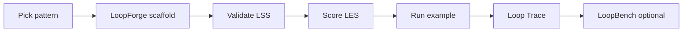

# Golden Path — Build Your First Loop in One Hour

**The authoritative onboarding path for practitioners.** Follow this document top-to-bottom; you do not need to read five other guides first.

**Target time:** ~15 min to a validated spec · ~45 min to a scored run  
**Prerequisites:** Python 3.10+, Git, internet for `pip install`

When finished, post your report on the [reproduction challenge](https://github.com/KanakMalpani/Loop-Engineering/discussions/10).

---

## Overview



| Step | Time | Outcome |
|------|------|---------|
| 0 — Setup | 5 min | Repo cloned, PyPI stack installed |
| 1 — Scaffold | 10 min | Valid LSS YAML in `loop-library/` |
| 2 — Validate | 5 min | Schema pass + optional level hint |
| 3 — Score | 5 min | LES JSON report |
| 4 — Run | 10 min | Reflection example or exported stub |
| 4b — Trace | 5 min | Loop Trace 1.0 JSON (optional) |
| 5 — Benchmark | 15 min | LoopBench run (optional) |
| 6 — Report | 5 min | Post reproduction |

Full deep-dive: [REPRODUCE.md](./REPRODUCE.md) · Curriculum: [education/practitioner/](../education/practitioner/README.md)

---

## Step 0 — Setup (5 min)

```bash
git clone https://github.com/KanakMalpani/Loop-Engineering.git
cd Loop-Engineering

python -m venv .venv
# Windows: .venv\Scripts\activate
# Unix:    source .venv/bin/activate

pip install "le-loopforge>=0.2.0" "le-loopctl>=0.1.0" "loopgym>=0.1.2" loopbench
```

Or from source while developing:

```bash
pip install -r loopforge/requirements.txt
pip install -e loopforge -e loopctl
pip install loopgym loopbench
```

Verify LoopForge:

```bash
loopforge list-patterns
# or: python -m loopforge list-patterns
```

---

## Step 1 — Scaffold with LoopForge (10 min)

Pick a pattern that matches your task (see [patterns/README.md](../patterns/README.md)):

| Task shape | Pattern |
|------------|---------|
| Single worker, quality rubric | `simple` |
| Generate → critique before commit | `reflection` |
| Code change + test gates | `verification` |
| Sourced research brief | `research` |

**Option A — new loop from pattern:**

```bash
python -m loopforge new \
  --pattern reflection \
  --name my-first-loop \
  --objective "Summarize user feedback into actionable themes" \
  --output loop-library/my-first-loop.yaml \
  --suggest-level
```

**Option B — fork an existing template:**

```bash
python -m loopforge fork \
  --from research-agent \
  --name my-research-v2 \
  --output loop-library/my-research-v2.yaml \
  --suggest-level
```

Edit the generated YAML: refine worker roles, rubric criteria, and input schema for your domain.

---

## Step 2 — Validate (5 min)

```bash
loopctl validate loop-library/my-first-loop.yaml
```

Or validate the entire library:

```bash
python scripts/validate_loop_library.py
```

Expected: `Valid LSS spec` with no schema errors.

---

## Step 3 — Score with LES (5 min)

```bash
loopctl score --spec loop-library/my-first-loop.yaml --json > my_les.json
```

Inspect eight LES dimensions plus composite score in `my_les.json`.

Optional diagram:

```bash
loopctl diagram loop-library/my-first-loop.yaml
```

---

## Step 4 — Run (10 min)

**No API keys — smoke the reflection example:**

```bash
python examples/reflection-loop/run.py
```

Expected: `Success: True` and a quality score.

**Or export your spec to a runnable stub:**

```bash
python -m loopforge export \
  --target generic \
  --spec loop-library/my-first-loop.yaml \
  --out implementations/my-first-loop/

python implementations/my-first-loop/run.py
```

---

## Step 4b — Loop Trace (optional, 5 min)

After a run, emit a [Loop Trace 1.0](../standards/LOOP-TRACE-1.0.md) for observed LES and LoopNet export.

**LoopGym (no API keys):**

```python
import loopgym as lg

env = lg.make("loopbench/code-repair-v1")
result = env.run_episode(task_id="cr-001", seed=42, trace_path="my-trace.json")
print(result["loop_trace"]["trace_version"])  # 1.0
```

**Validate and score from trace:**

```bash
loopctl trace validate my-trace.json
loopctl observed my-trace.json --spec loop-library/my-first-loop.yaml --json
```

Or use the repo smoke script:

```bash
python scripts/generate_loopgym_trace_demo.py
```

LoopNet export: [docs/loopnet/CONTRIBUTING-v0.3.md](../docs/loopnet/CONTRIBUTING-v0.3.md)

---

## Step 5 — LoopBench (optional, 15 min)

```bash
loopbench list
loopbench run --task LB-CR-1 --spec loop-library/my-first-loop.yaml --seeds 0,1,2,3,4 -o results.json
loopbench validate results.json
```

Guides: [BEAT_LB-CR-1.md](./BEAT_LB-CR-1.md) · [BEAT_TEMPLATE.md](./BEAT_TEMPLATE.md)

---

## Step 6 — Report

Comment on [Discussion #10](https://github.com/KanakMalpani/Loop-Engineering/discussions/10) with:

- [ ] Python version and `pip show le-loopforge le-loopctl loopgym loopbench`
- [ ] LoopForge command used (`new`, `fork`, or `intent`)
- [ ] `loopctl validate` output
- [ ] LES JSON snippet
- [ ] Reflection-loop or exported stub run output
- [ ] (Optional) Loop Trace + `loopctl observed` output
- [ ] (Optional) LoopBench `results.json`

---

## Success criteria

You have completed the Golden Path when you can:

1. Scaffold a spec with LoopForge (pattern or fork)
2. Pass LSS validation via `loopctl validate`
3. Emit an LES JSON report
4. Run `examples/reflection-loop/run.py` or an exported stub successfully

That meets the 2026 foundation exit criterion and prepares you for [Practitioner curriculum](../education/practitioner/README.md) capstone work.

---

## Next steps

| Goal | Link |
|------|------|
| Full reproduction checklist | [REPRODUCE.md](./REPRODUCE.md) |
| LoopForge API & patterns | [LOOP_FORGE.md](../All%20about%20loops/LOOP_FORGE.md) |
| Submit a benchmark row | [BEAT_TEMPLATE.md](./BEAT_TEMPLATE.md) |
| Composed loops | `loopforge compose --help` |
| Practitioner modules | [education/practitioner/](../education/practitioner/README.md) |
