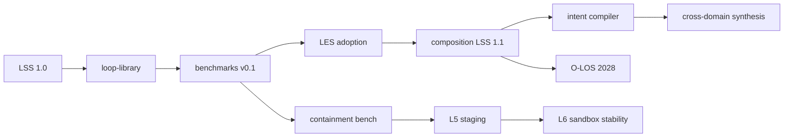

# Loop Engineering Research Roadmap

**Horizon: 2026–2030**

This roadmap coordinates community effort across standards, benchmarks, research, and organizational adoption. Dates are **targets**, not promises—they shift when evidence demands (see [GOVERNANCE.md](./GOVERNANCE.md) quarterly review).

---

## Vision (2030)

Loop Engineering is the **default framing** for building systems that improve through feedback:

- Loops are specified in LSS before implementation
- Performance is tracked with LES across dimensions, not single metrics
- Composition uses documented algebra, not ad hoc orchestration
- Organizations run human–machine loops on shared O-LOS infrastructure
- Level 5–6 systems operate only in governed tiers with containment proofs

---

## 2026 — Foundation and Legibility

**Theme:** Make loop structure explicit and measurable.

### Q2–Q3 2026

| Deliverable | Owner | Success signal |
|-------------|-------|----------------|
| LSS 1.0 stable | Standards stewards | Validator passes 100% of `loop-library/` |
| LES 1.0 calculator | Scoring stewards | CLI + docs; 8 dimensions documented |
| Six-level taxonomy complete | Architecture council | All level docs + cross-links |
| Pattern library ≥14 patterns | Community | Each with LSS + LES guidance |
| Open problems catalog | Research | ≥20 numbered LE-OP entries |
| Fundamentals track (13 topics) | Community | README learning path complete |

### Q4 2026

| Deliverable | Success signal |
|-------------|----------------|
| Benchmark suite v0.1 | ≥5 tasks, baseline LES JSON |
| Multi-harness comparison pilot | LE-OP-21 partial data on 2 harnesses |
| Case studies ≥6 | Real systems mapped to tuple |
| CONTRIBUTING + GOVERNANCE live | This directory complete |

**Exit criteria for 2026:** External team can fork repo, validate LSS, run one benchmark, publish LES without maintainer hand-holding.

---

## 2027 — Composition and Compilation

**Theme:** Loops as composable, partially synthesizable artifacts.

### Standards

- LSS 1.1: composition blocks (sequential, parallel), adapter refs, evaluator product types
- JSON schema versioning policy enacted
- LMIF draft for procedural memory interchange (LE-OP-09)

### Research closure targets

| Problem | Target outcome |
|---------|----------------|
| LE-OP-10 | Associativity conditions documented; validator warnings for adapter gaps |
| LE-OP-11 | Task→level recommender v0.1 on benchmark features |
| LE-OP-04 | Evaluator composition guidance + benchmark |
| LE-OP-15 | Intent→LSS compiler prototype (research branch) |

### Tools

- `loop_complexity_analyzer.py` composition-aware estimates
- `loop_comparison.py` Pareto LES reports
- Diagram generator supports composition trees

### Adoption

- 3+ public case studies from external orgs (not maintainer-authored)
- Loop mesh architecture reference impl (future-agent-architectures §2)

**Exit criteria for 2027:** Published composed loop spec running in production SOMEWHERE with public LES history (anonymized ok).

---

## 2028 — Organizational Loop Systems

**Theme:** Teams and companies govern loop fleets.

### O-LOS reference

- Charter service spec (informative, not mandatory standard)
- Telemetry schema for iteration events (OpenTelemetry alignment)
- Org loop registry format
- Escalation predicate library

### Research closure targets

| Problem | Target outcome |
|---------|----------------|
| LE-OP-16 | Human actor type + latency fields in LSS |
| LE-OP-17 | Simulation or case study on alignment mechanisms |
| LE-OP-08 | Merge conflict taxonomy + 1 reference μ implementation |

### Benchmarks

- Org-scale scenarios: PR loop, incident loop, experiment loop
- Adversarial eval gaming suite v0.1 (LE-OP-18)

### LES

- LES 1.1: correlation guidance, Pareto reporting templates
- Cross-org comparability report (LE-OP-21)

**Exit criteria for 2028:** Reference O-LOS deployment documented in case study with before/after LES.

---

## 2029 — Bounded Self-Modification

**Theme:** Level 5 in staging; Level 6 in sandbox only.

### Safety artifacts

- Modification lattice spec (LE-OP-14)
- Contained meta-loop LSS profile (LE-OP-19)
- Red-team benchmark `benchmarks/containment/` required for meta-loop PRs

### Research closure targets

| Problem | Target outcome |
|---------|----------------|
| LE-OP-13 | Stability benchmarks; champion–challenger formalized in LSS |
| LE-OP-19 | Containment profile passes red-team suite |
| LE-OP-05 | Oracle scheduling language + measured Speed gain |

### Evolutionary outer loops

- Production-tier (Level 4) loop tuning productized in ≥1 implementation
- Promotion gate: human + shadow LES

**Exit criteria for 2029:** No production incidents from undisclosed Level 5+ loops in recognized deployments (community audit).

---

## 2030 — Generalization and AGI-Relevant Milestones

**Theme:** Test whether loop synthesis generalizes across domains—not "AGI achieved" claims.

### Targets

| Milestone | Description |
|-----------|-------------|
| M4 | Intent→LSS at ≥80% human LES on 10+ benchmark intents (LE-OP-15) |
| M5 | Cross-domain loop synthesis without hand-authored LSS per domain |
| M6 | Level 6 stable under red-team in sandbox (LE-OP-13 + 19) |

### Standards

- LSS 2.0 only if evidence requires breaking change; otherwise cumulative 1.x
- Interoperability with external agent frameworks via LSS export/import

### Discipline maturity

- Academic courses / citations ≥50 (tracked via [CITATION.md](./CITATION.md))
- Industry job postings reference Loop Engineering or LSS (qualitative)

**Exit criteria for 2030:** Independent research group replicates M4 OR M5 without maintainer code.

---

## Cross-Cutting Tracks (All Years)

### Benchmarks

Continuous expansion; every closed LE-OP should link benchmark or case study.

| Year | Benchmark count target |
|------|------------------------|
| 2026 | 5 |
| 2027 | 12 |
| 2028 | 20 |
| 2029 | 30 |
| 2030 | 40+ |

### Education

- Learning paths maintained in root README
- Optional: interactive tutorial repo (external)

### Community

- CODE_OF_CONDUCT enforcement
- Steward elections when contributor threshold met
- Annual written retrospective (maintainers)

---

## Explicit Non-Goals (2026–2030)

We will **not** optimize the roadmap for:

- Claiming AGI before M4–M6 evidence bundle
- Promoting unbounded RSI in production tiers
- Vendor-specific lock-in as "standard"
- Scalar leaderboard that collapses LES to one number

---

## How to Influence the Roadmap

1. Close an open problem with reproducible artifact → automatic roadmap credit in CHANGELOG
2. RFC for reprioritization with evidence
3. Quarterly issue `Roadmap review YYYY-QN` for community comment

---

## Milestone Dependency Graph

---

## Status Log

| Date | Change |
|------|--------|
| 2026-06 | Initial roadmap published |
| 2026-06-17 | Post-papers ecosystem pass: LoopNet v0.2 alignment, loop-library LSS 1.0 validation gate, REPRODUCE.md, ALS-T2 baseline, reproduction challenge ([ADOPTION_SIGNAL.md](ADOPTION_SIGNAL.md)), RFC LSS 1.1 composition draft |
| 2026-06-17 | Next 10 Steps: YAML enrichment, CI, LB-CR-1 baseline, EXIT_CRITERIA, AUDIT |
| 2026-06-24 | Composed loops (4 nested/sequential), circuit-design removed, lb-cr-1-baseline rename |
| 2026-06-24 | Parallel scenario-swarm-rehearsal; All about loops checklist; LB-RS-1/LB-MA-1 baselines; mathematics/ seed; LoopBench PR #1 merged |

*Maintainers append rows on quarterly review.*

---

<em>The roadmap ends when loops are specified, scored, and reproduced by default.</em>

