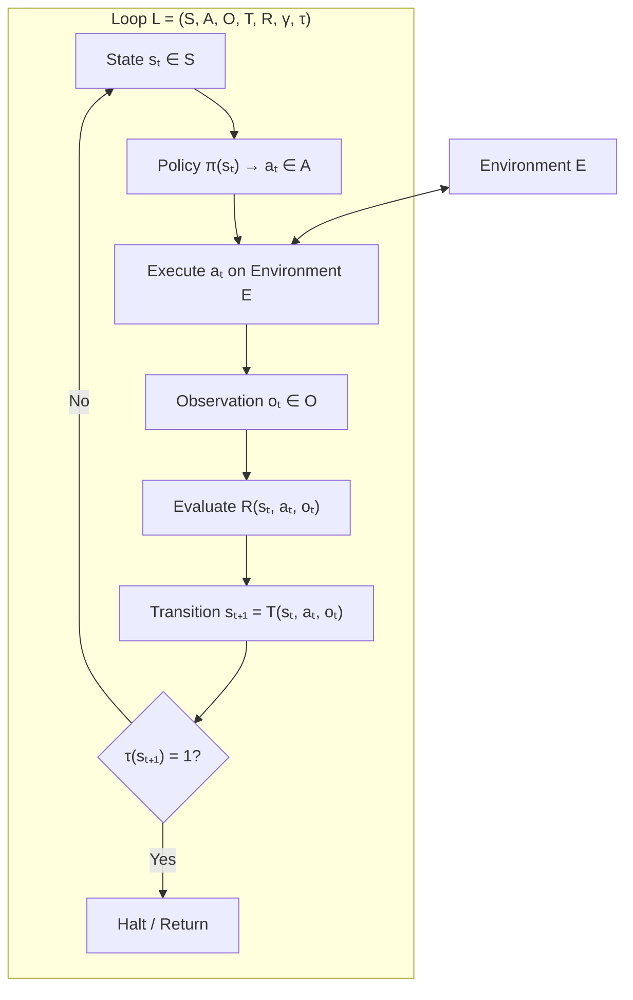
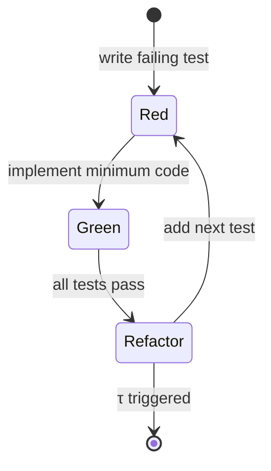
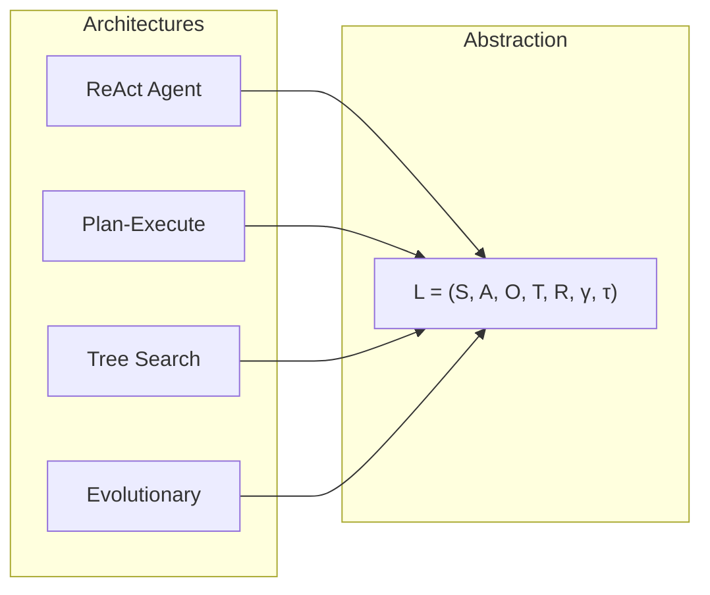

# What Is a Loop?

The foundational abstraction of Loop Engineering.

---

## Definitions

### Loop (informal)

A **loop** is a cyclic process in which a system takes action, observes the result, compares the observation to intent, and updates its internal state before acting again.

### Loop (formal)

A loop is a tuple:

$$\mathcal{L} = (S, A, O, T, R, \gamma, \tau)$$

Where:

| Symbol | Name | Definition |
|--------|------|------------|
| \( S \) | **State space** | The set of all possible internal configurations the system can occupy |
| \( A \) | **Action space** | The set of all operations the system can perform on the environment or itself |
| \( O \) | **Observation space** | The set of all signals the system can receive about the consequences of actions |
| \( T \) | **Transition function** | \( T: S \times A \times O \rightarrow S \) — maps current state, action taken, and observation received to next state |
| \( R \) | **Evaluation function** | \( R: S \times A \times O \rightarrow \mathbb{R} \) — assigns a scalar (or vector) score to a transition |
| \( \gamma \) | **Discount factor** | \( \gamma \in [0, 1] \) — weights future evaluations relative to immediate ones |
| \( \tau \) | **Termination function** | \( \tau: S \rightarrow \{0, 1\} \) — returns 1 when the loop should halt |

### Iteration

One **iteration** (or **cycle**, **step**, **tick**) is a single traversal:

$$s_{t+1} = T(s_t, a_t, o_t) \quad \text{where} \quad a_t \sim \pi(s_t), \quad o_t = \text{observe}(\text{env}, a_t)$$

### Policy

A **policy** \( \pi: S \rightarrow A \) (or \( \pi: S \rightarrow \Delta(A) \) for stochastic policies) selects which action to take in each state. In LLM-agent systems, the policy is typically the model plus prompt plus tool routing logic.

### Environment

The **environment** \( E \) is everything outside the loop's explicit state that actions affect and from which observations originate: filesystem, APIs, databases, human reviewers, other agents.

---

## The Canonical Loop Structure

---

## What Is NOT a Loop

| Pattern | Why It Fails the Definition |
|---------|----------------------------|
| Single LLM call | No observation, no transition, no iteration |
| `while(true)` without observation | Action without feedback — open-loop repetition |
| Retry on exception only | Feedback is binary (fail/succeed), not evaluative |
| Human copies output manually | Transition function is outside the system |

A retry wrapper around an API call is a degenerate loop with \( |O| = 2 \) and trivial \( T \). It is a loop, but one with minimal intelligence per iteration.

---

## Examples

### Example 1: Test-Driven Development Loop

| Component | Instance |
|-----------|----------|
| \( S \) | `{code, test_suite, failing_tests, iteration_count}` |
| \( A \) | `{write_code, refactor, add_test, run_tests}` |
| \( O \) | `{test_results, compiler_errors, coverage_report}` |
| \( T \) | Append errors to log; update code; increment counter |
| \( R \) | `+1` per passing test, `-0.1` per iteration (efficiency penalty) |
| \( \gamma \) | `1.0` (each iteration equally weighted) |
| \( \tau \) | All tests pass OR iteration_count > 50 |

### Example 2: Research Agent Loop

| Component | Instance |
|-----------|----------|
| \( S \) | `{hypothesis, sources_read, evidence_graph, confidence}` |
| \( A \) | `{search, read, synthesize, revise_hypothesis}` |
| \( O \) | `{search_results, document_content, contradiction_flags}` |
| \( T \) | Merge evidence; update confidence; prune dead hypotheses |
| \( R \) | Information gain × source reliability |
| \( \gamma \) | `0.95` (early evidence weighted slightly higher to prevent endless revision) |
| \( \tau \) | Confidence > 0.85 OR budget exhausted |

### Example 3: Hyperparameter Optimization Loop

| Component | Instance |
|-----------|----------|
| \( S \) | `{search_space, trials[], best_config, surrogate_model}` |
| \( A \) | `{propose_config, train, evaluate}` |
| \( O \) | `{validation_loss, training_time, divergence_flag}` |
| \( T \) | Append trial; update surrogate; set new best if improved |
| \( R \) | `-validation_loss` |
| \( \gamma \) | `1.0` |
| \( \tau \) | Plateau detected OR max trials reached |

---

## Formal Properties

### Closed-Loop vs Open-Loop

- **Open-loop**: \( o_t \) is ignored; \( T(s_t, a_t, o_t) = T'(s_t, a_t) \)
- **Closed-loop**: \( o_t \) materially affects \( s_{t+1} \)

Intelligence requires closed-loop operation.

### Markov Property

A loop is **Markovian** when \( s_t \) contains all information needed to select \( a_t \) and predict relevant future outcomes:

$$P(s_{t+1} | s_t, a_t, s_{t-1}, \ldots) = P(s_{t+1} | s_t, a_t)$$

Violations occur when critical history is not in \( S \) — e.g., an agent that forgets it already tried and rejected an approach.

### Loop Depth

**Depth** is the number of nested loops:

$$\mathcal{L}_{\text{outer}} \circ \mathcal{L}_{\text{inner}}$$

Outer loop: plan milestones. Inner loop: implement each milestone. Innermost: edit-compile-test.

Depth increases power and increases coordination cost (see Principle 10).

---

## Mapping Common Architectures

| Architecture | How It Maps |
|--------------|-------------|
| ReAct | Single loop; \( A \) = think/act tools; \( O \) = tool returns |
| Plan-and-Execute | Outer loop over plan steps; inner loop per step |
| Monte Carlo Tree Search | Loop over simulations; \( S \) = tree; \( R \) = rollout value |
| Genetic Algorithm | Loop over generations; \( T \) = selection + mutation |

All are loops. Engineering differs in how \( S \), \( R \), and \( \tau \) are specified.

---

## Practical Implications

### 1. Diagram Before Code

Before building any agent, write the tuple. Unspecified components become bugs:

- Unspecified \( S \) → context rot
- Unspecified \( R \) → reward hacking
- Unspecified \( \tau \) → runaway cost

### 2. Name Your Iterations

Log `(s_t, a_t, o_t, R_t, s_{t+1})` for every iteration. This is the flight recorder for debugging loop behavior.

### 3. Separate Policy from Loop

The loop structure is stable; the policy is swappable. Changing models should not require redesigning \( T \) or \( \tau \).

### 4. Environment Contracts

Document what \( E \) guarantees: latency, idempotency, side effects. Observations are only as reliable as the environment contract.

### 5. One Loop Per Concern

Do not merge planning, coding, and deployment into a single undifferentiated loop. Compose loops with explicit interfaces between them.

---

## Summary

A loop is not a programming construct. It is the **minimal structure of intelligence**: state, action, observation, transition, evaluation, horizon, and halt. Every iterative system — biological, organizational, or computational — instantiates this tuple. Loop Engineering is the discipline of specifying each component deliberately rather than letting them emerge accidentally.

**Next**: [Feedback Theory](02-feedback-theory.md) — how observations become corrections.
