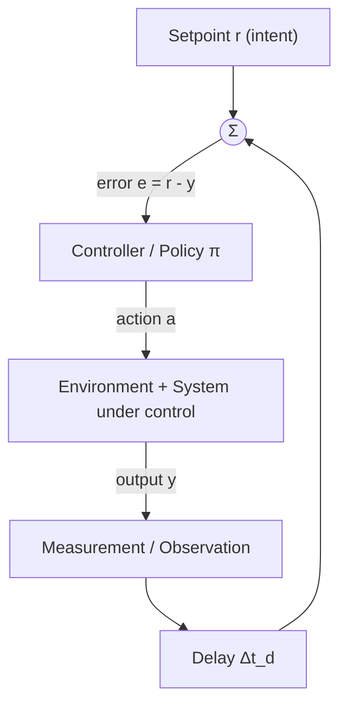
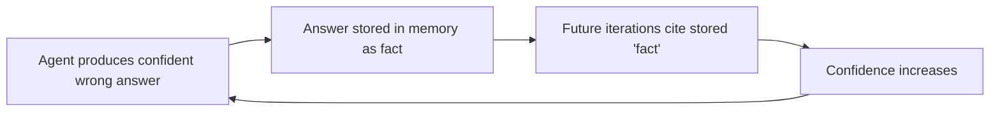
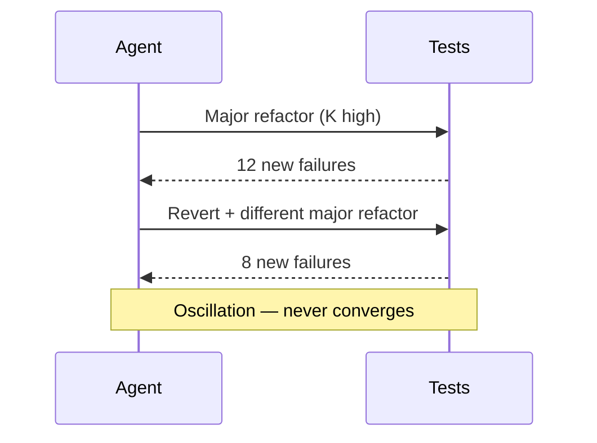
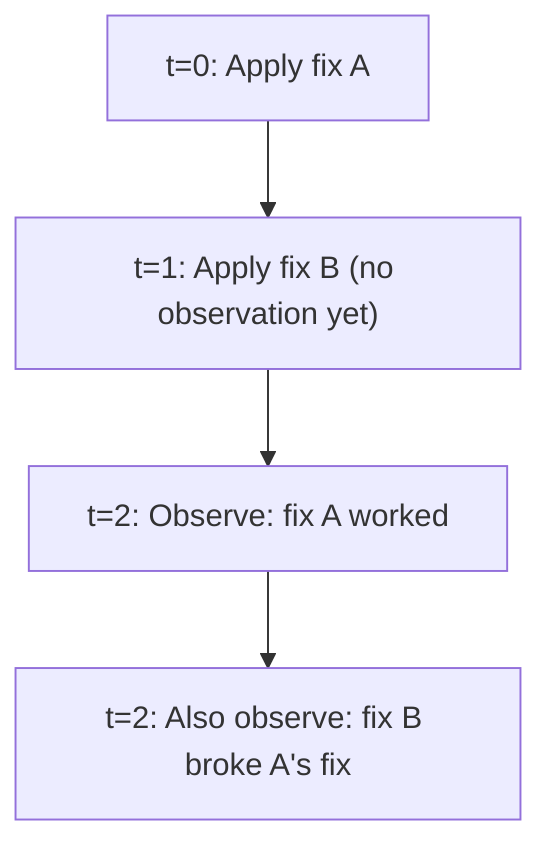
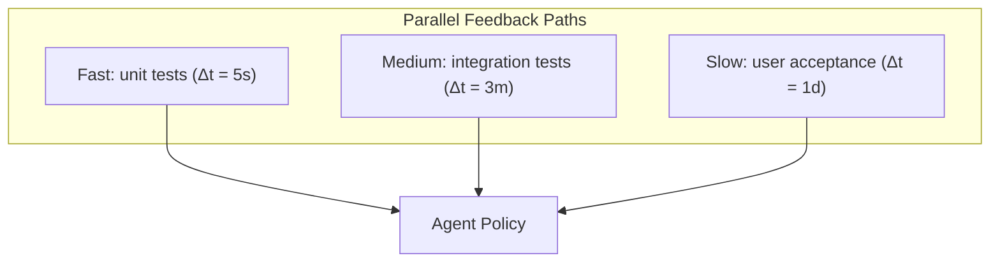

# Feedback Theory

How observations become corrections — and how corrections go wrong.

---

## Definitions

### Feedback

**Feedback** is the signal that closes the gap between observation and intent. Formally, for desired setpoint \( r \) and observed value \( y \):

$$e_t = r - y_t$$

The error \( e_t \) (or more generally, evaluation signal from \( R \)) drives the transition function \( T \).

### Negative Feedback

**Negative feedback** opposes deviation from the setpoint. When output exceeds target, correction pushes down; when below, correction pushes up.

- Stabilizing when properly tuned
- The mechanism of self-correction in most engineered loops

### Positive Feedback

**Positive feedback** amplifies deviation. Each iteration pushes further from (or further toward, if aligned) the current direction.

- Destabilizing in control contexts
- Useful for escape from local optima, viral growth, or phase transitions
- Dangerous when unintentional (runaway confidence, error cascades)

### Feedforward

**Feedforward** adjusts action based on predicted disturbance without waiting for observation. Not feedback — no closed path from outcome to correction. Useful combined with feedback for anticipatory control.

### Gain

**Gain** \( K \) is the proportionality between error and correction:

$$\Delta a_t = K \cdot e_t$$

High gain: aggressive correction, fast response, risk of overshoot.
Low gain: conservative correction, slow convergence, risk of stalling.

### Delay

**Delay** \( \Delta t_d \) is the time between action and usable observation. Includes:

- Execution latency (tests take 30 seconds)
- Human review queues (hours to days)
- Environmental lag (deploy → metrics stabilize)

### Signal-to-Noise Ratio

**SNR** in loop context:

$$\text{SNR} = \frac{\text{Var}(\text{true signal})}{\text{Var}(\text{noise})}$$

Low SNR means evaluation is unreliable; aggressive correction amplifies noise into oscillation.

---

## The Feedback Loop Model

---

## Negative Feedback: Stabilization

### Formal Model

Proportional correction:

$$a_{t+1} = a_t - K_p \cdot e_t$$

With integral and derivative terms (foreshadowing PID, see Module 09):

$$a_{t+1} = a_t - \left( K_p e_t + K_i \sum_{i=0}^{t} e_i + K_d (e_t - e_{t-1}) \right)$$

### Example: Code Lint Fix Loop

| Parameter | Value |
|-----------|-------|
| Setpoint \( r \) | Zero lint errors |
| Observation \( y_t \) | Lint error count |
| Gain \( K_p \) | Fix all errors in highest-severity file per iteration |
| Delay | Lint runs in 2 seconds |

**Behavior**: Errors decrease monotonically if each fix reduces count and gain does not introduce new errors faster than old ones are removed.

### Example: CI Fix Agent

| Parameter | Value |
|-----------|-------|
| Setpoint | All CI checks green |
| Observation | `{failing_job, log_excerpt, exit_code}` |
| Gain | Rewrite only the function indicated by stack trace |
| Delay | CI pipeline = 8 minutes |

**Risk**: High delay + high gain → agent rewrites unrelated code while waiting for CI, causing new failures when results arrive (oscillation).

---

## Positive Feedback: Amplification

### When Intentional

| Use Case | Mechanism |
|----------|-----------|
| Best-of-N sampling | Reinforce prompts that produced high-scoring outputs |
| Momentum in search | Increase step size when metric improves consistently |
| Confidence building | Weight sources that corroborate emerging hypothesis |

### When Accidental (Failure Mode)

**Positive feedback loop of hallucination**: each iteration reinforces prior error because memory lacks provenance or contradiction detection.

### Damping Positive Feedback

- Require provenance on memory writes
- Inject contradiction checks in \( O \)
- Cap confidence growth per iteration
- Use negative feedback on auxiliary metrics (test failures, human rejection)

---

## Gain: Tuning the Response

### Gain Too High

**Symptoms**: Large swings in state; metric improves then regresses; churn without net progress.

**Remediation**: Reduce step size; fix one failure per iteration; use gradient of \( R \) not binary pass/fail.

### Gain Too Low

**Symptoms**: Metric creeps toward goal over hundreds of iterations; appears stuck but technically progressing.

**Remediation**: Increase gain when SNR is high; batch related fixes; use adaptive gain (raise when progress consistent, lower when oscillating).

### Adaptive Gain

$$K_t = K_0 \cdot \exp(-\lambda \cdot \text{oscillation\_count}_t)$$

Reduce gain when sign of \( \Delta R \) alternates frequently.

---

## Delay: The Hidden Destabilizer

### Delay-Induced Oscillation

With delay \( \Delta t_d \), the controller responds to **stale** error:

$$e_{t} = r - y_{t - \Delta t_d}$$

If the system already corrected but observation has not arrived, controller over-corrects.

### Strategies for Delay

| Strategy | When to Use |
|----------|-------------|
| **Wait for observation** | Delay is acceptable; cost of wrong correction is high |
| **Optimistic action with rollback** | Delay is long; reversible actions |
| **Surrogate model** | Enough history to predict \( y \) before measurement |
| **Batching** | Multiple actions, single observation |
| **Pipelining** | Work on next task while awaiting observation for prior |

### Example: Deployment Loop

Observation delay = time to production + metrics stabilization (15–60 min).

**Wrong**: Deploy every code change immediately upon local test pass.
**Right**: Deploy; wait for canary metrics; only then transition state to "successful" and proceed.

---

## Oscillation

### Definition

**Oscillation** occurs when the system cycles through states without net progress toward setpoint:

$$s_{t+k} \approx s_t \quad \text{for some } k > 0, \quad R(s_t) \approx R(s_{t+k})$$

### Root Causes

1. Gain too high relative to delay
2. Competing objectives without scalarization (fix lint breaks tests, fix tests re-breaks lint)
3. Positive feedback without damping
4. Quantized observations (binary pass/fail hiding partial progress)

### Detection

Monitor rolling variance of \( R \):

$$\text{oscillation\_flag} = \mathbb{1}\left[ \frac{1}{W}\sum_{i=t-W}^{t} \mathbb{1}[\text{sign}(\Delta R_i) \neq \text{sign}(\Delta R_{i-1})] > 0.6 \right]$$

### Remediation

- Reduce gain
- Add integral term (persist correction across oscillations)
- Decompose \( R \) into prioritized sub-metrics
- Introduce hysteresis: require \( N \) consecutive improvements before adopting change

---

## Signal-to-Noise in Evaluation

### Sources of Noise

| Source | Example |
|--------|---------|
| Stochastic environment | Flaky tests |
| LLM sampling variance | Different code each generation |
| Proxy metric mismatch | Lint clean ≠ correct |
| Measurement imprecision | LLM-as-judge inconsistency |
| External interference | Another developer's concurrent commit |

### SNR and Gain Relationship

$$\text{Effective gain} = K \cdot \sqrt{\text{SNR}}$$

When SNR is low, reduce gain or increase sample size per evaluation (run tests 3×, majority vote on LLM judge).

### Example: LLM-as-Judge

| Configuration | SNR | Recommended Gain |
|---------------|-----|------------------|
| Single judge, temperature 0.7 | Low | Do not auto-apply; human review |
| 3 judges, temperature 0, majority vote | Medium | Small incremental edits only |
| Rubric + deterministic checks + judge | High | Moderate automated gain |

---

## Composing Feedback Paths

Real systems have multiple feedback paths:

**Priority rule**: Fast feedback gates early iterations; slow feedback validates final state. Do not let slow path override fast path mid-iteration without explicit escalation.

---

## Practical Implications

1. **Classify every feedback path** as negative or positive. Audit for unintentional positive loops.

2. **Measure delay** for each observation type. Put it in the system spec.

3. **Tune gain empirically**: start low, increase until oscillation, back off 30%.

4. **Never correct on stale observations**. Timestamp observations; reject if age > threshold.

5. **Invest in SNR before investing in model size**. A smarter model with noisy evaluation loses to a weaker model with clean oracles.

6. **Separate exploration feedback from exploitation feedback**. Exploration can tolerate noise; exploitation requires high SNR.

---

## Summary

Feedback is not "telling the AI what went wrong." It is a **control-theoretic signal** with gain, delay, polarity, and noise properties. Negative feedback stabilizes; positive feedback amplifies; delay destabilizes; noise limits effective gain. Engineering feedback means engineering all four — not just writing better error messages.

**Next**: [State Transitions](03-state-transitions.md) — how \( T \) uses feedback to advance state.
