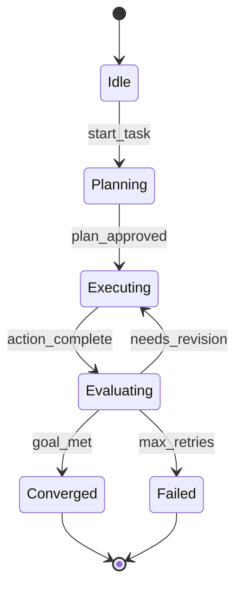
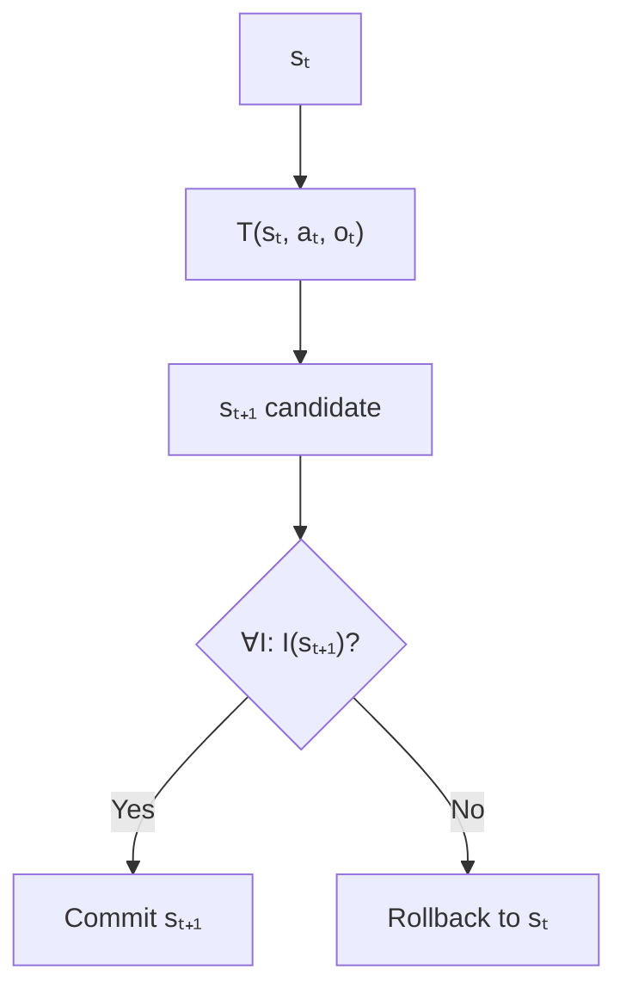

# State Transitions

How loops move from one state to the next — and how to do it safely.

---

## Definitions

### State

**State** \( s \in S \) is the sufficient statistic for loop decisions at time \( t \). Everything needed to select actions and interpret observations must be derivable from \( s_t \).

### Transition Function \( T \)

**\( T \)** maps \( (s_t, a_t, o_t) \) to \( s_{t+1} \). It encodes the loop's **learning rule** — what to remember, discard, or update.

### Idempotency

Action \( a \) is **idempotent** when applying it twice from the same observation yields the same result:

$$T(T(s, a, o), a, o) = T(s, a, o)$$

### Invariant

An **invariant** \( I(s) \) must hold for all reachable states: \( \forall t: I(s_t) = \text{true} \).

---

## Formal Abstractions

### State Machine

A state machine is \( (S, A, \delta) \) where \( \delta: S \times A \rightarrow S \). In full loop context:

$$s_{t+1} = T(s_t, a_t, o_t) = \delta(s_t, f(a_t, o_t))$$

### Reduce Pattern

$$s_{t+1} = \text{reduce}(s_t, \text{event}_t) \quad \text{where } \text{event}_t = \{a_t, o_t, R_t\}$$

Pure reduce functions are testable, replayable, and serializable.

### Guarded Transitions

$$s_{t+1} = \begin{cases}
T_{\text{forward}}(s_t, a_t, o_t) & \text{if } G(s_t, o_t) \\
T_{\text{fallback}}(s_t, a_t, o_t) & \text{otherwise}
\end{cases}$$

---

## State Machine Anatomy

---

## Examples

### File Edit Loop

| Event | Transition |
|-------|------------|
| `apply_patch` + tests pass | Update content; append history; set result=pass |
| `apply_patch` + tests fail | Revert content; append failure; increment iteration |
| `iteration > 20` | Transition to Failed macro-state |

**State schema**: `{target_file, content, edit_history[], last_test_result, iteration}`

### Hypothesis Research Loop

Evidence supports → increase confidence. Contradicts → decrease; if < 0.3, mark inactive. All inactive → Failed or reseed.

### Idempotent Tool Call

**Non-idempotent**: `write_file(path, content)` — blind overwrite on retry.

**Idempotent**: `apply_patch(path, patch, expected_hash)` — conflict if hash mismatch.

---

## Transition Pipeline

---

## Practical Implications

1. **Define state schema first**. Use typed structures, not freeform conversation.
2. **Implement T as pure reduce**. Side effects belong in action execution, not transition logic.
3. **Make every mutating action idempotent**. Assume retries will happen.
4. **Check invariants after every transition**. Fail closed on violation.
5. **Log events, not just states**. Event sourcing enables replay.

---

## Summary

State transitions are where feedback becomes memory. Engineer \( T \) with typed state, pure reduce, and idempotent actions.

**Next**: [Memory Systems](04-memory-systems.md).
