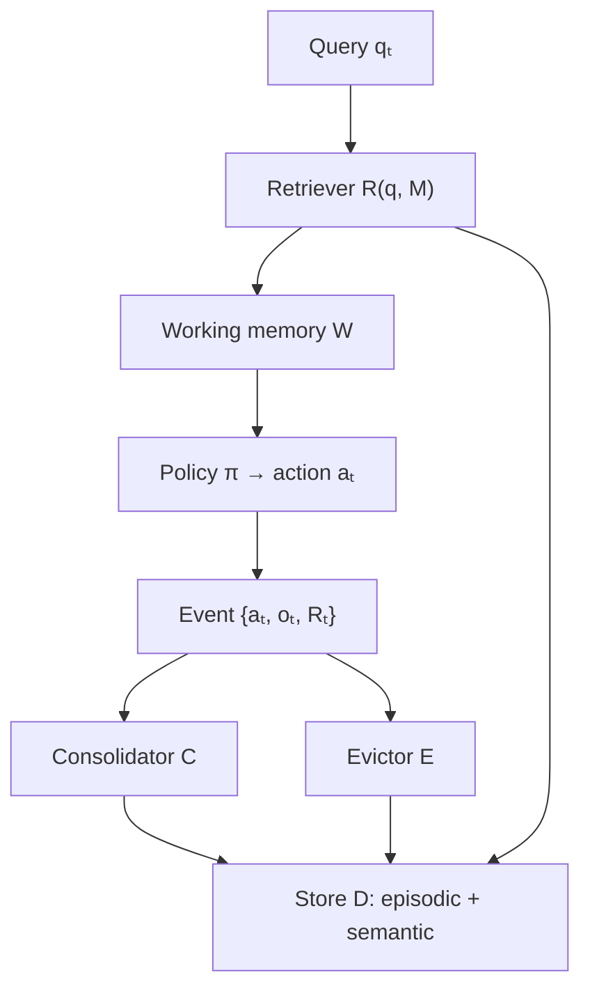

# Memory Systems

How loops remember, retrieve, and forget across iterations.

---

## Definitions

### Memory

**Memory** persists information from past iterations into future state:

$$s_t = \text{assemble}(\text{working\_state}_t, \text{retrieve}(q_t, M_t))$$

### Working vs Long-Term

- **Working memory**: current context — bounded, volatile
- **Long-term memory** \( M \): cross-session store — facts, episodes, procedures

### Episodic vs Semantic

- **Episodic**: timestamped events — what happened, with what outcome
- **Semantic**: distilled facts — what is generally true

### Retrieval

**Retrieval** maps query \( q_t \) to relevant items. Loop intelligence across sessions is bounded by retrieval quality.

---

## Formal Abstractions

### Memory Tuple

$$\mathcal{M} = (D, W, R, C, E)$$

| Symbol | Role |
|--------|------|
| \( D \) | Durable store |
| \( W \) | Working buffer |
| \( R \) | Retriever \( R(q, D) \rightarrow \{m_1, \ldots, m_k\} \) |
| \( C \) | Consolidator — episodic → semantic |
| \( E \) | Evictor — prune and archive |

### Write Policy

$$\text{write}(M, \text{event}) \iff R(\text{event}) > \theta \land \text{provenance}(\text{event}) \neq \emptyset$$

### Memory-Augmented Transition

$$s_{t+1} = T(s_t, a_t, o_t, R(q_t, M_t))$$

---

## Memory Architecture

---

## Examples

### Coding Agent

| Layer | Content | Trigger |
|-------|---------|---------|
| Working | Open files, edit plan | Always loaded |
| Episodic | Past fixes, CI outcomes | File path match |
| Semantic | Conventions, API contracts | Task description |

### Research Agent

Episodic: sources read, contradictions. Semantic: claims with confidence. Retrieve by hypothesis keywords.

### Failure: Hallucination Reinforcement

Wrong answer stored as fact; future iterations cite it. **Fix**: provenance on write; contradiction checks.

---

## Practical Implications

1. **Separate working from long-term memory**. Context window ≠ database.
2. **Store episodes first; distill later**. Consolidation is its own loop.
3. **Attach provenance to every write**. Source, timestamp, confidence.
4. **Bound retrieval**. Top-k with threshold; empty retrieval is valid.
5. **Evict aggressively**. Stale memory steers wrong.
6. **Test retrieval, not just storage**. Failures appear at read time.

---

## Summary

Memory is a governed subsystem with write policies, retrieval contracts, consolidation, and eviction — not a vector dump.

**Next**: [Optimization Systems](05-optimization-systems.md).
