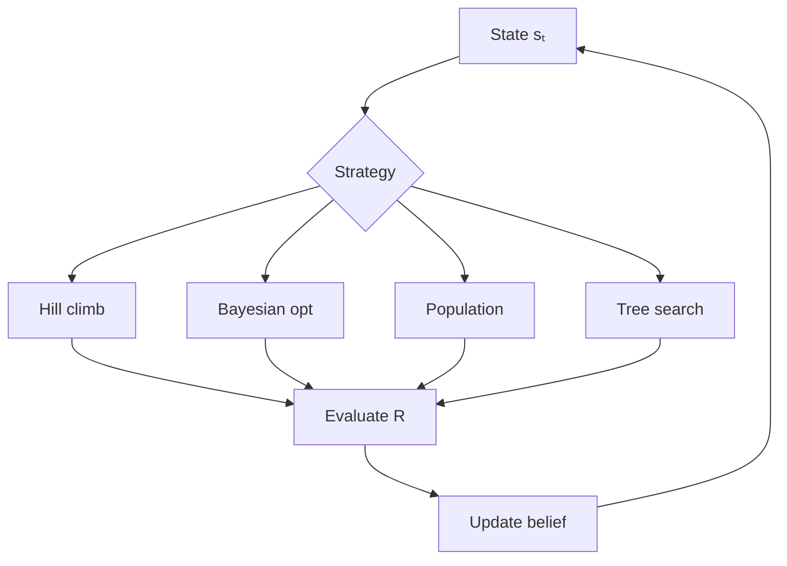

# Optimization Systems

How loops search for better actions, policies, and configurations.

---

## Definitions

### Optimization

Select \( a_t \) or \( \pi \) to maximize expected cumulative evaluation:

$$\max_{\pi} \mathbb{E}\left[\sum_{t=0}^{\infty} \gamma^t R(s_t, a_t, o_t)\right]$$

### Search Space

Set of reachable \( (s, a) \) pairs under current constraints. Must be explicit, not implicit.

### Exploit vs Explore

- **Exploit**: highest known \( R \)
- **Explore**: reduce uncertainty about \( R \)

### Surrogate Model

Cheap approximation of \( R \) from history, guiding search without full evaluation cost.

---

## Formal Abstractions

### Hill Climbing

$$a_t = \arg\max_{a \in \mathcal{N}(s_t)} \hat{R}(s_t, a)$$

### Bandit (UCB)

$$\text{UCB}_i = \hat{\mu}_i + c\sqrt{\frac{\ln t}{n_i}}$$

### Population Search

$$P_{t+1} = \text{select}(\text{mutate}(\text{evaluate}(P_t)))$$

### Bayesian Optimization

$$a_{\text{next}} = \arg\max_a \left( \hat{R}(a) + \kappa \cdot \sigma(a) \right)$$

---

## Search Strategies

---

## Examples

### Hyperparameter Loop

Search space: lr, batch size, layers. Bayesian optimization; Gaussian-process surrogate; expected-improvement acquisition.

### Code Repair Loop

Neighborhood: single-function edits. Hill climb, beam width 3. After 5 stalls: structural mutation.

### Prompt Optimization

Population of 20 variants; evolutionary selection; evaluate on held-out suite only.

---

## Practical Implications

1. **Define search space explicitly**. Unbounded space → unbounded cost.
2. **Match strategy to evaluation cost**. Cheap eval → population; expensive → Bayesian.
3. **Log every trial**. Surrogates require history.
4. **Inject exploration budget**. Pure exploitation stalls locally.
5. **Separate optimizer from executor**. Propose vs validate.
6. **Watch proxy overfitting**. Lint score ≠ correctness.

---

## Summary

Optimization turns iteration into directed search. Neighborhood, explore/exploit balance, and evaluation cost determine global improvement vs local churn.

**Next**: [Evaluation Systems](06-evaluation-systems.md).
