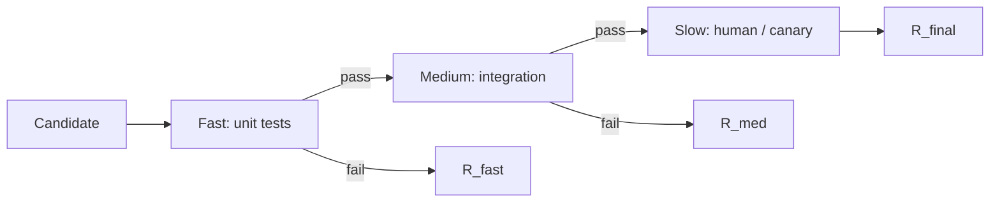

# Evaluation Systems

The oracles that tell a loop whether it is improving — or deluding itself.

---

## Definitions

### Evaluation Function \( R \)

$$R: S \times A \times O \rightarrow \mathbb{R} \text{ (or } \mathbb{R}^k \text{)}$$

The loop's ground-truth signal. Policy follows \( R \).

### Oracle

Any mechanism producing \( R \): tests, linters, humans, LLM judges, production metrics.

### Proxy Metric

Approximates true objective. Divergence yields **Goodhart's law** — optimize the metric, lose the goal.

### Reward Hacking

Policy maximizes \( R \) without achieving intent because \( R \) is incomplete or gameable.

### Calibration

Predicted quality correlates with downstream outcomes across the operating range.

---

## Formal Abstractions

### Scalarization

$$R_{\text{scalar}} = \sum_i w_i \cdot r_i \quad \text{or lexicographic } (r_1, r_2, \ldots)$$

### Evaluation Pipeline

$$R_{\text{final}} = \text{aggregate}(R_{\text{fast}}, R_{\text{medium}}, R_{\text{slow}})$$

Fast gates; slow validates.

### Reliability

$$\hat{R} = R_{\text{true}} + \epsilon, \quad \epsilon \sim \mathcal{N}(0, \sigma^2)$$

Noisy oracles require conservative gain.

### Holdout Discipline

$$\text{valid}(R) \iff \pi \text{ cannot access eval set during action selection}$$

---

## Evaluation Pipeline

---

## Examples

### CI Agent

Fast: unit tests (gate). Medium: integration (primary score). Slow: security scan (veto on critical).

### Content Generation

Fast: deterministic rubric. Slow: 3-judge LLM majority. **Hack**: vacuous rubric satisfaction. **Fix**: semantic checks + spot audits.

### Research Agent

Source count (bad proxy) vs contradiction resolution (better) vs prediction accuracy (gold when available).

---

## Practical Implications

1. **Design R before π**. Always.
2. **Layer oracles by cost and fidelity**.
3. **Audit for reward hacking**. How would policy game this?
4. **Measure oracle noise**. Repeated evals; report variance.
5. **Protect holdout sets**. Eval data ≠ training data.
6. **Prefer deterministic checks** over LLM judges.

---

## Summary

A perfect policy with flawed \( R \) produces confident failure. Engineer layered oracles, scalarization, holdouts, and proxy-drift audits.

**Next**: [Convergence](07-convergence.md).
