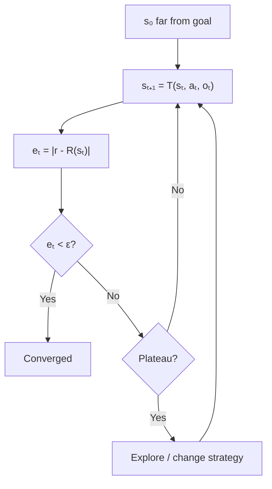

# Convergence

When iterative improvement approaches a goal — and when it only appears to.

---

## Definitions

### Convergence

Loop **converges** when error approaches setpoint \( r \):

$$\lim_{t \to \infty} |r - R(s_t)| = 0 \quad \text{or } R(s_t) \geq r_{\text{threshold}} \text{ within budget}$$

### Plateau

\( \Delta R_t \approx 0 \) despite continued iteration — local optimum, exhausted search, or noise floor.

### Finite vs Asymptotic

Engineering loops need **finite** guarantees. Asymptotic approach without threshold hit is insufficient.

### Apparent Convergence

Metric stabilizes; true objective unmet — proxy saturation or blind spots.

---

## Formal Abstractions

### Contraction Mapping

$$d(T(s, a, o), r) \leq \alpha \cdot d(s, r), \quad \alpha < 1$$

Guarantees convergence when \( \alpha < 1 \).

### Convergence Rates

Linear: \( |e_{t+1}| \leq \alpha |e_t| \). Quadratic: \( |e_{t+1}| \leq c |e_t|^2 \). Logarithmic: slow steady progress.

### Plateau Detection

$$\text{plateau}_t = \mathbb{1}\left[\max_{i \in [t-W,t]} R_i - \min_{i \in [t-W,t]} R_i < \epsilon \right]$$

### Lyapunov Function (informal)

\( V(s_{t+1}) < V(s_t) \) when \( s_t \neq r \) — proves descent without full dynamics.

---

## Convergence Dynamics

---

## Examples

### Lint Fix (Linear)

One error class per iteration → finite convergence in \( O(n) \) steps.

### LLM Code Gen (Stochastic)

No contraction guarantee. Requires plateau detection and iteration cap.

### Hyperparameter Search

Loss gains shrink asymptotically. Stop on 10-trial plateau or budget.

### Apparent Trap

100% coverage; logic still wrong. **Fix**: behavioral oracles beyond coverage.

---

## Practical Implications

1. **State convergence assumptions**. Metric, threshold, expected rate.
2. **Detect plateaus early**. Plateau ≠ success.
3. **Budget escape moves**. Reserve exploration iterations.
4. **Validate on holdout** after apparent convergence.
5. **Log convergence curves**. Reveals oscillation vs stall.
6. **Prefer contraction guarantees** when stakes are high.

---

## Summary

Convergence is measurable error reduction — not merely stopping. Engineer thresholds, plateau detection, escape, and holdout validation.

**Next**: [Termination Conditions](08-termination-conditions.md).
