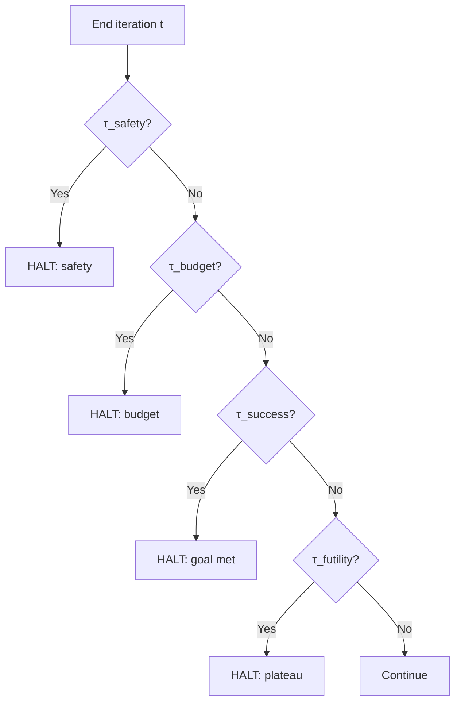

# Termination Conditions

When a loop should stop — success, failure, or budget exhaustion.

---

## Definitions

### Termination Function \( \tau \)

$$\tau: S \rightarrow \{0, 1\} \quad \text{where } \tau(s) = 1 \Rightarrow \text{halt}$$

Unspecified \( \tau \) is the primary cause of runaway agent cost.

### Success / Failure Termination

- **Success**: \( R(s_t) \geq r_{\text{threshold}} \) and invariants hold
- **Failure**: budget exhausted, unrecoverable error, safety violation

### Graceful Degradation

**Graceful halt** returns best-so-far state plus diagnostic, not empty failure.

### Watchdog

External \( \tau \) independent of agent self-assessment — timeout, cost cap, human kill switch.

---

## Formal Abstractions

### Compound Termination

$$\tau(s) = \tau_{\text{success}}(s) \lor \tau_{\text{budget}}(s) \lor \tau_{\text{safety}}(s) \lor \tau_{\text{futility}}(s)$$

### Precedence

Safety > budget > success > futility. Safety always wins.

### Futility Detection

$$\tau_{\text{futility}}(s) = \mathbb{1}\left[\text{iteration} > N \land \text{plateau}_W(s)\right]$$

### Partial Success Return

`(status, s_best, R_best, halt_reason, iterations_used)`

---

## Termination Decision Tree

---

## Examples

### Coding Agent

| Condition | Threshold | Type |
|-----------|-----------|------|
| All tests pass | required suites | Success |
| Iteration cap | 50 edits | Budget |
| Cost cap | $5 API spend | Budget |
| New critical lint | severity=error | Safety |
| No improvement 10 iters | plateau | Futility |

### Research Agent

Success: confidence > 0.85. Futility: no new sources in 3 rounds. Failure: 5 unresolved contradictions.

### Deployment Loop

Success: canary within SLO 30 min. Safety: error rate > 2× baseline → rollback and halt.

---

## Practical Implications

1. **Specify τ before first iteration**. No default "run until done."
2. **Layer independent watchdogs**. Self-termination is insufficient.
3. **Return best-so-far on budget halt**. Partial value beats total loss.
4. **Log halt reason every time**. Aggregate reasons reveal design flaws.
5. **Safety termination is non-negotiable**.
6. **Distinguish pause from terminate**. Checkpoint enables human resume.

---

## Summary

Termination is half the loop specification. \( \tau \) encodes risk tolerance, budgets, and quality bars.

**Next**: [Control Theory Connections](09-control-theory-connections.md).
