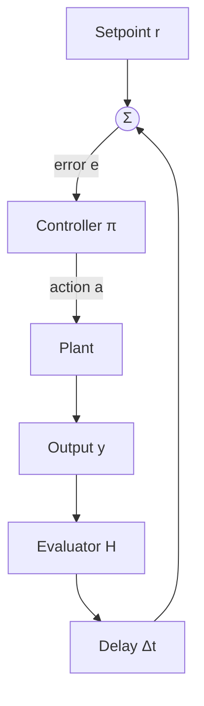

# Control Theory Connections

Mapping Loop Engineering to classical control — stability, tuning, and governance.

---

## Definitions

### Plant

The **plant** is environment plus system under control — everything transforming action into observable output.

### Controller

The **controller** is policy \( \pi \) mapping error to corrective action (model + prompt + tool routing).

### Setpoint

**Setpoint** \( r \) is desired output — goal state or evaluation threshold.

### Stability

**Stable** loops produce bounded corrections without unbounded oscillation or divergence.

### PID Control

**PID** combines proportional (current error), integral (accumulated error), and derivative (error rate) terms.

---

## Formal Abstractions

### Closed-Loop (informal)

$$Y = \frac{G \cdot C}{1 + G \cdot C \cdot H} \cdot R$$

\( G \) = plant, \( C \) = controller, \( H \) = sensor/evaluator.

### PID in Loop Terms

$$a_{t+1} = a_t - \left( K_p e_t + K_i \sum e_i + K_d \Delta e_t \right)$$

| Term | Instance |
|------|----------|
| \( K_p \) | Fix severity ∝ failure count |
| \( K_i \) | Persist strategy across noisy iterations |
| \( K_d \) | Brake when improvement rate slows |

### Phase Margin

Tolerance for delay before oscillation. Long CI delays → lower \( K_p \).

---

## Control Loop Mapping

---

## Examples

### CI Fix Agent as PID

P: one failing test per iteration. I: after 3 oscillations, keep working pattern. D: if regression, halve edit scope.

### Canary Deployment

Setpoint: error rate < 0.1%. Low \( K_p \): one variable per deploy. Integral: rollback on cumulative error budget breach.

### Unstable Loop

High gain + 8 min CI delay = oscillation. **Fix**: reduce \( K_p \); add derivative braking.

---

## Practical Implications

1. **Name setpoint explicitly**.
2. **Tune gain against delay**. High delay → low \( K_p \).
3. **Add integral for persistent errors**.
4. **Use derivative to prevent overshoot**.
5. **Model the plant** before tuning.
6. **Watchdog = safety controller** separate from performance.

---

## Summary

Control theory is operational vocabulary for loop stability. Gain, delay, integral persistence, and derivative braking translate directly to agent behavior.

**Next**: [Reinforcement Learning Connections](10-reinforcement-learning-connections.md).
