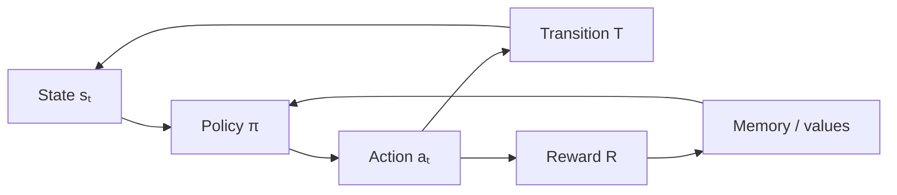

# Reinforcement Learning Connections

Mapping Loop Engineering to RL — policies, rewards, horizons, and exploration.

---

## Definitions

### Markov Decision Process (MDP)

MDP: \( (S, A, P, R, \gamma) \). Stochastic loops are MDPs; deterministic loops are degenerate MDPs.

### Policy \( \pi \)

Selects actions: \( \pi(a|s) \). LLM agents implement stochastic policies via temperature and prompt variation.

### Return

$$G_t = \sum_{k=0}^{\infty} \gamma^k R_{t+k+1}$$

### Value Function

\( V^\pi(s) \) = expected return from \( s \). \( Q^\pi(s,a) \) includes action choice.

### Exploration

Select actions to improve \( Q \) estimates, not only maximize current best.

---

## Formal Abstractions

### Loop as Episode

Each run: \( (s_0, a_0, r_0, \ldots, s_T) \) with \( \tau(s_T) = 1 \).

### Policy Gradient (conceptual)

$$\nabla_\theta J(\pi_\theta) \propto \mathbb{E}\left[\nabla_\theta \log \pi_\theta(a|s) \cdot A(s,a)\right]$$

### Offline vs Online

- **Online**: update during execution (risky in production)
- **Offline**: learn from logs; deploy next run

### Credit Assignment

Long episodes need step-level oracles or shaped rewards.

---

## RL Mapping

---

## Examples

### ReAct Agent

Episode = one task. Step reward = per-tool eval. Terminal = completion score. Policy = prompt + model + tools.

### Prompt Tuning as Bandit

Each prompt is an arm. Update from success rate; budget exploration.

### Reward Shaping Failure

+1 per file touched → touches many files, fixes nothing. **Fix**: reward test passage only.

---

## Practical Implications

1. **Define step rewards**, not just terminal.
2. **Treat production as offline RL**. Log episodes; deploy deliberately.
3. **Budget exploration**. ε-greedy or UCB for variants.
4. **γ encodes urgency**. Low γ = fast finish; high γ = thorough search.
5. **Audit R for hacking**. RL amplifies eval weakness.
6. **Value estimates enable pruning**. Drop low-\( Q \) branches.

---

## Summary

RL provides the mathematical frame for policies that improve from experience. Make \( R \), \( \gamma \), \( \tau \), and exploration explicit.

**Next**: [Cybernetics Connections](11-cybernetics-connections.md).
