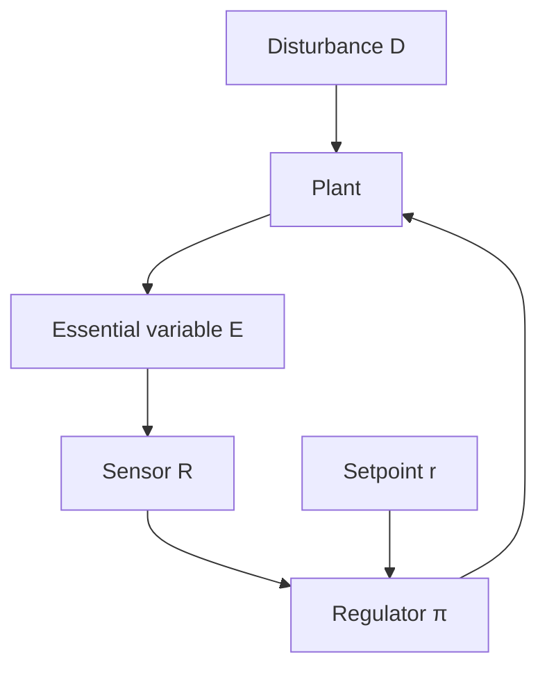

# Cybernetics Connections

Regulation, variety, and recursive structure — the science of steered systems.

---

## Definitions

### Cybernetics

Studies goal-directed systems regulating via feedback. Loop Engineering is applied cybernetics for computational systems.

### Regulation

Maintains variables within bounds despite disturbance. Negative-feedback loops are regulators.

### Variety (Ashby's Law)

Only variety destroys variety. Controller response modes must match disturbance diversity.

### Ultrastability

When essential variables leave safe bounds, system reorganizes until regulation resumes.

### Second-Order Cybernetics

Observes the observer — loops that modify their own evaluation criteria.

---

## Formal Abstractions

### Regulator Model

$$E = P(D, R(\text{sensor}(P)))$$

\( R \) = policy, sensor = evaluator, \( D \) = disturbance.

### Requisite Variety

$$V_{\text{controller}} \geq V_{\text{disturbance}}$$

50 error types with 3 fix templates → persistent failure.

### Recursive Structure

$$\mathcal{L}_0 \rightarrow \mathcal{L}_1 \text{ monitors} \rightarrow \mathcal{L}_2 \text{ governs}$$

Each level has own \( S, R, \tau \).

---

## Regulatory Hierarchy

---

## Examples

### Variety Mismatch

Agent handles syntax, not concurrency bugs. **Fix**: expand actions or narrow scope.

### Ultrastable CI Loop

Failure rate 3× baseline → switch to human escalation, reduce gain.

### Second-Order Loop

Meta-evaluator audits LLM-judge vs human correlation; triggers recalibration.

---

## Practical Implications

1. **Inventory disturbance variety**. Match action space.
2. **Design ultrastability paths**. Reorganize on bound breach.
3. **Separate regulatory levels**. Executor, monitor, governor.
4. **Evaluation = sensor engineering**.
5. **Respect requisite variety**. Narrow domain for simple controllers.
6. **Bound recursive depth**. Second-order loops need verification.

---

## Summary

Cybernetics describes LLM agents precisely: regulation, variety matching, hierarchy, recursion — made buildable with explicit state and halt conditions.

**Next**: [Organizational Learning Connections](12-organizational-learning-connections.md).
