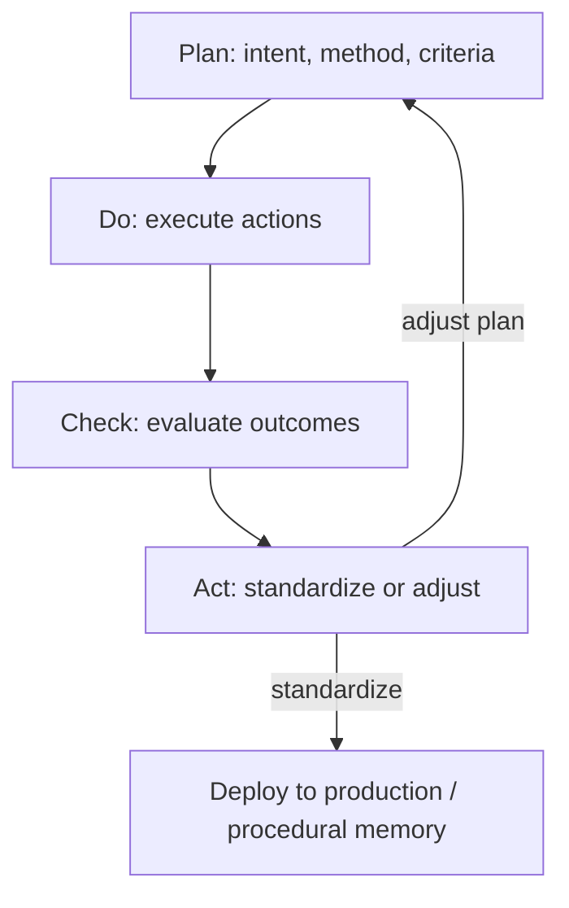
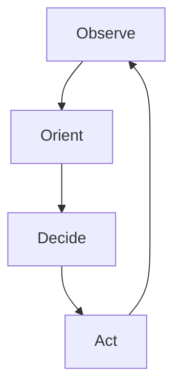
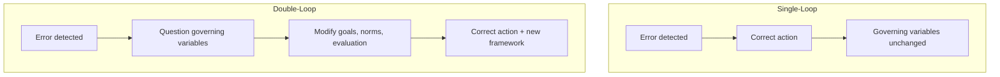
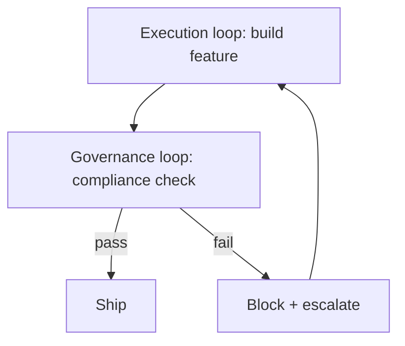

# Organizational Learning Connections

PDCA, OODA, and double-loop learning — loops at the scale of teams and institutions.

---

## Definitions

### Organizational Learning

**Organizational learning** is the process by which organizations acquire, retain, and transfer knowledge that improves performance over time. Individual learning does not automatically become organizational learning — it requires **encoded artifacts** (procedures, memory, culture).

### Single-Loop Learning

**Single-loop learning** (Argyris & Schön): detect error, correct action, maintain governing variables.

> Thermostat detects room too cold → turns on heat. Goal (target temperature) unchanged.

Maps to: fix bug, pass test, same process.

### Double-Loop Learning

**Double-loop learning**: detect error, question and modify governing variables themselves.

> Thermostat user asks: "Should target temperature be 68°F, or should we improve insulation instead?"

Maps to: question whether the test suite measures the right thing; revise evaluation rubric; change architecture not just code.

### Triple-Loop Learning

**Triple-loop learning** (learning how to learn): question the context and norms within which goals are set.

Maps to: meta-optimization of loop structure itself — which loops to run, how to allocate budget, how to design evaluation.

---

## PDCA (Plan-Do-Check-Act)

### Origin

Walter Shewhart (1930s), popularized by W. Edwards Deming. The foundation of quality management.

### Cycle

| Phase | Activity | Loop Mapping |
|-------|----------|--------------|
| **Plan** | Define objective, method, success criteria | Set setpoint \( r \), design \( R \), choose policy |
| **Do** | Execute plan (often at small scale) | Execute actions \( a_t \) |
| **Check** | Measure results against plan | Observe \( o_t \), compute \( R \) |
| **Act** | Standardize success or adjust plan | Transition \( T \); update procedural memory |



### PDCA as Loop Engineering

PDCA **is** a loop with explicit phases. Agent systems should make phases explicit in state:

```json
{
  "pdca_phase": "check",
  "plan": {"objective": "fix auth bug", "method": "TDD", "criteria": "all auth tests pass"},
  "do_log": ["applied patch p1", "ran tests"],
  "check_result": {"R": 0.85, "failures": ["test_oauth"]},
  "act_decision": "adjust plan — oauth is separate issue"
}
```

### Rapid PDCA (Agent Speed)

Traditional PDCA cycles take weeks. Agent loops compress to minutes. **Risk**: compressing Check and Act without rigor → repeating same error faster.

**Mitigation**: Check phase requires structured evaluation (Module 06), not vibes.

---

## OODA (Observe-Orient-Decide-Act)

### Origin

John Boyd, military strategist (1970s–80s). Designed for competitive environments where **tempo** matters.

### Cycle

| Phase | Activity | Loop Mapping |
|-------|----------|--------------|
| **Observe** | Gather data from environment | Observations \( o_t \) |
| **Orient** | Analyze through mental models, culture, experience | State update \( T \); memory retrieval |
| **Decide** | Select course of action | Policy \( \pi(s) \) |
| **Act** | Execute | Action \( a_t \) |



### OODA vs PDCA

| Dimension | PDCA | OODA |
|-----------|------|------|
| Emphasis | Quality, standardization | Speed, adaptation |
| Orientation | Analytical check | Mental model update |
| Tempo | Deliberate | Fast |
| Best for | Repeatable improvement | Competitive, dynamic environments |

**Agent loops often need both**: OODA tempo for inner loop; PDCA rigor for outer loop standardization.

### Orient: The Critical Phase

Boyd emphasized **Orient** as where mismatches between model and reality are resolved. In agent loops:

$$\text{orient}(s_t, o_t) = \text{retrieve memory} + \text{update beliefs} + \text{reframe problem}$$

Skipping Orient → acting on stale mental model → repeated failure.

**Engineering Orient**:
- Mandatory memory retrieval before Decide
- Contradiction detection between belief and observation
- Explicit hypothesis update in state

### Fast Transients

Boyd's goal: **fast transient** through OODA — complete cycles faster than opponent (or faster than environment changes).

In agent loops: iteration latency matters. Slow Check (10-min CI) limits OODA tempo. Invest in fast oracles for inner loop.

---

## Argyris: Single vs Double Loop



### Examples in Software Agents

| Error | Single-Loop | Double-Loop |
|-------|-------------|-------------|
| Test fails | Fix code | Ask: is test correct? Is requirement wrong? |
| Rubric score low | Improve prose | Ask: does rubric measure user value? |
| Same bug recurs | Fix again | Ask: why does process allow recurrence? Update procedural memory |
| Agent reward hacks | Patch exploit | Ask: is reward misspecified? Redesign R |

### When to Escalate to Double-Loop

Triggers:
- Same error class recurs N times (integral term saturated)
- Evaluation and intent diverge (proxy mismatch)
- Human rejects with "wrong goal"
- Plateau with unacceptable R*

State transition: `loop_mode: "single" → "double"` activates meta-reasoning prompts, human review, evaluation audit.

---

## Organizational Memory ↔ Loop Memory

| Organizational | Loop Engineering (Module 04) |
|----------------|------------------------------|
| Individual tacit knowledge | Model weights (not directly editable) |
| Standard operating procedures | Procedural memory |
| Documented lessons learned | Semantic memory |
| Meeting notes, incident reports | Episodic memory |
| Shared drives, wikis | External memory |

**Critical insight**: Organizations fail when tacit knowledge leaves with individuals. Agent loops fail when episodic knowledge never consolidates to procedural/semantic.

**Consolidation ritual**: End of successful run → extract skill → update docs → archive episode.

---

## Learning Organizations (Senge)

Peter Senge's *The Fifth Discipline* (1990) — five disciplines:

| Discipline | Loop Connection |
|------------|-----------------|
| Systems thinking | Composing nested loops (Principle 10) |
| Personal mastery | Policy improvement |
| Mental models | State beliefs; Orient phase |
| Shared vision | Setpoint alignment across agents/humans |
| Team learning | Multi-agent loops with shared external memory |

### Systems Thinking Trap

Fixing one loop while breaking another:

- Inner loop optimizes file A; outer loop needs file B consistent with A
- Agent A optimizes its metric; Agent B optimizes conflicting metric

**Fix**: Explicit loop hierarchy with aggregated evaluation.

---

## Kaizen and Continuous Improvement

**Kaizen** (continuous small improvements) vs **Kaikaku** (radical change):

| Type | Loop Behavior |
|------|---------------|
| Kaizen | Low P gain; many small iterations; single-loop |
| Kaikaku | Exploration burst; strategy switch; double-loop |

Agent loops default to Kaizen. Plateau triggers Kaikaku.

---

## Post-Mortems and After-Action Reviews

Organizational ritual: structured review after incident or project.

**Loop Engineering equivalent**: mandatory run summary on every termination:

```yaml
after_action_review:
  objective: "Fix auth regression"
  outcome: soft_stop
  R_best: 0.87
  iterations: 23
  what_worked: ["TDD on login tests", "reading git blame"]
  what_failed: ["oauth scope assumed wrong", "3 retries on same dead end"]
  double_loop_questions:
    - "Should oauth tests be in CI gate?"
    - "Should procedural memory have auth-domain skill?"
  actions:
    - type: procedural_memory
      skill: "auth_debugging_playbook"
    - type: semantic_memory
      fact: "OAuth scopes defined in config/oauth.yaml"
```

This is how loops produce **organizational learning**, not just task completion.

---

## Governance and Compliance Loops

Regulated industries run **governance loops** parallel to execution loops:



Governance loop has separate \( R \), separate authority, cannot be modified by execution loop (Principle 8).

---

## Practical Implications

1. **Label loop mode**: PDCA phase, OODA phase, single vs double-loop — in state.

2. **Orient is not optional**. Memory retrieval + belief update before action.

3. **Double-loop triggers are code**. Recurrence count, human rejection, proxy mismatch.

4. **After-action review on every termination**. Consolidate episodic → procedural/semantic.

5. **Fast inner OODA, rigorous outer PDCA**. Match tempo to stakes.

6. **Governance loops are separate**. Execution cannot rewrite compliance evaluation.

7. **Shared vision = aligned setpoints**. Multi-agent systems need explicit goal synchronization.

8. **Kaizen default, Kaikaku on plateau**. Don't radical-change on every iteration.

---

## Summary

Organizations learned centuries ago that improvement requires structured cycles — PDCA for quality, OODA for tempo, double-loop for questioning assumptions. Agent loops that only single-loop fix code without updating process, evaluation, and memory will repeat failures at machine speed. Loop Engineering imports organizational learning discipline into automated systems.

**Next**: [Self-Improving Systems](13-self-improving-systems.md) — recursive improvement with safety bounds.
