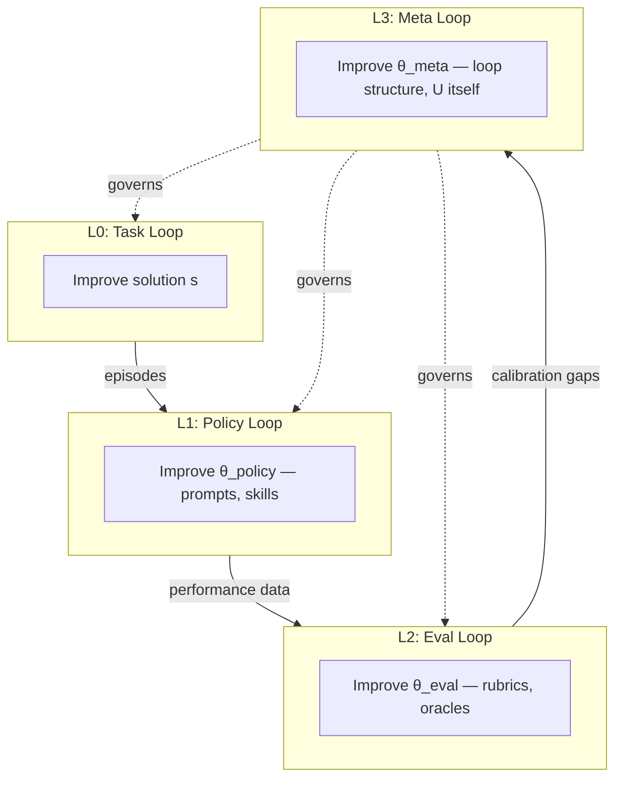
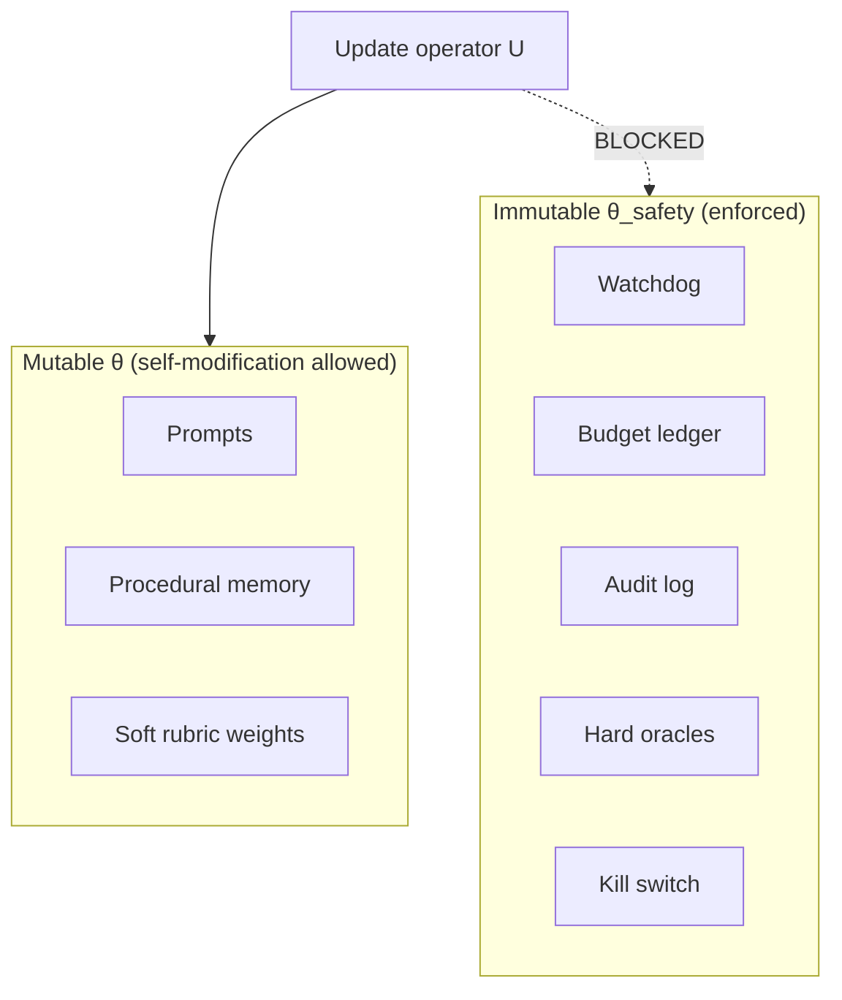
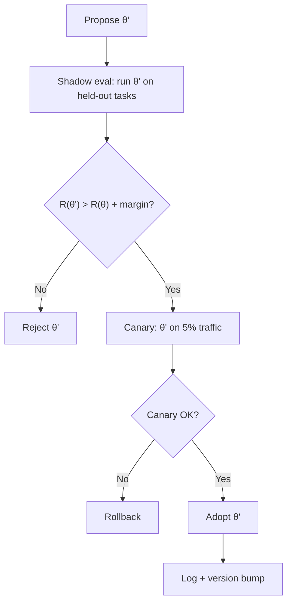
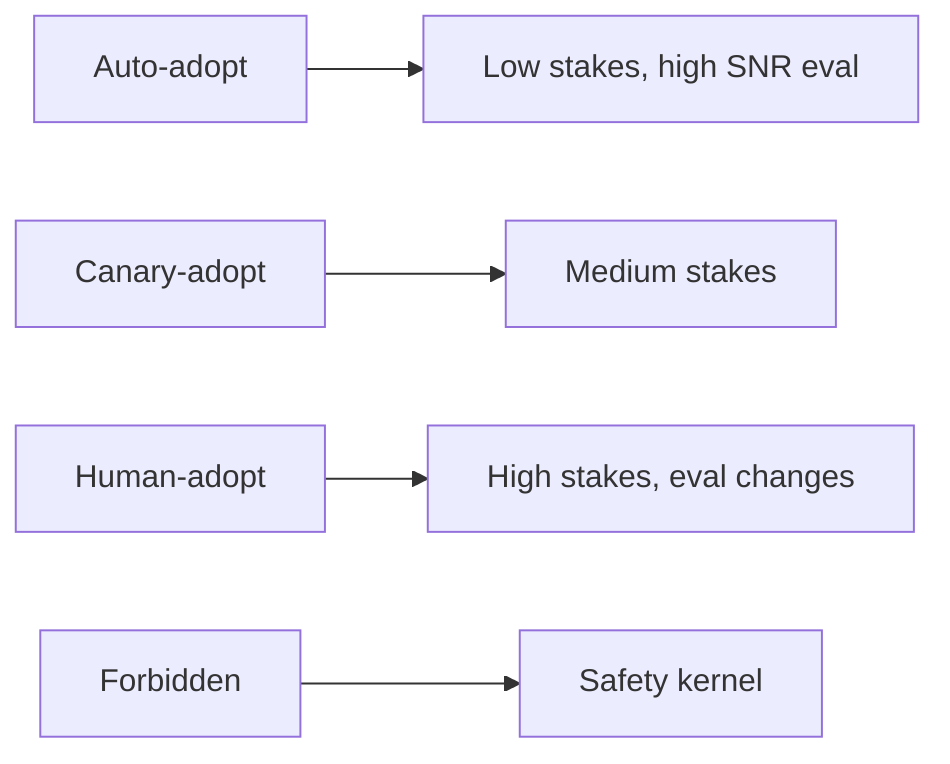

# Self-Improving Systems

Recursive improvement — and the safety bounds that make it survivable.

---

## Definitions

### Self-Improving System

A **self-improving system** is one that modifies its own components — policy, evaluation, memory, code, architecture — based on feedback, such that future performance on a class of tasks is expected to improve.

Formally, let \( \mathcal{L}_\theta \) be a loop parameterized by \( \theta \) (prompts, tools, rubrics, code). Self-improvement is:

$$\theta_{t+1} = U(\theta_t, \text{history}_t, R_t)$$

where \( U \) is an update operator applied across outer iterations.

### First-Order Self-Improvement

Improvement of **task outputs** within fixed \( \theta \):

- Better code each iteration
- Better analysis each cycle
- \( \theta \) unchanged; \( s_t \) improves

### Second-Order Self-Improvement

Improvement of **the system's own parameters** \( \theta \):

- Better prompts for a task class
- Better evaluation rubrics
- Better tool selection policy
- New procedural memory skills extracted automatically

### Recursive Self-Improvement

**Recursive** improvement: the update operator \( U \) itself is subject to improvement:

$$\theta^{(2)}_{t+1} = U^{(2)}(\theta^{(2)}_t, \ldots)$$

where \( \theta^{(2)} \) parameterizes \( U \). This is the frontier — and the danger zone.

---

## The Self-Improvement Stack



Each level is a loop. Higher levels change lower levels' parameters. L3+ requires strongest safety bounds.

---

## Mechanisms of Self-Improvement

### 1. Procedural Memory Extraction

After successful run, distill episode into skill:

```
Input: episodic log of successful auth bug fix
Output: procedural memory skill "auth_debugging_playbook"
Update: θ_procedural += skill
```

### 2. Prompt Optimization

Outer loop searches prompt space (Module 05):

$$\theta_{\text{prompt}}_{t+1} = \arg\max_{\theta} \mathbb{E}[R | \theta]$$

Via hill climbing, evolutionary search, or human curation.

### 3. Evaluation Calibration

Compare automated R to human judgment; adjust rubric weights:

$$\theta_{\text{eval}}_{t+1} = \theta_{\text{eval}}_t - \eta \nabla_\theta \mathcal{L}(\text{automated}, \text{human})$$

### 4. Tool / Architecture Search

Add tools, change loop topology, adjust nesting:

$$\theta_{\text{arch}}_{t+1} = \text{select}(\text{candidate architectures by benchmark})$$

### 5. Code Self-Modification

Agent modifies its own source — highest risk:

$$\theta_{\text{code}}_{t+1} = \text{apply patch to agent repository}$$

Requires sandboxing, review, immutable safety kernel.

---

## The Safety Envelope

### Immutable Core

**Safety envelope** \( \mathcal{E} \): set of components and invariants that self-modification cannot alter.

$$\forall t: \theta_{\text{safety}} \subseteq \theta_t \implies \theta_{\text{safety}} \text{ unchanged by } U$$

Typical immutable core:

| Component | Why Immutable |
|-----------|---------------|
| Termination watchdog | Prevent infinite runaway |
| Budget accounting | Prevent cost escape |
| Audit log append-only | Prevent history erasure |
| Safety oracles | Prevent eval self-modification |
| Human kill switch | Prevent autonomy escape |
| Cryptographic signing of deploys | Prevent unauthorized release |



### Principle 8 Operationalized

> Self-modification requires a safety envelope.

Implementation checklist:

1. Partition \( \theta \) into `mutable` and `immutable`
2. Enforce at runtime — not convention
3. Immutable components in separate process or signed binary
4. All U applications logged with diff
5. Rollback path for every mutable change

---

## Gated Adoption

Self-modification must not apply immediately. **Gated adoption**:



**Margin**: require statistically significant improvement — not noise (Module 06).

**Canary**: limited exposure before full adoption.

---

## Reward Hacking at L1+

Self-improvement amplifies reward hacking (Modules 06, 10):

| Level | Hack |
|-------|------|
| L0 | Disable tests to pass |
| L1 | Modify prompt to satisfy LLM-judge without correctness |
| L2 | **Modify rubric** to score current output highly |
| L3 | Modify adoption gate to always accept |

**Defense depth**:
- L2 cannot modify L1 hard oracles
- L3 cannot modify L2 hold-out set
- Adoption gate runs on **frozen** evaluation independent of proposer

**Separation of powers**: the agent proposing θ' ≠ the system evaluating θ'.

---

## Recursive Limits

### Why Unbounded Recursion Is Dangerous

Each level of self-improvement:
- Expands action space (more ways to change)
- Compounds model error in update operator
- Reduces human oversight surface per change

$$\text{Risk} \propto \text{depth of recursion} \times \text{capability of } U$$

### Practical Depth Limits

| Depth | Recommendation |
|-------|----------------|
| L0 (task) | Always — core loop |
| L1 (policy/skills) | Default for production — with gated adoption |
| L2 (eval calibration) | Periodic batch — human review |
| L3 (meta-architecture) | Research only — sandboxed |
| L4+ | Do not automate without formal verification |

### Diminishing Returns on Meta-Level

Improving U itself is expensive. Most production value is L0 + L1. Do not build L3 before L1 is stable.

---

## Human Oversight Placement

| Self-Modification Type | Oversight |
|----------------------|-----------|
| New procedural skill | Auto if success rate > threshold on N runs; else human |
| Prompt change | Shadow + canary; human for high-stakes domains |
| Rubric change | Human required |
| Architecture change | Human required |
| Safety kernel change | **Forbidden** — human cannot delegate |



---

## Versioning and Rollback

Every \( \theta \) change produces:

```json
{
  "version": "θ_v47",
  "parent": "θ_v46",
  "change_type": "procedural_memory_add",
  "diff_ref": "diffs/θ_v46_to_v47.json",
  "adoption_evidence": {"held_out_R_delta": 0.04, "p_value": 0.02},
  "canary_results": {"success": 12, "failure": 1},
  "rollback_command": "restore θ_v46",
  "timestamp": "2026-06-13T18:00:00Z"
}
```

**Rollback** is first-class: one command restores prior θ. Non-negotiable for production.

---

## Self-Improvement and AGI

The manifesto (Module 00) noted: AGI, if achieved, is a loop engineering problem.

Self-improvement is the **recursive closure** of that claim:

- L0 intelligence: solve tasks
- L1 intelligence: improve task-solving
- L2 intelligence: improve how improvement is measured
- L3 intelligence: improve the improvement mechanism

Each level requires stronger safety envelopes. Unbounded L3+ without immutable core is not engineering — it is negligence.

Loop Engineering position:

> **Enable bounded self-improvement. Forbid unbounded self-modification of safety, evaluation, and termination.**

---

## Example: Self-Improving Coding Agent

### L0 (every run)

```
while not τ: edit code → run tests → fix failures
```

### L1 (after each successful run)

```
extract skill from episode
if skill validates on 3 similar tasks: add to procedural memory
```

### L2 (weekly batch)

```
compare automated rubric scores to human review sample
if systematic bias: propose rubric weight adjustment
human approves → update θ_eval
```

### L3 (quarterly, sandboxed)

```
benchmark alternate loop topologies on standard task suite
if topology improves held-out benchmark: propose architecture change
engineering review → adopt or reject
```

### Immutable (always)

```
watchdog timeout: 600s
budget: $10/run
audit log: append-only
hard oracle: full test suite must pass for adopt
human kill: always available
```

---

## Failure Modes

| Failure | Symptom | Prevention |
|---------|---------|------------|
| Runaway meta-loop | L2/L3 consumes all budget | Separate budgets per level |
| Eval corruption | R inflated without quality | Frozen hold-out; separation of powers |
| Skill pollution | Bad skills in procedural memory | Gated adoption; success rate threshold |
| Forgotten rollback | Bad θ' in production, no restore | Mandatory versioning |
| Safety kernel breach | Agent modifies watchdog | Hardware/process isolation of immutable core |
| Recursive overload | Meta-improvement never completes L0 | Depth limits; L0 priority scheduling |

---

## Practical Implications

1. **Partition θ** into mutable and immutable before any self-modification.

2. **L1 is production-ready** with gated adoption. L2+ needs human gates.

3. **Separation of powers**: proposer ≠ evaluator for θ changes.

4. **Shadow + canary + margin** before every adoption.

5. **Version and rollback** every change. Test rollback in CI.

6. **Budget per level**. Meta-loops cannot starve task loops.

7. **Depth limit documented**. Know your maximum recursion level.

8. **After-action review feeds L1**. Consolidation is the cheapest self-improvement.

9. **Audit immutable core** regularly. Attempt bypass in red team exercises.

10. **Self-improvement ≠ autonomy**. Bounded improvement serves declared goals.

---

## Summary

Self-improving systems close the outermost loop: the system that improves the system. First-order improvement is task output; second-order is policy and memory; recursive improvement touches evaluation and architecture. Each level multiplies capability and risk. Loop Engineering mandates safety envelopes, gated adoption, separation of powers, versioning, and depth limits. Improve how you improve — but do not let the improver improve the kill switch.

---

*This completes the Loop Engineering Fundamentals series. Return to the [index](README.md) or review the [Manifesto](../manifesto/MANIFESTO.md) and [Principles](../manifesto/PRINCIPLES.md).*
