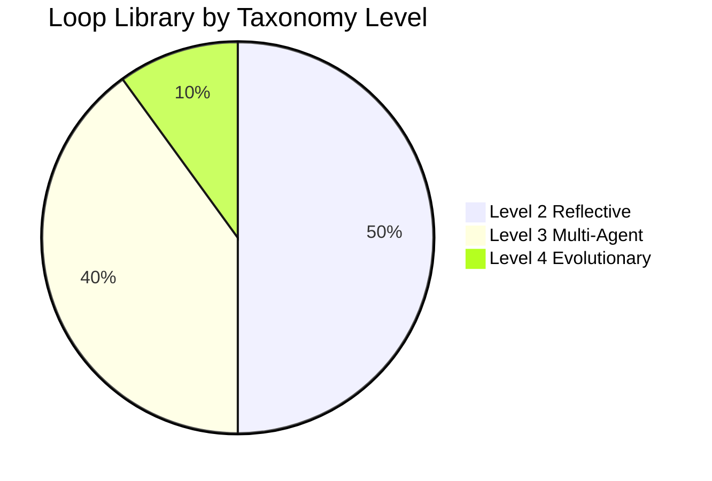

# Loop Library

Production-ready **Loop Specification Standard (LSS) 1.0** definitions for common autonomous workflows. Each entry includes a declarative YAML spec, companion architecture document, estimated LES score, and recommended model tiers.

## Catalog

| Loop | Taxonomy Level | Domain | LES Est. | Primary Evaluator |
|------|----------------|--------|----------|-------------------|
| [Research Agent](./research-agent.yaml) | 2 — Reflective | Literature synthesis | 78 | Citation verifier + coherence rubric |
| [Coding Agent](./coding-agent.yaml) | 3 — Multi-Agent | Feature implementation | 82 | Test suite + static analysis |
| [Scientific Discovery Agent](./scientific-discovery-agent.yaml) | 4 — Evolutionary | Hypothesis testing | 71 | Statistical significance + replication |
| [Business Strategy Agent](./business-strategy-agent.yaml) | 3 — Multi-Agent | Strategic planning | 76 | Scenario stress tests + KPI alignment |
| [Startup Validator](./startup-validator.yaml) | 2 — Reflective | PMF experiments | 74 | Experiment outcome + falsification log |
| [Learning Coach](./learning-coach.yaml) | 2 — Reflective | Adaptive tutoring | 80 | Mastery probes + retention checks |
| [Interview Coach](./interview-coach.yaml) | 2 — Reflective | Technical interview prep | 77 | Rubric scoring + behavioral calibration |
| [Writing Assistant](./writing-assistant.yaml) | 2 — Reflective | Long-form composition | 79 | Style rubric + fact-check channel |
| [Circuit Design Agent](./circuit-design-agent.yaml) | 3 — Multi-Agent | Analog/digital design | 73 | SPICE simulation + DRC/LVS |
| [Autonomous Debugger](./autonomous-debugger.yaml) | 3 — Multi-Agent | Test-driven repair | 85 | Failing test oracle + diff budget |

## How to Use

1. **Select** a loop closest to your use case from the catalog above.
2. **Read** the companion `.md` file for architecture, diagrams, and model recommendations.
3. **Copy** the YAML and adapt `inputs`, `cost_limits`, and `safety_constraints` to your environment.
4. **Validate** (when tools are available): `python tools/loop_validator.py loop-library/<name>.yaml`
5. **Score** with LES: `python tools/les_calculator.py --spec loop-library/<name>.yaml`

## LSS 1.0 Required Fields

Every spec in this library declares:

```yaml
loop_name: string
version: "1.0"
objective: string
inputs: [...]
memory: {...}
workers: [...]
evaluators: [...]
feedback_channels: [...]
optimization_strategy: {...}
termination_conditions: [...]
metrics: [...]
safety_constraints: [...]
cost_limits: {...}
```

See [standards/LSS-1.0.md](../standards/LSS-1.0.md) for the full schema and validation rules.

## Taxonomy Distribution



## Composition Patterns

Loops compose cleanly when evaluators of the upstream loop feed `feedback_channels` of the downstream loop:

| Pipeline | Composition |
|----------|---------------|
| Research → Writing | `research-agent` artifacts → `writing-assistant` inputs |
| Startup → Strategy | `startup-validator` falsification log → `business-strategy-agent` scenario inputs |
| Code → Debug | `coding-agent` partial implementation → `autonomous-debugger` repair loop |

When composing, **never merge evaluators**—each loop retains its own oracle to prevent self-grading collapse.

## Versioning Policy

- **Patch** (1.0.x): cost limit tuning, model string updates, comment clarifications
- **Minor** (1.x.0): new workers/evaluators without breaking field names
- **Major** (x.0.0): schema migration requiring LSS version bump

## Contributing New Loops

New library entries must include:

1. Valid LSS 1.0 YAML with inline comments on non-obvious fields
2. Companion `.md` with mermaid diagram, architecture prose, LES estimate with category breakdown, and model tiers
3. At least one worked termination trace (success and bounded-failure paths)
4. Explicit safety constraints for domain-specific harm vectors

See [contributions/CONTRIBUTING.md](../contributions/CONTRIBUTING.md).
