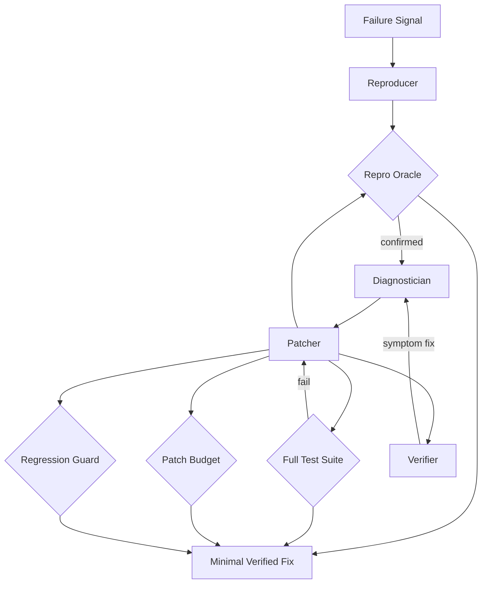

# Autonomous Debugger

**LSS Spec:** [autonomous-debugger.yaml](./autonomous-debugger.yaml)  
**Taxonomy Level:** 3 — Multi-Agent  
**LES Estimate:** **85 / 100**

## Loop Diagram

## Architecture

Reference **hypothesis-stack** debug loop—the highest LES entry in the library. Strict phase ordering: reproduce before diagnose, diagnose before patch, verify before accept.

Diagnostician ranks hypotheses from stack traces and git blame; bisect optional for regression isolation. Patcher applies smallest diff; verifier rejects symptom fixes (e.g., catching exceptions without addressing cause). regression_guard blocks unrelated file changes.

Procedural fix_patterns memory accelerates recognition of known bug signatures across sessions.

## LES Score Breakdown

| Category | Score | Rationale |
|----------|-------|-----------|
| Effectiveness | 0.90 | Test oracle ground truth |
| Speed | 0.85 | Hypothesis stack limits thrashing |
| Cost | 0.88 | $3.50 cap, tight scope |
| Robustness | 0.88 | Rollback + full suite |
| Scalability | 0.82 | Codebase graph reuse |
| Safety | 0.87 | No test weakening |
| Adaptability | 0.80 | Language-agnostic with test_command |
| Autonomy | 0.89 | Runs from failure_signal alone |

**Composite LES:** 0.85

## Recommended Models

| Worker | Primary | Fallback | Notes |
|--------|---------|----------|-------|
| Reproducer | GPT-4.1 Mini | Shell scripts | Deterministic repro |
| Diagnostician | GPT-5.3 Codex | Claude Sonnet 4.6 | Root cause analysis |
| Patcher | GPT-5.3 Codex | GPT-4.1 | Minimal diffs |
| Verifier | Claude Sonnet 4.6 | GPT-4.1 | Symptom-fix rejection |

## When to Use

- CI failure triage
- Regression isolation with bisect
- Night-shift autonomous repair with human review gate

## Anti-Patterns

- Patcher also serving as verifier (LES Safety → ~0.3)
- Raising max_patch_lines to avoid hard thinking
