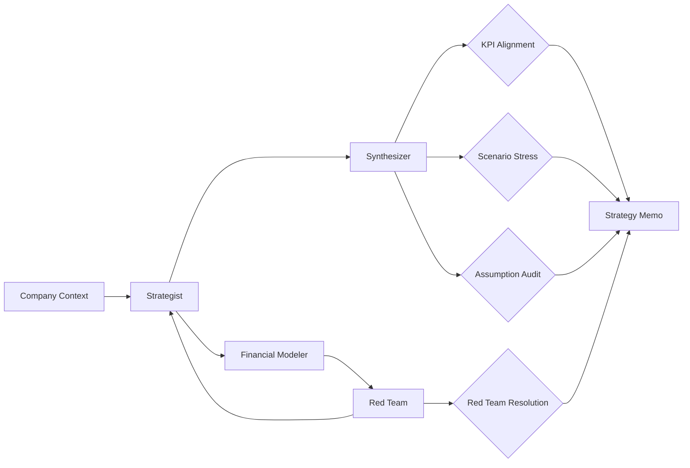

# Business Strategy Agent

**LSS Spec:** [business-strategy-agent.yaml](./business-strategy-agent.yaml)  
**Taxonomy Level:** 3 — Multi-Agent  
**LES Estimate:** **76 / 100**

## Loop Diagram

## Architecture

**Debate-then-converge** multi-agent pattern. Strategist proposes options; financial modeler quantifies; red team adversarially stress-tests the leading option. Synthesizer integrates into an executive memo only after evaluators pass.

Monte Carlo scenario_stress (1000 trials) ensures strategies survive demand shocks and competitor entry—not just base-case spreadsheets. The assumption_audit evaluator requires every material claim tagged with confidence and validation path, preventing "strategy theater."

Red team resolution is a hard gate: every critical finding must have mitigation or an explicit accepted_risk flag. This prevents polished memos that ignore fatal flaws.

## LES Score Breakdown

| Category | Score | Rationale |
|----------|-------|-----------|
| Effectiveness | 0.78 | Strong framing; weak without good inputs |
| Speed | 0.70 | Debate rounds are expensive |
| Cost | 0.68 | Opus + simulation tokens |
| Robustness | 0.80 | Stress tests surface tail risks |
| Scalability | 0.72 | Memo templates reuse well |
| Safety | 0.84 | Regulatory flags, no insider trading |
| Adaptability | 0.77 | General across industries |
| Autonomy | 0.75 | Exec review still expected |

**Composite LES:** 0.76

## Recommended Models

| Worker | Primary | Fallback | Notes |
|--------|---------|----------|-------|
| Strategist | Claude Opus 4.8 | GPT-4.1 | Option generation |
| Financial Modeler | GPT-4.1 | Code interpreter | Spreadsheet accuracy |
| Red Team | Claude Sonnet 4.6 | GPT-4.1 | Adversarial depth |
| Synthesizer | GPT-4.1 | Claude Sonnet 4.6 | Memo clarity |

## When to Use

- Strategic option comparison with quantified trade-offs
- Board-ready memos with explicit assumptions
- Pre-M&A scenario planning

## Anti-Patterns

- Skipping red team for speed (Robustness → ~0.5)
- Unstructured company_context (KPI alignment fails)
