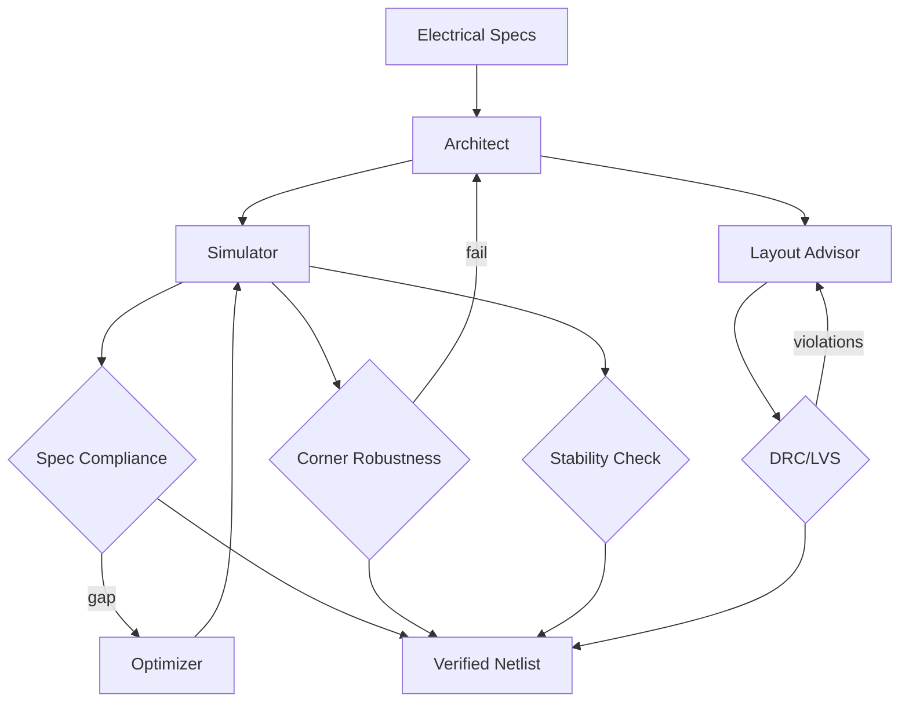

# Circuit Design Agent

**LSS Spec:** [circuit-design-agent.yaml](./circuit-design-agent.yaml)  
**Taxonomy Level:** 3 — Multi-Agent  
**LES Estimate:** **73 / 100**

## Loop Diagram

## Architecture

**Simulate–optimize** inner loop wrapped by topology-level revision. Architect selects topology; optimizer tunes parameters via Bayesian search; simulator runs AC/DC/transient across process corners (tt/ff/ss/fs/sf).

Layout advisor provides pre-tape-out feedback on matching and parasitics before DRC/LVS hard gate. Stability check enforces phase margin > 45°—non-negotiable for analog loops.

PDK version and netlist hash logged for every simulation run (reproducibility requirement).

## LES Score Breakdown

| Category | Score | Rationale |
|----------|-------|-----------|
| Effectiveness | 0.75 | Strong with good PDK models |
| Speed | 0.60 | SPICE sweeps are slow |
| Cost | 0.68 | Simulation compute + LLM |
| Robustness | 0.80 | Corner batch sim |
| Scalability | 0.65 | PDK-specific memory |
| Safety | 0.82 | abs_max and export control |
| Adaptability | 0.70 | Topology-class dependent |
| Autonomy | 0.74 | Needs valid PDK + ruleset |

**Composite LES:** 0.73

## Recommended Models

| Worker | Primary | Fallback | Notes |
|--------|---------|----------|-------|
| Architect | Claude Opus 4.8 | GPT-4.1 | Topology selection |
| Simulator | GPT-4.1 + ngspice | Local scripts | Metric extraction |
| Layout Advisor | Claude Sonnet 4.6 | — | Parasitic heuristics |
| Optimizer | GPT-4.1 Mini + BoTorch | Grid search | Parameter tuning |

## When to Use

- Op-amp and filter design iterations
- Mixed-signal block sizing before layout
- Teaching labs with verifiable specs

## Anti-Patterns

- Single-corner simulation only
- Skipping DRC for " schematic-only" handoff
