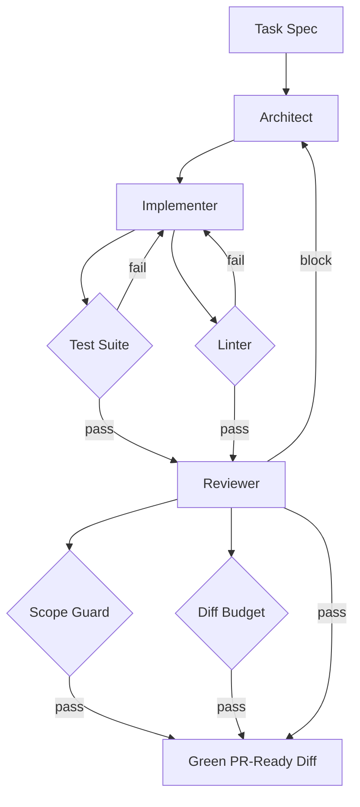

# Coding Agent

**LSS Spec:** [coding-agent.yaml](./coding-agent.yaml)  
**Taxonomy Level:** 3 — Multi-Agent  
**LES Estimate:** **82 / 100**

## Loop Diagram

## Architecture

A classic **maker–checker** multi-agent loop. The architect produces a file-touch plan before any code changes, reducing scope creep. The implementer owns the edit–test inner loop; the reviewer is blocked from seeing tests until a green local run completes, reducing grade inflation.

Four evaluators operate as hard gates: test suite (functional oracle), linter (style/safety oracle), diff budget (complexity cap), and scope guard (path allowlist). The scope guard is critical—without it, agents drift into refactors that invalidate LES Robustness scores.

Semantic memory indexes the codebase symbol graph so the architect avoids proposing changes to non-existent modules. Procedural memory stores repo-specific conventions learned from prior successful loops.

## LES Score Breakdown

| Category | Score | Rationale |
|----------|-------|-----------|
| Effectiveness | 0.88 | High when tests cover task |
| Speed | 0.78 | Review rounds add 20–40% time |
| Cost | 0.72 | $5 cap; implementer dominates spend |
| Robustness | 0.85 | Rollback on test regression |
| Scalability | 0.80 | Code index amortizes over tasks |
| Safety | 0.86 | Secret path blocking, command allowlist |
| Adaptability | 0.79 | Works across stacks with test_command config |
| Autonomy | 0.84 | Minimal human input after spec |

**Composite LES:** 0.82

## Recommended Models

| Worker | Primary | Fallback | Notes |
|--------|---------|----------|-------|
| Architect | Claude Sonnet 4.6 | GPT-4.1 | Planning accuracy |
| Implementer | GPT-5.3 Codex | Claude Sonnet 4.6 | Code generation + tools |
| Reviewer | Claude Sonnet 4.6 | GPT-4.1 | Security smell detection |

## When to Use

- Feature implementation with existing test coverage
- Bug fixes within bounded file sets
- Refactors with explicit allowed_paths

## Anti-Patterns

- Empty test suite (Effectiveness drops below 0.5)
- Reviewer and implementer sharing the same model instance without role separation
