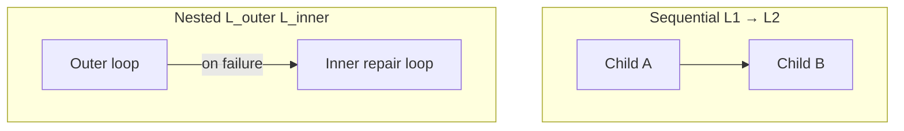

# Composed Loops

**LSS 1.1 draft** — loops inside loops via explicit `composition` blocks. Each spec is a valid LSS 1.0 orchestrator shell plus a typed child graph.

## Catalog

| Composition | Type | Children | LES Est. | Use when |
|-------------|------|----------|----------|----------|
| [research-to-writing](./research-to-writing.yaml) | sequential | research → writing | 81 | Brief → polished doc |
| [startup-to-strategy](./startup-to-strategy.yaml) | sequential | validator → strategy | 77 | PMF evidence → decision memo |
| [code-debug-repair](./code-debug-repair.yaml) | **nested** | coding ⊃ debugger | 86 | Ship feature; auto-repair on test fail |
| [research-code-nest](./research-code-nest.yaml) | **nested** | research ⊃ coding | 84 | Research then prototype in one loop |

## Nested vs sequential



- **Sequential:** each child runs once in order; adapters pass outputs forward.
- **Nested:** outer runs first; inner child(s) invoke only when outer fails its gate (e.g. test suite).

## Validate and run

```bash
python scripts/validate_loop_library.py      # atomic + composed specs
python tools/composition_validator.py --library
python examples/compose-loop/run.py loop-library/compositions/code-debug-repair.yaml
```

## Design rules

1. **Never merge evaluators** across children — each child keeps its own oracles.
2. **Adapters are typed glue** — declare `from`/`to` paths explicitly.
3. **Cost caps sum** — parent `cost_limits.cumulative_usd` ≥ sum of child budgets.

See [RFC-LSS-1.1-composition.md](../../contributions/RFC-LSS-1.1-composition.md) and [loop-composition-algebra.md](../../research/loop-composition-algebra.md).
