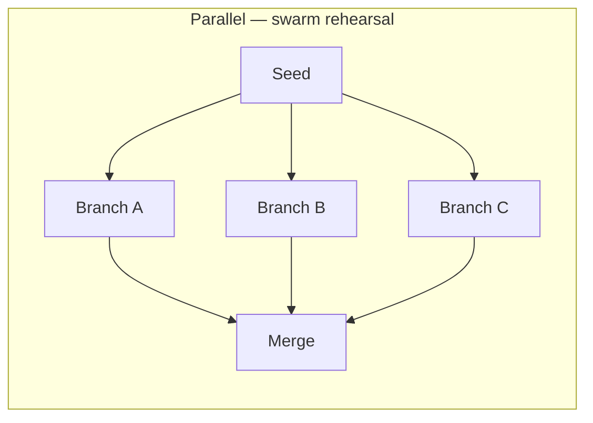

# Composed Loops

**LSS 1.1 draft** — loops inside loops via explicit `composition` blocks.

## Catalog

| Composition | Type | Children | LES Est. | Use when |
|-------------|------|----------|----------|----------|
| [scenario-swarm-rehearsal](./scenario-swarm-rehearsal.yaml) | **parallel** | 3 branches | 83 | Launch/policy rehearsal ([MiroFish-inspired](./scenario-swarm-rehearsal.md)) |
| [code-debug-repair](./code-debug-repair.yaml) | **nested** | coding ⊃ debugger | 86 | Ship feature; auto-repair on test fail |
| [research-code-nest](./research-code-nest.yaml) | **nested** | research ⊃ coding | 84 | Research then prototype |
| [research-to-writing](./research-to-writing.yaml) | sequential | research → writing | 81 | Brief → polished doc |
| [startup-to-strategy](./startup-to-strategy.yaml) | sequential | validator → strategy | 77 | PMF evidence → decision memo |

## Composition operators



- **Parallel:** same seed, divergent `lens` per branch; `merge.min_branches_pass` gates success.
- **Nested:** outer first; inner on failure trigger.
- **Sequential:** adapters chain outputs forward.

## Validate and run

```bash
python scripts/validate_loop_library.py
python tools/composition_validator.py --library
python examples/compose-loop/run.py loop-library/compositions/scenario-swarm-rehearsal.yaml
```

## Design rules

1. Each child keeps its own evaluators — no merged oracles.
2. Parallel branches must declare a `merge` block.
3. Preserve dissent in parallel merge output when `preserve_dissent: true`.

See [RFC-LSS-1.1-composition.md](../../contributions/RFC-LSS-1.1-composition.md).
