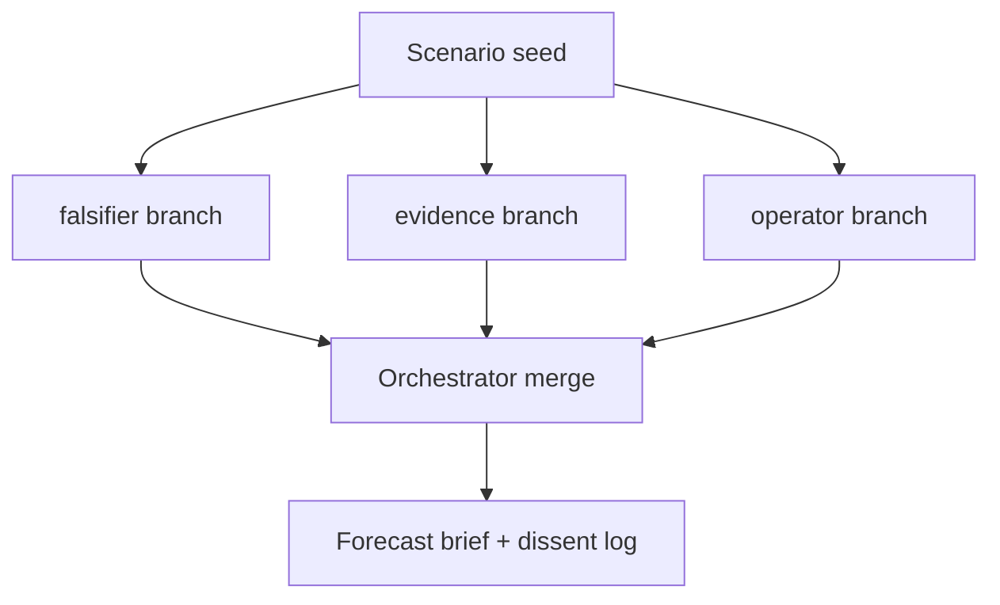

# Scenario Swarm Rehearsal (Parallel)

**Composition type:** parallel  
**Inspired by:** [MiroFish](https://github.com/666ghj/MiroFish) dual-world simulation — divergent branches run concurrently, then merge into a forecast brief.

## Bridge: MiroFish → LSS (existing audience)

| MiroFish | Loop Engineering (this spec) |
|----------|-------------------------------|
| Millions of agent personas in a sandbox | **3 declarative branches** (falsifier, evidence, operator) |
| Implicit graph in app UI | Portable **LSS 1.1 `composition: parallel`** YAML |
| Opaque merge | **`merge.preserve_dissent`** + orchestrator rubric |
| Requires MiroFish runtime | Runs via [`composed_runtime.py`](../../implementations/generic/composed_runtime.py) or LoopBench **LB-COMP-1** |

**You already run parallel worldview sims?** Map your branches to this spec, then score:

```bash
python examples/compose-loop/run.py loop-library/compositions/scenario-swarm-rehearsal.yaml
loopbench run --task LB-COMP-1 --spec loop-library/compositions/scenario-swarm-rehearsal.yaml --seeds 0,1,2,3,4 -o results.json
```

Post your run on the [reproduction challenge](https://github.com/KanakMalpani/Loop-Engineering/discussions/10).

---

## Community gap

Most agent stacks offer **debate** (adversarial rounds) or **sequential pipelines**. Few ship a portable spec for **parallel worldview rehearsal**:

- Same scenario, **different lenses** at once (falsifier, evidence, operator)
- **Merge with dissent preserved** — not a single median answer
- Reusable for launch decisions, policy drafts, fundraising narratives, incident post-mortems

This is the Loop Engineering take on “rehearse the future in a sandbox” without requiring a million-agent runtime.

## Architecture



| Branch | Child loop | Lens |
|--------|------------|------|
| falsifier | startup-validator | Pre-mortem: what kills this? |
| evidence | research-agent | Sourced facts + uncertainty |
| operator | business-strategy-agent | 90-day action memo |

## When to use

- Before a **launch, fundraise, or policy commit** — not for simple Q&A
- When you need **structured disagreement**, not consensus theater
- When sequential research→strategy is too slow for time-boxed decisions

## Run

```bash
python examples/compose-loop/run.py loop-library/compositions/scenario-swarm-rehearsal.yaml
```

## vs debate-loop

| | Debate loop | Scenario swarm rehearsal |
|--|-------------|--------------------------|
| Flow | Rounds of rebuttal | Parallel independent branches |
| Merge | Judge picks winner | Synthesizer preserves all branch outputs |
| Best for | Argument quality | Decision rehearsal under uncertainty |

See [debate-loop.md](../../patterns/debate-loop.md) for adversarial round-based patterns.
