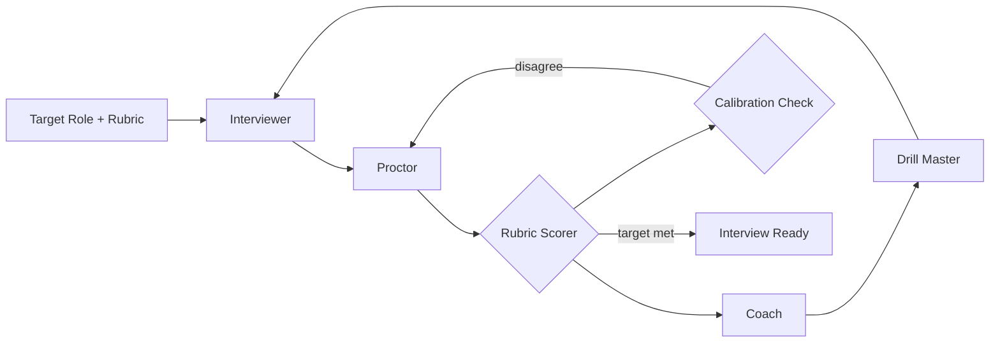

# Interview Coach

**LSS Spec:** [interview-coach.yaml](./interview-coach.yaml)  
**Taxonomy Level:** 2 — Reflective  
**LES Estimate:** **77 / 100**

## Loop Diagram

## Architecture

**Spaced mock interviews** with strict role separation: interviewer simulates; proctor scores without coaching mid-session. Dual-model calibration_check limits rubric drift between scoring passes.

Coach delivers feedback only after session completion, preserving realistic pressure. Drill master generates micro-exercises targeting weakest rubric dimensions before difficulty ramps.

Termination requires two consecutive sessions above target_score—preventing lucky single-session passes.

## LES Score Breakdown

| Category | Score | Rationale |
|----------|-------|-----------|
| Effectiveness | 0.80 | Rubric-aligned improvement |
| Speed | 0.75 | 48h spacing between mocks |
| Cost | 0.74 | $4 cap over 5 sessions |
| Robustness | 0.78 | Calibration check stabilizes scores |
| Scalability | 0.73 | Question bank grows per role |
| Safety | 0.85 | Bias checks, no false certification |
| Adaptability | 0.79 | Multi interview_type support |
| Autonomy | 0.76 | Candidate self-schedules |

**Composite LES:** 0.77

## Recommended Models

| Worker | Primary | Fallback | Notes |
|--------|---------|----------|-------|
| Interviewer | Claude Sonnet 4.6 | GPT-4.1 | Realistic follow-ups |
| Proctor | GPT-4.1 | Claude Sonnet 4.6 | Strict scoring |
| Coach | Claude Sonnet 4.6 | GPT-4.1 | Actionable feedback |
| Drill Master | GPT-4.1 Mini | — | Rapid micro-drills |

## When to Use

- FAANG-style technical interview prep
- Behavioral STAR coaching
- System design rehearsal with rubric feedback

## Anti-Patterns

- Coach allowed during mock (invalidates scores)
- Single-session termination
