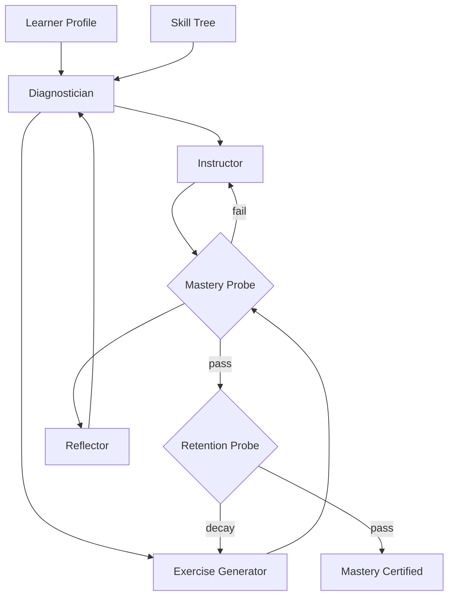

# Learning Coach

**LSS Spec:** [learning-coach.yaml](./learning-coach.yaml)  
**Taxonomy Level:** 2 — Reflective  
**LES Estimate:** **80 / 100**

## Loop Diagram

## Architecture

**Mastery-based progression** over a prerequisite-respecting skill tree. The diagnostician maintains a knowledge state model using Item Response Theory calibration on mastery probes. Instructor applies fading scaffolding: hint rates must fall below 0.3 hints per correct answer before node advancement.

Delayed retention probes (default 24h) distinguish cramming from durable learning—a key Effectiveness differentiator. The reflector worker adds metacognitive prompts without contaminating probe scoring.

Session engagement guard enforces max duration to prevent fatigue-driven false negatives.

## LES Score Breakdown

| Category | Score | Rationale |
|----------|-------|-----------|
| Effectiveness | 0.85 | Retention probes validate real learning |
| Speed | 0.82 | Session-bounded iterations |
| Cost | 0.88 | $1.50 total cap |
| Robustness | 0.79 | Remediation cycles handle failure |
| Scalability | 0.76 | Per-learner state grows linearly |
| Safety | 0.86 | No answer dumping on graded work |
| Adaptability | 0.83 | Skill tree configurable |
| Autonomy | 0.77 | Learner drives pace |

**Composite LES:** 0.80

## Recommended Models

| Worker | Primary | Fallback | Notes |
|--------|---------|----------|-------|
| Diagnostician | GPT-4.1 | Claude Sonnet 4.6 | State estimation |
| Instructor | Claude Sonnet 4.6 | GPT-4.1 | Pedagogical clarity |
| Exercise Generator | GPT-4.1 Mini | Gemini Flash | Novel item generation |
| Reflector | GPT-4.1 Mini | — | Lightweight summaries |

## When to Use

- Technical skill onboarding with measurable outcomes
- Certification prep with spaced repetition
- Corporate training with audit trails

## Anti-Patterns

- Advancing on first probe pass without retention check
- Identical exercises repeated (Adaptability collapse)
