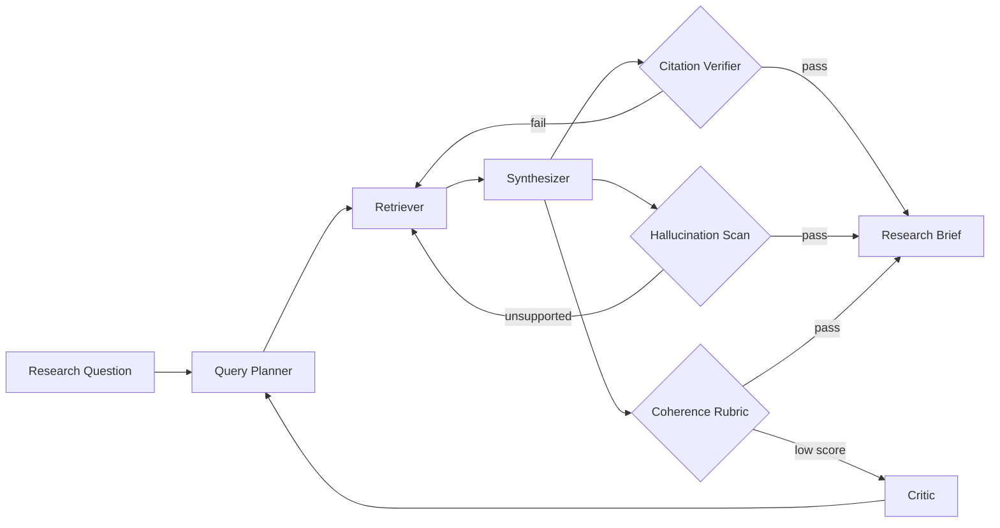

# Research Agent

**LSS Spec:** [research-agent.yaml](./research-agent.yaml)  
**Taxonomy Level:** 2 — Reflective  
**LES Estimate:** **78 / 100**

## Loop Diagram

## Architecture

The research agent implements a **retrieve–synthesize–verify** cycle. Four workers partition concerns: planning queries, fetching evidence, drafting prose, and adversarial review. Three independent evaluators form a **triangular oracle**—citation integrity, entailment alignment, and rhetorical coherence must all pass before termination.

Episodic memory holds raw search results and extracted passages for the session. Semantic memory persists verified claims and contradiction pairs across runs, enabling the loop to avoid re-litigating settled facts. The critic worker prevents premature convergence: low coherence scores trigger targeted re-retrieval rather than cosmetic rewrites.

Optimization uses hill-climbing with backtrack: if coherence regresses after a revision, the loop restores the prior draft state and tries an alternate synthesis path. Stagnation detection (three iterations without improvement) halts with a partial brief flagged explicitly in the output schema.

## LES Score Breakdown

| Category | Score | Rationale |
|----------|-------|-----------|
| Effectiveness | 0.82 | Strong when sources exist; weak on niche pre-2020 topics |
| Speed | 0.74 | Multi-query retrieval adds latency |
| Cost | 0.76 | Capped at $2.50; retriever-heavy |
| Robustness | 0.77 | Backtrack handles synthesis regressions |
| Scalability | 0.70 | Vector store growth linear with depth |
| Safety | 0.85 | Provenance logging and domain disclaimers |
| Adaptability | 0.80 | Query planner generalizes across domains |
| Autonomy | 0.78 | Runs unattended; human needed for paywalled sources |

**Composite LES:** 0.78

## Recommended Models

| Worker | Primary | Fallback | Notes |
|--------|---------|----------|-------|
| Query Planner | Claude Sonnet 4.6 | GPT-4.1 | Strong decomposition |
| Retriever | GPT-4.1 Mini | Gemini Flash | Tool-use reliability |
| Synthesizer | Claude Sonnet 4.6 | Claude Opus 4.8 | Long-context synthesis |
| Critic | GPT-4.1 | Claude Sonnet 4.6 | Adversarial consistency |
| Citation Verifier | Deterministic + Mini LLM | — | Hybrid oracle preferred |

## When to Use

- Literature reviews with mandatory citations
- Competitive intelligence with source audit trails
- Due diligence research packs

## Anti-Patterns

- Using as sole legal/medical authority without human review
- Disabling citation_verifier to save cost (collapses LES Safety to ~0.4)
