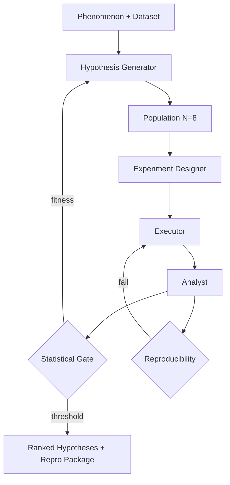

# Scientific Discovery Agent

**LSS Spec:** [scientific-discovery-agent.yaml](./scientific-discovery-agent.yaml)  
**Taxonomy Level:** 4 — Evolutionary  
**LES Estimate:** **71 / 100**

## Loop Diagram

## Architecture

An **evolutionary outer loop** wraps reflective inner cycles. Each generation maintains a population of competing hypotheses mutated and crossed over by the hypothesis generator. The experiment designer pre-registers analysis plans before execution—a hard requirement enforced by the falsification_log evaluator.

Fitness combines statistical significance, effect size, simplicity penalty, and replication success. Elitism preserves top-two hypotheses; tournament selection maintains diversity. Population collapse detection injects random immigrants to escape local optima.

Container sandbox execution with fixed seeds ensures reproducibility_check can hash-match outputs. The analyst acts as p-hacking guard: post-hoc test sequences are flagged but cannot advance selection.

## LES Score Breakdown

| Category | Score | Rationale |
|----------|-------|-----------|
| Effectiveness | 0.70 | Depends on phenomenon tractability |
| Speed | 0.55 | Generations × experiments = slow |
| Cost | 0.60 | $15 cap; compute-heavy |
| Robustness | 0.75 | Replication gate catches flaky wins |
| Scalability | 0.65 | Population size linear cost |
| Safety | 0.82 | Sandbox + IRB guard |
| Adaptability | 0.78 | General across quantitative domains |
| Autonomy | 0.72 | Needs dataset access setup |

**Composite LES:** 0.71

## Recommended Models

| Worker | Primary | Fallback | Notes |
|--------|---------|----------|-------|
| Hypothesis Generator | Claude Opus 4.8 | GPT-4.1 | Creative mutation |
| Experiment Designer | Claude Sonnet 4.6 | GPT-4.1 | Pre-registration discipline |
| Executor | GPT-4.1 Mini | Local Python | Deterministic runs |
| Analyst | GPT-4.1 | Claude Sonnet 4.6 | Stats rigor |

## When to Use

- Exploratory data analysis with falsifiable hypotheses
- Automated feature discovery in structured datasets
- Research prototyping before human lab validation

## Anti-Patterns

- Small datasets without power analysis (false discoveries)
- Disabling replication for speed (Robustness collapse)
