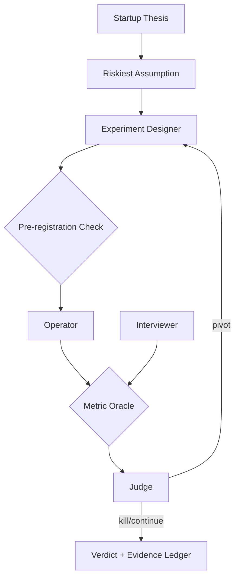

# Startup Validator

**LSS Spec:** [startup-validator.yaml](./startup-validator.yaml)  
**Taxonomy Level:** 2 — Reflective  
**LES Estimate:** **74 / 100**

## Loop Diagram

## Architecture

**Sequential falsification** loop inspired by Lean Startup methodology. One assumption tested at a time with frozen success criteria before data collection. The preregistration_check invalidates runs if criteria move mid-flight—preventing metric hacking.

The judge worker compares outcomes to pre-registered thresholds without goalpost movement. Qualitative interviews feed contradictions back to experiment design, not directly to the verdict, preserving quantitative rigor.

Falsification registry in semantic memory accumulates killed hypotheses across pivots, building an auditable PMF evidence ledger.

## LES Score Breakdown

| Category | Score | Rationale |
|----------|-------|-----------|
| Effectiveness | 0.76 | Decisive when experiments well-designed |
| Speed | 0.65 | Wall-clock dominated by real users |
| Cost | 0.80 | Low LLM cost; ad spend separate |
| Robustness | 0.78 | Pre-registration prevents self-deception |
| Scalability | 0.70 | One experiment at a time |
| Safety | 0.83 | Deception and privacy guards |
| Adaptability | 0.75 | Templates across B2B/B2C |
| Autonomy | 0.72 | Human needed for customer access |

**Composite LES:** 0.74

## Recommended Models

| Worker | Primary | Fallback | Notes |
|--------|---------|----------|-------|
| Experiment Designer | Claude Sonnet 4.6 | GPT-4.1 | Falsifiable design |
| Operator | GPT-4.1 Mini | Automation scripts | Tool execution |
| Interviewer | GPT-4.1 | Claude Sonnet 4.6 | Qual synthesis |
| Judge | Claude Sonnet 4.6 | GPT-4.1 | Neutral verdicts |

## When to Use

- Pre-seed assumption testing
- Pivot/kill/continue decisions with audit trail
- Accelerator cohort experiment design

## Anti-Patterns

- Parallel experiments on correlated assumptions
- Judge allowed to revise success_criteria after data
