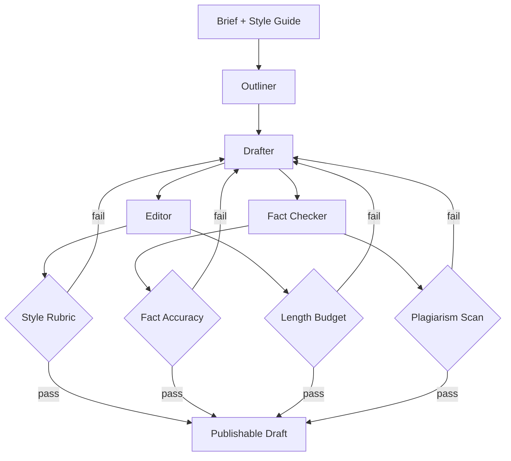

# Writing Assistant

**LSS Spec:** [writing-assistant.yaml](./writing-assistant.yaml)  
**Taxonomy Level:** 2 — Reflective  
**LES Estimate:** **79 / 100**

## Loop Diagram

## Architecture

**Hierarchical revision**: outline locked after approval, then section-level edit loops. Four evaluators run in parallel on each draft generation—style, length, facts, plagiarism.

Fact checker operates per policy tier (light/standard/rigorous). Rigorous mode requires primary source for every quantitative claim. Editor and fact checker feed independent channels to drafter to prevent fact-sacrificing-for-style tradeoffs.

Semantic fact_registry persists verified claims for reuse in series content.

## LES Score Breakdown

| Category | Score | Rationale |
|----------|-------|-----------|
| Effectiveness | 0.84 | Multi-oracle quality gate |
| Speed | 0.72 | Full draft rewrites capped at 2 |
| Cost | 0.70 | Opus drafter dominates |
| Robustness | 0.80 | Separate fact/style channels |
| Scalability | 0.75 | Style profiles reusable |
| Safety | 0.86 | Defamation and copyright guards |
| Adaptability | 0.82 | Brief-driven configuration |
| Autonomy | 0.78 | Optional human acceptance gate |

**Composite LES:** 0.79

## Recommended Models

| Worker | Primary | Fallback | Notes |
|--------|---------|----------|-------|
| Outliner | Claude Sonnet 4.6 | GPT-4.1 | Structure |
| Drafter | Claude Opus 4.8 | Claude Sonnet 4.6 | Voice quality |
| Editor | GPT-4.1 | Claude Sonnet 4.6 | Line editing |
| Fact Checker | GPT-4.1 Mini + search | — | Verification speed |

## When to Use

- Long-form articles, whitepapers, newsletters
- Research-backed content with citation requirements
- Brand-voice constrained marketing copy

## Anti-Patterns

- Skipping outline lock (structural drift)
- Disabling fact_checker for "creative" pieces on factual topics
