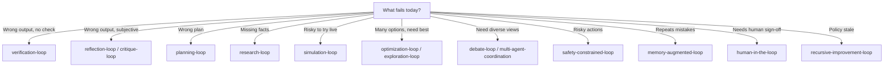

# Loop Engineering Patterns

Patterns are **reusable loop compositions**—proven control structures you embed inside a taxonomy level. A pattern answers *how* to wire observe–act–evaluate phases; a level answers *how deep* the cognition goes.

**Scaffold a spec:** once you pick a pattern, use [LoopForge](../All%20about%20loops/LOOP_FORGE.md) or the [Golden Path](../contributions/GOLDEN_PATH.md):

```bash
python -m loopforge new --pattern reflection --name my-loop --objective "Your goal" --output loop-library/my-loop.yaml
```

Each pattern document is self-contained: problem, solution, architecture, workflow, mermaid diagram, pseudocode, implementation notes, tradeoffs, and failure modes.

---

## Pattern Catalog

| Pattern | Level | One-line summary |
|---------|-------|------------------|
| [reflection-loop](./reflection-loop.md) | L2 | Agent evaluates its own output before commit |
| [critique-loop](./critique-loop.md) | L2 | Dedicated critic model gates generator output |
| [planning-loop](./planning-loop.md) | L2 | Plan → validate → execute with replan on failure |
| [verification-loop](./verification-loop.md) | L2 | Deterministic checks drive retry until pass |
| [research-loop](./research-loop.md) | L1–L2 | Iterative gather → synthesize until coverage met |
| [simulation-loop](./simulation-loop.md) | L2–L4 | Hypothesize → simulate → update belief |
| [debate-loop](./debate-loop.md) | L3 | Adversarial agents argue; judge merges |
| [exploration-loop](./exploration-loop.md) | L4 | Branch search with backtracking / bandits |
| [optimization-loop](./optimization-loop.md) | L4 | Score candidates; keep best; mutate |
| [memory-augmented-loop](./memory-augmented-loop.md) | L2–L5 | Read/write episodic or semantic memory each iteration |
| [human-in-the-loop](./human-in-the-loop.md) | L1–L3 | Explicit human approval or edit gates |
| [safety-constrained-loop](./safety-constrained-loop.md) | All | Policy envelope wraps any inner loop |
| [multi-agent-coordination](./multi-agent-coordination.md) | L3 | Orchestrator + specialists + merge protocol |
| [recursive-improvement-loop](./recursive-improvement-loop.md) | L5–L6 | Successive self-edits with convergence bounds |

---

## Patterns by Category

### Reflective & Quality Gates (L2)

- **[reflection-loop](./reflection-loop.md)** — Same-agent second pass before side effects.
- **[critique-loop](./critique-loop.md)** — Independent critic separates generation from judgment.
- **[verification-loop](./verification-loop.md)** — Executable checks as the verdict function.
- **[planning-loop](./planning-loop.md)** — Validate intent before mutating the world.

### Information & Search (L1–L4)

- **[research-loop](./research-loop.md)** — Evidence gathering with coverage-driven refinement.
- **[simulation-loop](./simulation-loop.md)** — Safe world model before production action.
- **[exploration-loop](./exploration-loop.md)** — Tree search and backtracking over action space.
- **[optimization-loop](./optimization-loop.md)** — Population-based improvement on explicit fitness.

### Multi-Agent & Governance (L1–L6)

- **[debate-loop](./debate-loop.md)** — Structured disagreement with judge resolution.
- **[multi-agent-coordination](./multi-agent-coordination.md)** — Orchestrated specialists with typed handoffs.
- **[human-in-the-loop](./human-in-the-loop.md)** — Pause/resume gates for human authority.
- **[safety-constrained-loop](./safety-constrained-loop.md)** — Outer envelope for every inner pattern.

### Persistence & Meta (L2–L6)

- **[memory-augmented-loop](./memory-augmented-loop.md)** — Retrieve and write durable learnings each tick.
- **[recursive-improvement-loop](./recursive-improvement-loop.md)** — Bounded self-edits evaluated on benchmarks.

---

## Selection Guide



---

## Recommended Compositions

| Goal | Outer → Inner stack |
|------|---------------------|
| Production coding agent | `safety-constrained-loop` → `planning-loop` → `verification-loop` → `critique-loop` |
| Research report | `research-loop` → `debate-loop` → `human-in-the-loop` |
| Autonomous tuning | `safety-constrained-loop` → `optimization-loop` → `verification-loop` |
| Long-running assistant | `memory-augmented-loop` → `reflection-loop` → task-specific inner loop |
| Self-improving harness | `safety-constrained-loop` → `recursive-improvement-loop` → benchmark `verification-loop` |

---

## Composition Rules

1. **Outer safety wraps inner cognition**: `safety-constrained-loop` should envelope debate, optimization, and self-modification patterns.
2. **Verification before reflection**: prefer cheap deterministic `verification-loop` before expensive LLM critique.
3. **One primary driver per macro-iteration**: avoid running optimization and debate in the same tick without orchestration budget.
4. **Human gates on irreversible actions**: pair `human-in-the-loop` with planning and safety envelopes for deploy/send/delete paths.
5. **Log pattern name in telemetry**: enables post-hoc cost attribution and failure taxonomy.

---

## Pattern Document Structure

Every file in this catalog follows the same schema:

| Section | Purpose |
|---------|---------|
| **Problem** | Failure mode the pattern addresses |
| **Solution** | Control structure and invariants |
| **Architecture** | Components, data flow, diagrams |
| **Workflow** | Numbered steps with stop conditions |
| **Pseudocode** | Language-neutral control logic |
| **Implementation notes** | Practical engineering guidance |
| **Tradeoffs** | Pros and cons table |
| **Failure modes** | Signals and mitigations |
| **Taxonomy level** | Cross-link to [../taxonomy/README.md](../taxonomy/README.md) |

---

## Implementations

Reference implementations live under [../implementations/](../implementations/):

- `generic/reflection_loop.py` — reflection pattern
- `generic/verification_loop.py` — verification pattern
- `generic/research_loop.py` — research pattern
- `generic/multi_agent_loop.py` — multi-agent coordination
- `langgraph/reflection_graph.py` — graph-based reflection

---

## Taxonomy Cross-Reference

See [../taxonomy/README.md](../taxonomy/README.md) for the six-level capability model (L1 single-step through L6 recursive meta). Patterns do not replace levels—they **instantiate** them in concrete control flow.

See [../fundamentals/01-what-is-a-loop.md](../fundamentals/01-what-is-a-loop.md) for formal definitions of state, action, observation, transition, evaluation, and termination.
