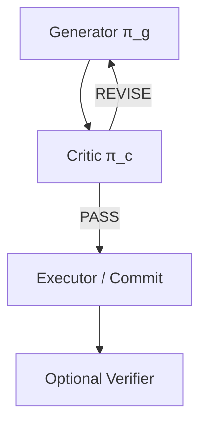
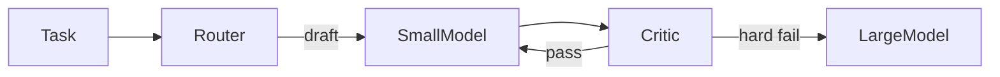

# Critique Loop

## Problem

Self-reflection shares the generator's biases. A single model both produces and judges, so it approves subtle logical errors, security holes, or hallucinated citations. **One policy** cannot reliably adversarial-review itself at depth.

This failure is especially dangerous in high-stakes domains: the agent "checks its work" and still ships a broken or unsafe artifact.

## Solution

Separate **generator** π_g and **critic** π_c—distinct prompts, and often distinct models (e.g., fast generator + strong critic). The critic never executes tools that mutate production state; it returns structured verdicts only. The generator revises from critic feedback until pass or budget exhaustion.

**Invariant**: critic context includes goal + candidate but excludes generator chain-of-thought unless explicitly needed for audit—reduces sycophantic agreement.

## Architecture



**Dual-model routing:**



| Component | Role |
|-----------|------|
| Generator | Produces and revises candidate artifacts |
| Critic | Scores against rubric; emits actionable issues |
| Rubric | Weighted dimensions with blocking thresholds |
| Executor | Applies approved artifact with write-capable tools |

## Workflow

1. Generator produces initial candidate artifact from goal spec.
2. Critic scores against rubric dimensions (correctness, safety, completeness, style).
3. If any **blocking** dimension falls below threshold → return issues to generator with severity tags.
4. Generator revises; repeat until pass or round budget exhausted.
5. Executor commits approved artifact; optional deterministic verifier runs post-commit.
6. On budget exceed → return best snapshot + unresolved issues for human review.

## Pseudocode

```
function critique_loop(goal, max_rounds=5):
    candidate = generator.run(goal)
    best = (candidate, score=-inf)
    for i in 1..max_rounds:
        review = critic.evaluate(candidate, goal, rubric=R)
        best = max(best, (candidate, review.score), key=score)
        if review.blocking_count == 0:
            return executor.commit(candidate)
        candidate = generator.revise(candidate, review.issues)
    return escalate(best.candidate, review.unresolved)
```

## Implementation Notes

- **Critic temperature low** (0–0.3); generator may be higher for creative exploration.
- Critic must output **actionable** issues: `{location, problem, suggested_fix, severity, dimension}`.
- Prevent critic tool access to user secrets unless red-team role is explicitly scoped.
- Log disagreement rate between critic verdict and post-hoc tests—calibrate rubric weights over time.
- For code: run static analysis and unit tests **before** LLM critic to save tokens and anchor facts.
- Separate **blocking** vs. **advisory** findings so revision loops don't chase polish forever.

## Tradeoffs

| Pros | Cons |
|------|------|
| Independent judgment reduces self-bias | Minimum 2× model cost |
| Flexible model routing (cheap draft, strong review) | Handoff and schema latency |
| Strong for security and compliance review | Critic can be overly harsh or pedantic |
| Clear audit trail of issues and resolutions | Rubric design becomes maintenance burden |

## Failure Modes

| Mode | Signal | Mitigation |
|------|--------|------------|
| Generator-critic collusion | Shared weights or identical prompts | True model/prompt split |
| Scope creep | Critic redesigns the feature | Rubric: in-scope vs. out-of-scope tags |
| Stale critic | Wrong API or library knowledge | Tool-augmented critic with live docs |
| Endless revise | Never reaches PASS | Max rounds + best-of snapshot fallback |
| Severity inflation | Everything marked blocking | Calibrate thresholds; human sample audit |

## Taxonomy Level

**Level 2** — Reflective Loops. Escalate to `debate-loop` when multiple orthogonal critics are required, or `verification-loop` when checks can be made deterministic.
