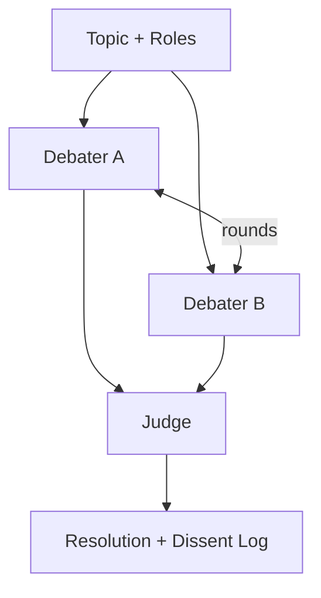

# Debate Loop

## Problem

Single-agent reasoning collapses to one framing. Complex decisions need **orthogonal perspectives**—security vs. UX, short-term vs. long-term, optimistic vs. pessimistic—but one model tends toward a median answer that hides unresolved conflict.

Without structured disagreement, blind spots survive every reflection pass.

## Solution

Deploy **adversarial debaters** with assigned roles (proposer, challenger, devil's advocate) plus a **judge** that merges or selects. Debaters iterate rounds of argument and rebuttal on structured claims; the judge emits a decision with explicit dissent preserved.

**Invariant**: debaters cannot mutate external state; only the judge may emit the final actionable artifact after debate terminates.

## Architecture



| Component | Role |
|-----------|------|
| Proposer | Argues for a concrete plan or answer |
| Challenger | Attacks assumptions, cites counter-evidence |
| Optional specialists | Domain roles (legal, safety, cost) |
| Judge | Synthesizes, scores arguments, decides |
| Transcript | Immutable record of claims and rebuttals |

## Workflow

1. Frame debate question, success criteria, and role assignments.
2. Proposer submits initial structured argument (claims + evidence).
3. Challenger rebuts specific claims; may introduce new evidence.
4. Repeat for N rounds or until argument novelty falls below threshold.
5. Judge evaluates claim strength, flags unresolved disputes, emits decision.
6. Optional: human reviews dissent log before execution.

## Pseudocode

```
function debate_loop(question, roles, max_rounds=4):
    transcript = []
    proposal = proposer.open(question)
    transcript.append(proposal)
    for r in 1..max_rounds:
        rebuttal = challenger.rebut(transcript, question)
        transcript.append(rebuttal)
        if novelty(rebuttal) < epsilon:
            break
        proposal = proposer.respond(transcript)
        transcript.append(proposal)
    decision = judge.resolve(transcript, question)
    return {decision, dissent: judge.unresolved, transcript}
```

## Implementation Notes

- Assign **non-overlapping incentives** in role prompts; avoid symmetric "discuss" prompts.
- Require claims as `{id, text, evidence_refs[]}` so rebuttals target IDs precisely.
- Judge temperature low; may use stronger model than debaters.
- Cap transcript length via rolling summaries of settled claims.
- For high-stakes decisions, preserve **dissent** in output even when judge picks a side.
- Debate cost scales with rounds × debaters—use early-stop on convergence metrics.

## Tradeoffs

| Pros | Cons |
|------|------|
| Surfaces hidden tradeoffs | High token and latency cost |
| Reduces single-framing bias | Debates can perform conflict without resolution |
| Rich audit trail | Judge may flatten nuance incorrectly |
| Strong for policy and design | Role prompts require careful engineering |

## Failure Modes

| Mode | Signal | Mitigation |
|------|--------|------------|
| Theater debate | Rhetoric without new evidence | Require evidence refs per claim |
| Judge capture | Judge repeats last speaker | Blind judge; hide debater identities |
| Stalemate | Circular arguments | Max rounds + forced judge decision |
| False consensus | Dissent suppressed | Mandate dissent section in output |
| Cost blowup | Unbounded transcript | Summarize settled claims each round |

## Taxonomy Level

**Level 3** — Multi-Agent Loops. Compose with `multi-agent-coordination` for execution after debate and `safety-constrained-loop` for action emission.
