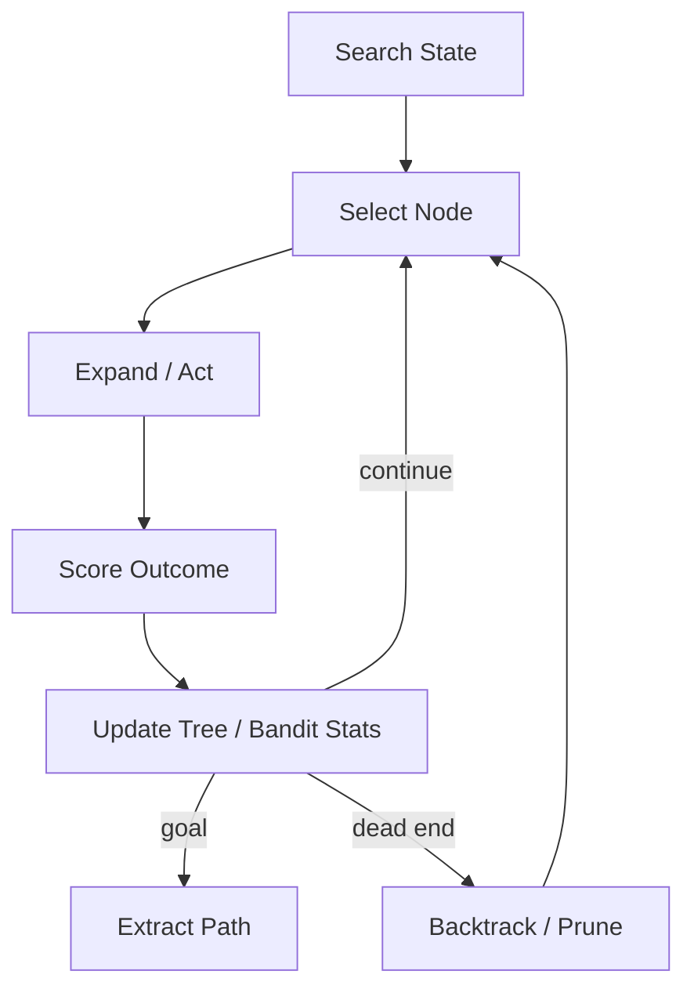

# Exploration Loop

## Problem

Greedy agents commit to the first viable path and miss better alternatives. Tasks with **large branching factor**—debugging, design search, puzzle solving—require systematic exploration with backtracking, not linear retries on a single trajectory.

Without exploration structure, loops look like repetition without learning which branches to abandon.

## Solution

Treat the task as a **search tree** or bandit problem. The exploration loop selects nodes via policy (DFS, BFS, MCTS, UCB), expands them with agent actions, scores outcomes, and backtracks or prunes unpromising branches. State captures path, depth, and accumulated rewards.

**Invariant**: every expansion records parent pointer and rollback action so backtrack restores prior world state when possible.

## Architecture



| Component | Role |
|-----------|------|
| Frontier | Priority queue or stack of unexplored nodes |
| Expansion policy | Agent or heuristic proposing child actions |
| Scorer | Heuristic, verifier partial pass, or learned value |
| Pruner | Cuts subtrees below score floor or depth limit |
| Path extractor | Reconstructs winning action sequence |

## Workflow

1. Initialize root node from initial state and goal heuristic.
2. Select frontier node via exploration strategy (explore/exploit balance).
3. Expand: agent proposes k candidate actions; apply in sandbox when possible.
4. Score each child; add viable children to frontier.
5. Prune dominated or failing branches; backtrack if dead end.
6. Stop on goal found, budget exhausted, or best-so-far meets threshold.

## Pseudocode

```
function exploration_loop(initial, goal, budget):
    tree = Node(initial)
    frontier = PriorityQueue([(heuristic(initial), tree)])
    best = (None, -inf)
    while budget > 0 and frontier:
        node = frontier.pop()
        if goal(node.state):
            return extract_path(node)
        for action in expand(node, k=K):
            child_state = transition(node.state, action)
            score = evaluate(child_state, goal)
            best = max(best, (child_state, score))
            if score > prune_floor:
                frontier.push((score + ucb_bonus(node), child(action)))
            budget -= 1
    return best_effort(best)
```

## Implementation Notes

- Prefer **sandboxed transitions** so backtrack doesn't corrupt production state.
- UCB or Thompson sampling balances novelty vs. known good paths.
- Cache state hashes to detect cycles and duplicate subtrees.
- Log full search tree for post-hoc analysis—critical for tuning heuristics.
- Combine with `verification-loop` partial checks as cheap node scores.
- Depth and branching caps prevent exponential blowup; widen cap on stagnation.

## Tradeoffs

| Pros | Cons |
|------|------|
| Finds non-obvious solutions | Compute grows with branching factor |
| Principled backtracking | Heuristic quality dominates performance |
| Works with weak step verifiers | State restore may be imperfect |
| Adaptable to many search algorithms | Hard to debug long search traces |

## Failure Modes

| Mode | Signal | Mitigation |
|------|--------|------------|
| Heuristic misguide | Ignores true goal path | Admissible heuristics; random restarts |
| State explosion | Frontier never shrinks | Aggressive pruning; beam width limits |
| Cycle loops | Revisits equivalent states | Transposition table |
| Sandbox drift | Backtrack doesn't restore reality | Immutable snapshots; copy-on-write |
| Premature exploit | UCB too greedy early | Minimum exploration visits per node |

## Taxonomy Level

**Level 4** — Evolutionary Loops. Often wraps inner `verification-loop` or `planning-loop` at each node expansion.
