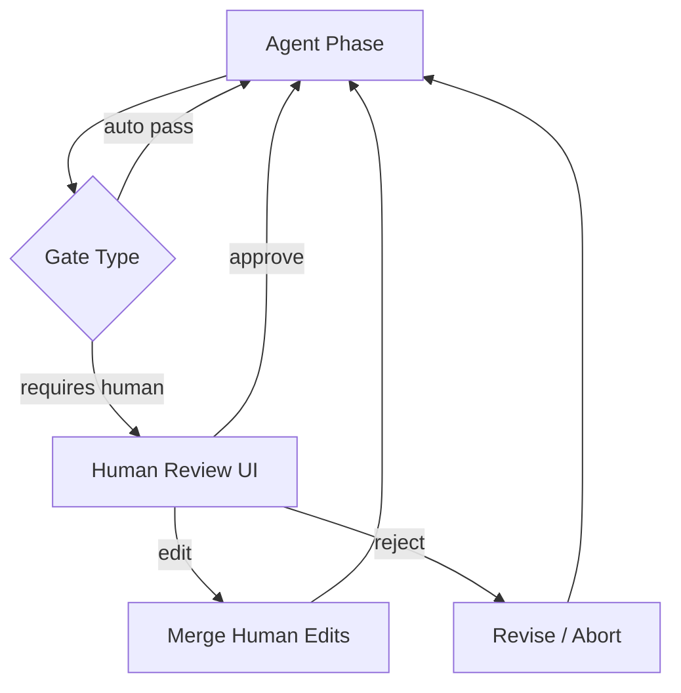

# Human-in-the-Loop

## Problem

Fully autonomous loops optimize the wrong objective, hide uncertainty, and execute **irreversible** actions without accountability. Some decisions require human judgment, legal approval, or domain expertise that no automated rubric captures reliably.

Black-box automation erodes trust when users cannot intervene at proportional cost.

## Solution

Insert explicit **human gates** at defined points: approve plans before execution, edit drafts mid-loop, override verdicts, or provide labels that steer the next iteration. The loop pauses with a structured payload; resumes only on human signal (approve, reject, edit, defer).

**Invariant**: paused states hold no dangling partial mutations; resume applies human input as authoritative state update.

## Architecture



| Component | Role |
|-----------|------|
| Gate policy | Rules for when human review is mandatory |
| Review payload | Diff, plan summary, risk score, alternatives |
| Human channel | UI, chat, ticket, or approval API |
| Merge layer | Applies edits without losing audit trail |
| SLA timer | Escalates or defaults on timeout per policy |

## Workflow

1. Agent reaches gate checkpoint (plan ready, diff produced, threshold uncertainty).
2. Serialize review payload: context summary, proposed action, risks, recommended decision.
3. Pause loop; notify human via configured channel.
4. Human responds: approve, reject with reason, inline edit, or request more analysis.
5. Merge response into loop state; resume agent from checkpoint with human input pinned.
6. Log human decision with identity and timestamp for compliance audit.

## Pseudocode

```
function hitl_loop(agent_fn, gate_policy, max_auto_iters=10):
    state = init()
    for i in 1..max_auto_iters:
        proposal = agent_fn(state)
        if not gate_policy.requires_human(proposal, state):
            state = apply(proposal)
            if done(state):
                return state
            continue
        review = pause_and_notify(proposal, state)
        decision = await_human(review)
        if decision.type == REJECT:
            state.feedback = decision.reason
            continue
        if decision.type == EDIT:
            state = merge_edits(state, decision.patches)
        state = apply(decision.approved_proposal or proposal)
        if done(state):
            return state
    return escalate(state)
```

## Implementation Notes

- Gate on **risk signals**: mutating tools, PII, financial thresholds, low model confidence.
- Present **minimal sufficient context**—executive summary plus expandable detail—to reduce review fatigue.
- Support async review: persist paused state durably; idempotent resume tokens.
- Never auto-approve high-risk actions on timeout unless policy explicitly allows break-glass defaults.
- Capture **rationale** field on reject for training and rubric improvement.
- Differentiate **inform** (human notified, loop continues) vs. **approve** (hard block).

## Tradeoffs

| Pros | Cons |
|------|------|
| Accountability and trust | Latency bounded by human availability |
| Catches objectives automation misses | Review fatigue → rubber-stamp approvals |
| Regulatory alignment | Scaling bottleneck without tiered gates |
| Human edits improve downstream quality | Inconsistent decisions across reviewers |

## Failure Modes

| Mode | Signal | Mitigation |
|------|--------|------------|
| Rubber-stamp | Instant approve without read | Risk-proportional friction; sampling audit |
| Gate fatigue | Too many interrupts | Raise gate thresholds; batch reviews |
| Context dump | Humans overwhelmed | Tiered summaries; highlight diffs only |
| Stale pause | World changes while waiting | Re-validate on resume |
| Bypass | Agent mutates before gate | Runtime enforce gate before side effects |

## Taxonomy Level

**Level 1–3** — Applies across single-step through multi-agent loops. Wrap `planning-loop` before execution and `safety-constrained-loop` for policy-defined mandatory gates.
