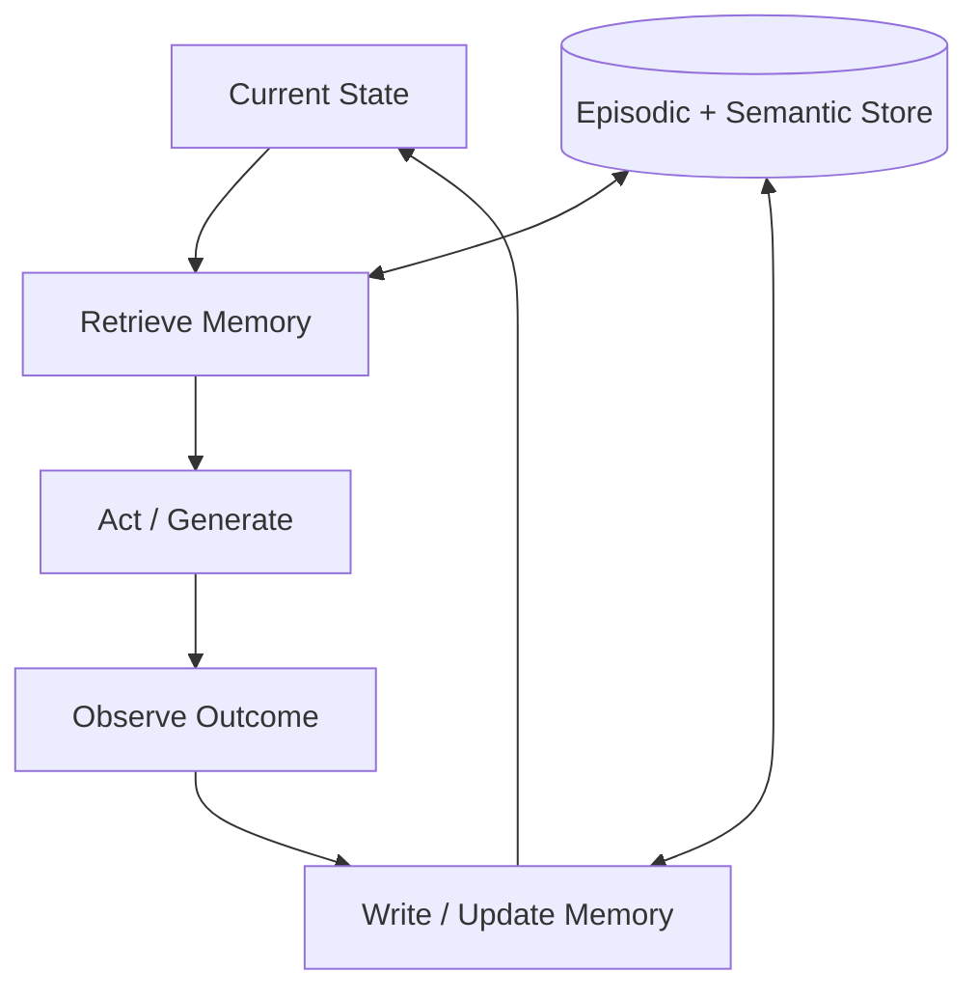

# Memory-Augmented Loop

## Problem

Stateless agents repeat mistakes, re-discover known facts, and lose thread across sessions. Context windows truncate history, so long-running work **forgets** decisions, failures, and user preferences unless something external persists learnings.

Each iteration starts near zero knowledge of what already failed.

## Solution

Attach **read/write memory** to every loop tick: episodic logs (what happened), semantic stores (facts and procedures), and optional working memory summaries. Before acting, retrieve relevant memories; after observing outcomes, write structured updates with tags, confidence, and expiry.

**Invariant**: memory writes pass through a schema validator and conflict resolver; raw chat logs are not the memory of record.

## Architecture



| Component | Role |
|-----------|------|
| Retriever | Embedding search, tags, or graph traversal |
| Working summary | Compressed recent context for prompt injection |
| Episodic store | Timestamped events: actions, results, errors |
| Semantic store | Stable facts, preferences, learned procedures |
| Consolidator | Merges episodic traces into semantic entries offline |

## Workflow

1. On iteration start, query memory with goal + current state embedding.
2. Inject top-k retrieved items into prompt with provenance labels.
3. Execute action or generation pass using augmented context.
4. Observe outcome; extract memory-worthy facts (success patterns, failures, user corrections).
5. Write updates with `{key, content, confidence, ttl, source_iteration}`.
6. Periodically consolidate episodic noise into semantic entries; prune expired or superseded facts.

## Pseudocode

```
function memory_loop(goal, state, memory, max_iters):
    for t in 1..max_iters:
        hits = memory.retrieve(query=goal + state.summary, k=K)
        prompt = compose(state, goal, hits)
        action = policy(prompt)
        outcome = env.execute(action)
        entries = extract_memories(outcome, goal)
        memory.write(entries, conflict_policy=RESOLVE_BY_RECENCY)
        state = transition(state, action, outcome)
        if terminate(state, goal):
            return state
    return state
```

## Implementation Notes

- Separate **hot working memory** (last N turns) from **cold semantic store** (long-term).
- Tag entries by project, user, and task type to reduce cross-contamination.
- Never retrieve secrets into prompts without redaction layer.
- Version semantic entries; supersede rather than delete for audit unless GDPR requires erasure.
- Run consolidation asynchronously to avoid blocking the act phase.
- Measure retrieval precision—bad memories hurt more than no memories.

## Tradeoffs

| Pros | Cons |
|------|------|
| Continuity across sessions | Stale or wrong memories persist |
| Avoids repeated failures | Retrieval noise injects bad context |
| Enables personalization | Storage, embedding, and sync costs |
| Supports team-shared knowledge | Privacy and tenancy boundaries complex |

## Failure Modes

| Mode | Signal | Mitigation |
|------|--------|------------|
| Memory poisoning | Wrong fact retrieved repeatedly | Confidence scores; human confirm for writes |
| Context stuffing | Too many hits dilute prompt | Rerank; hard cap on injected tokens |
| Stale recall | Outdated procedure applied | TTL; last-verified timestamps |
| Cross-task bleed | Wrong project memories surface | Strict namespace filters |
| Write amplification | Every trivial turn persisted | Write gate: only durable learnings |

## Taxonomy Level

**Level 2–5** — Reflective through self-modifying depending on whether memory updates policy. Wrap any inner loop; essential for long-horizon `recursive-improvement-loop`.
