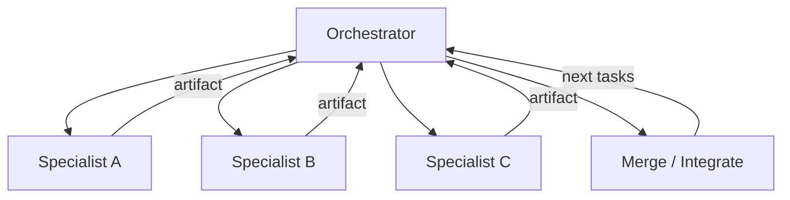

# Multi-Agent Coordination

## Problem

Monolithic agents jack-of-all-trade poorly on complex workflows: research plus coding plus review plus deployment need **different tools, prompts, and failure budgets**. Flat multi-agent chat devolves into duplicated work, conflicting edits, and missing handoff contracts.

Without orchestration protocol, parallelism increases chaos rather than throughput.

## Solution

Use an **orchestrator** that decomposes work, assigns specialists, defines handoff schemas, and merges partial results. Specialists run bounded sub-loops (research, implement, verify) and return structured artifacts—not raw chat—to the orchestrator for integration.

**Invariant**: at most one agent holds write lock on a shared artifact region at a time; merges are explicit three-way or orchestrator-mediated.

## Architecture



| Component | Role |
|-----------|------|
| Orchestrator | Task graph, assignments, budget allocation |
| Specialists | Domain agents with scoped tools |
| Shared workspace | Files, tickets, or structured state store |
| Handoff schema | Typed inputs/outputs per edge |
| Merge protocol | Conflict resolution and integration rules |

## Workflow

1. Orchestrator parses goal into task DAG with dependencies and parallelism hints.
2. Assign ready tasks to specialists with scoped context and tool permissions.
3. Specialists run inner loops until subtask complete or sub-budget exhausted.
4. Return structured handoff payload to orchestrator; update shared workspace.
5. Orchestrator triggers integration step (merge code, unify report sections).
6. Repeat until DAG complete; final verification and delivery.

## Pseudocode

```
function multi_agent_coord(goal, specialists, orchestrator):
    dag = orchestrator.plan(goal)
    workspace = SharedWorkspace()
    while dag.has_open():
        batch = dag.ready_tasks()
        results = parallel_map(batch, lambda t:
            specialists[t.role].run(t, workspace.slice(t.scope))
        )
        for r in results:
            if r.conflict:
                workspace = orchestrator.resolve(r, workspace)
            else:
                workspace.apply(r.artifact)
            dag.mark_done(r.task_id)
    return orchestrator.finalize(workspace)
```

## Implementation Notes

- **Minimize shared mutable state**; prefer immutable handoff blobs with references.
- Orchestrator should not implement domain work—only coordinate—to avoid bottleneck skill mismatch.
- Use message schemas (JSON Schema, protobuf) for every specialist boundary.
- Track per-specialist token and time budgets; reassign on repeated failure.
- Integrate `verification-loop` as a dedicated verifier specialist before merge to main.
- Log task graph visualization for debugging stalled workflows.

## Tradeoffs

| Pros | Cons |
|------|------|
| Parallelism on independent subtasks | Orchestration overhead and complexity |
| Specialist depth beats generalist | Handoff bugs and schema drift |
| Clear responsibility boundaries | Merge conflicts require explicit protocol |
| Scales team-like workflows | Higher aggregate token cost |

## Failure Modes

| Mode | Signal | Mitigation |
|------|--------|------------|
| Orchestrator bottleneck | All work serializes through one agent | Lightweight orchestrator; delegate planning |
| Duplicate work | Two specialists same task | Idempotent task IDs; claim locks |
| Schema mismatch | Downstream can't parse handoff | Contract tests on boundaries |
| Conflict spiral | Endless merge failures | Single writer rule; orchestrator tie-break |
| Context loss | Specialist lacks upstream detail | Handoff packs minimal full context slice |

## Taxonomy Level

**Level 3** — Multi-Agent Loops. Compose specialists running `research-loop`, `critique-loop`, `verification-loop`; wrap with `safety-constrained-loop`.

## LSS 1.1 composition diagram

```bash
python tools/loop_diagram_generator.py loop-library/compositions/scenario-swarm-rehearsal.yaml -o docs/diagrams/scenario-swarm-rehearsal.mmd
```

Reference: [scenario-swarm-rehearsal.yaml](../loop-library/compositions/scenario-swarm-rehearsal.yaml) · [docs/diagrams/scenario-swarm-rehearsal.mmd](../docs/diagrams/scenario-swarm-rehearsal.mmd)
