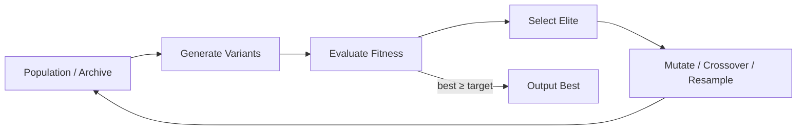

# Optimization Loop

## Problem

Agents produce one-shot outputs when the task is inherently **multi-candidate**: prompt tuning, code generation, layout design, hyperparameter search. Without iterative scoring and selection, quality plateaus at whatever the first sample provides.

Single-pass generation cannot climb a fitness landscape it never measures.

## Solution

Run a closed loop: **generate candidates → score → retain elite → mutate or resample → repeat**. The loop maintains a population or archive of best-so-far artifacts ranked by an explicit objective (automated metric, verifier score, human rating, or composite).

**Invariant**: every committed artifact must have a recorded score and generation lineage; promotion requires beating the incumbent by a margin δ.

## Architecture



| Component | Role |
|-----------|------|
| Generator | LLM, template mutator, or param sampler |
| Evaluator | Deterministic metric, verifier, or model judge |
| Archive | Top-k candidates with scores and metadata |
| Mutation operator | Edits prompts, code diffs, or hyperparameters |
| Stop rule | Target score, plateau detection, or budget cap |

## Workflow

1. Define objective function, constraints, and scoring budget per candidate.
2. Seed population with diverse initial candidates (temperature, prompts, seeds).
3. Evaluate all candidates; record scores and failure diagnostics.
4. Select elite set; generate offspring via mutation, crossover, or fresh samples.
5. Repeat until target met, improvement below ε for N generations, or budget exhausted.
6. Return best candidate with score trace and comparison to baseline.

## Pseudocode

```
function optimization_loop(objective, pop_size=8, max_gen=20):
    population = [generate(seed=i) for i in 1..pop_size]
    best = None
    for gen in 1..max_gen:
        scores = [objective.evaluate(c) for c in population]
        ranked = sort(zip(population, scores), key=score, desc=True)
        best = ranked[0]
        if best.score >= objective.target:
            return best
        if plateau(scores, window=3):
            population = diversify(ranked)
        else:
            elite = ranked[:pop_size//2]
            population = elite + [mutate(e) for e in elite]
    return best
```

## Implementation Notes

- **Evaluator must be cheaper than generator** when possible—or subsample candidates per generation.
- Use diverse seeds and prompt variants early; narrow mutation radius near convergence.
- Track lineage to avoid re-evaluating identical candidates (hash cache).
- Combine fast proxy metrics with occasional full verification on elites only.
- For LLM prompts: mutate system instructions, few-shot examples, and tool order separately.
- Guard against **reward hacking**—objective should align with true task via holdout checks.

## Tradeoffs

| Pros | Cons |
|------|------|
| Systematic quality improvement | Many evaluations → high cost |
| Works with black-box objectives | Local optima without diversity |
| Parallelizable candidate eval | Mis-specified metric → wrong winner |
| Reproducible with logged seeds | Slow for expensive evaluators |

## Failure Modes

| Mode | Signal | Mitigation |
|------|--------|------------|
| Reward hacking | High score, bad real behavior | Holdout tests; human spot audit |
| Diversity collapse | Population converges to clones | Mutation rate floor; novelty bonus |
| Eval noise | Rankings shuffle randomly | Multiple eval runs; confidence intervals |
| Budget burn | No improvement after many gens | Early stop on plateau |
| Overfitting eval set | Great on train checks, fails deploy | Separate validation verifier |

## Taxonomy Level

**Level 4** — Evolutionary Loops. Often outer loop around `verification-loop` evaluators or `critique-loop` judges as fitness functions.
