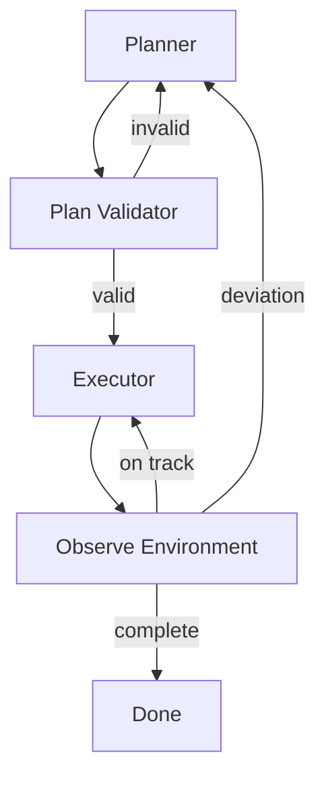

# Planning Loop

## Problem

Agents that act immediately without a validated plan waste tool calls, hit dead ends, and produce incoherent multi-step work. **Reactive execution** fails when dependencies, ordering constraints, or rollback paths matter—common in software changes, data migrations, and operational runbooks.

Without replanning, the first wrong assumption poisons every subsequent step.

## Solution

Insert an explicit **plan → validate → execute → observe → replan** cycle. Plans are structured artifacts (steps, preconditions, success criteria) validated before any mutating action. Execution emits observations that trigger partial or full replanning when reality diverges from the model.

**Invariant**: mutating tools require a plan step ID and pre-check pass; orphan actions are rejected at the runtime layer.

## Architecture



| Component | Role |
|-----------|------|
| Planner | Decomposes goal into ordered steps with dependencies |
| Validator | Checks feasibility, scope, safety, resource budget |
| Executor | Runs one or more steps with tool bindings |
| Observer | Compares expected vs. actual post-step state |
| Replan trigger | Threshold on deviation, failure, or new information |

## Workflow

1. Ingest goal spec, constraints, and current world state snapshot.
2. Planner emits structured plan: steps, inputs, outputs, rollback hints.
3. Validator checks: tool availability, permission scope, dependency graph acyclicity.
4. Execute next eligible step(s); collect observations (stdout, diffs, API responses).
5. If observation violates step success criteria → mark step failed; replan from current state.
6. Repeat until all steps complete or global budget exceeded; emit plan audit log.

## Pseudocode

```
function planning_loop(goal, state, max_replans=5):
    plan = planner.create(goal, state)
    for replan in 0..max_replans:
        ok, issues = validator.check(plan, state)
        if not ok:
            plan = planner.revise(plan, issues)
            continue
        while plan.has_pending():
            step = plan.next_executable()
            result = executor.run(step)
            obs = observer.compare(step.expected, result)
            if obs.deviation > threshold or result.failed:
                plan = planner.replan(goal, state, from_step=step)
                break
            plan.mark_done(step)
        if plan.complete():
            return SUCCESS(plan)
    return PARTIAL(plan, state)
```

## Implementation Notes

- Represent plans as **machine-readable graphs** (JSON, YAML), not prose-only bullet lists.
- Validator should run cheap checks first: schema, tool allowlist, estimated token/cost budget.
- Support **partial replan**: preserve completed steps; only recompute downstream subgraph.
- Attach rollback or compensating actions to mutating steps when the environment allows it.
- Surface plan to humans at coarse granularity for `human-in-the-loop` approval on risky plans.
- Log plan version hashes so regressions across replans are traceable.

## Tradeoffs

| Pros | Cons |
|------|------|
| Reduces wasted tool calls | Upfront latency before first action |
| Handles multi-step dependencies | Plan drift if world changes rapidly |
| Clear audit trail of intent vs. execution | Over-planning on trivial tasks |
| Enables human review of intent before action | Replan storms on noisy observations |

## Failure Modes

| Mode | Signal | Mitigation |
|------|--------|------------|
| Fantasy plan | Steps reference unavailable tools | Validator with live capability manifest |
| Analysis paralysis | Endless plan revision, no execution | Step budget; time-box planning phase |
| Brittle plan | Single failure aborts entire run | Partial replan + skip/alternate paths |
| Plan-execution skew | Executor ignores plan structure | Runtime enforces step IDs on mutations |
| Stale snapshot | Plan based on outdated state | Refresh state before each replan |

## Taxonomy Level

**Level 2** — Reflective Loops. Compose with `verification-loop` at step boundaries and `safety-constrained-loop` for mutating plans.
