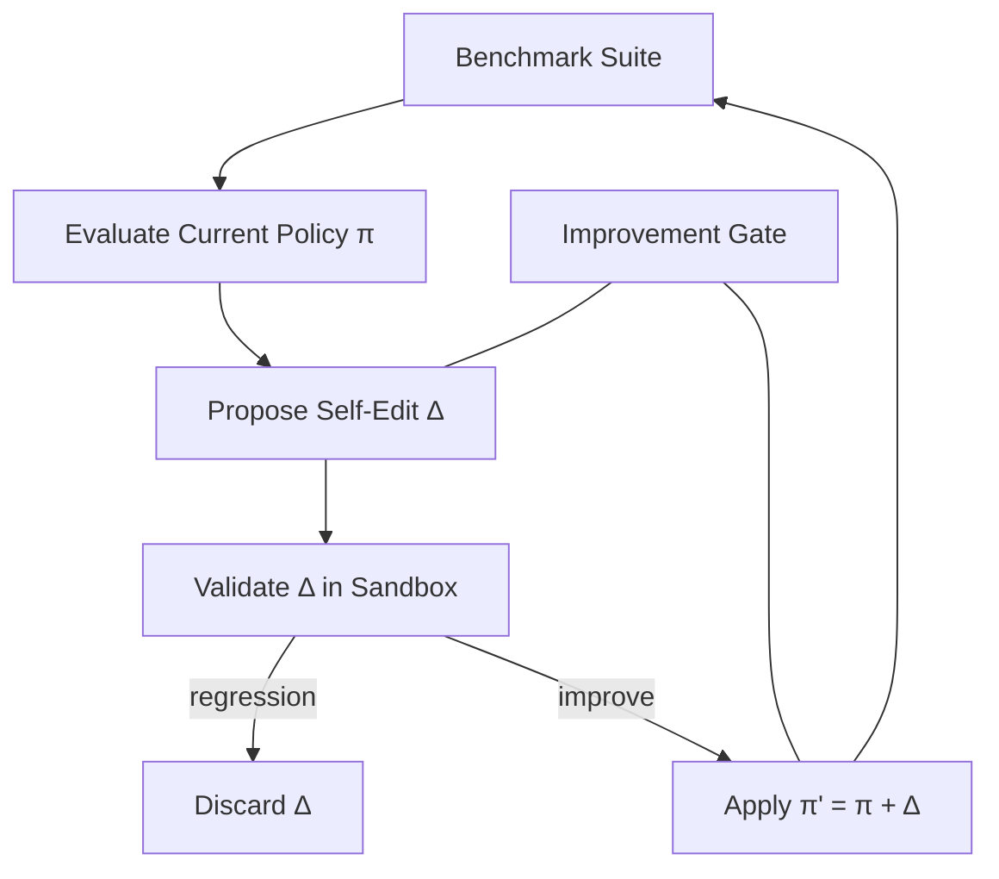

# Recursive Improvement Loop

## Problem

Static prompts, tools, and policies decay as tasks and environments evolve. Manual tuning does not scale. Agents that cannot ** revise their own operating procedures** within bounds hit quality ceilings and repeat the same class of errors indefinitely.

Unbounded self-modification, however, risks instability and goal drift.

## Solution

Run an outer loop where the agent proposes **bounded edits** to its configuration—prompt fragments, tool wrappers, rubric weights, retrieval strategies—evaluates on a fixed benchmark suite, and accepts changes only if metrics improve by δ without safety regression. Human or automated gates cap the edit surface.

**Invariant**: self-edits never modify envelope policy, authentication, or kill-switch code in the same loop without dual-control approval.

## Architecture



| Component | Role |
|-----------|------|
| Policy bundle | Prompts, tools, rubrics, retrieval config |
| Edit proposer | Generates minimal diffs to policy bundle |
| Benchmark suite | Held-out tasks with scored outcomes |
| Sandbox evaluator | Runs π' without production side effects |
| Improvement gate | Human, dual-model, or statistical significance check |

## Workflow

1. Snapshot current policy bundle π and baseline benchmark scores.
2. Run evaluation; identify weakest dimensions from telemetry and failures.
3. Proposer generates candidate edit Δ targeting weak dimension.
4. Evaluate π + Δ in sandbox on full or sampled benchmark.
5. Accept if primary metric improves ≥ δ and no safety metric regresses.
6. Commit π'; log lineage; optionally consolidate learnings to `memory-augmented-loop`.
7. Stop on plateau, max edits, or gate rejection streak.

## Pseudocode

```
function recursive_improvement(policy, benchmarks, max_edits=10):
    baseline = evaluate(policy, benchmarks)
    for i in 1..max_edits:
        weak = diagnose(baseline.traces)
        delta = proposer.suggest(policy, weak, allowed_surface=EDITABLE)
        if not gate.pre_approve(delta):
            continue
        candidate = apply_sandbox(policy, delta)
        scores = evaluate(candidate, benchmarks)
        if scores.primary >= baseline.primary + DELTA
           and scores.safety >= baseline.safety:
            policy = promote(candidate)
            baseline = scores
            log_edit(delta, scores)
        else:
            discard(delta, scores)
        if plateau(baseline, window=3):
            break
    return policy, baseline
```

## Implementation Notes

- Define **editable surface** explicitly: which files, prompts, and params are fair game.
- Never evaluate self-edits on the same samples used to train the proposer without holdout separation.
- Require statistical significance or multiple-seed stability before promotion.
- Keep rollback snapshots for every applied edit; one-command revert.
- Pair with `safety-constrained-loop` and mandatory human gate for envelope-adjacent edits.
- Monitor for **Goodharting**—benchmark score up, real user satisfaction down.

## Tradeoffs

| Pros | Cons |
|------|------|
| Adaptive without constant human tuning | Risk of goal drift or overfit benchmarks |
| Compounds gains over deployments | Evaluation cost each edit cycle |
| Targets actual failure modes from traces | Complex governance requirements |
| Enables meta-learning at org scale | Hard to debug which edit caused regression |

## Failure Modes

| Mode | Signal | Mitigation |
|------|--------|------------|
| Benchmark overfit | Great scores, poor production | Holdout sets; live canary metrics |
| Goal drift | Edits optimize proxy not intent | Anchor constraints; human spot review |
| Unstable oscillation | Alternating conflicting edits | Edit magnitude limits; cooldown periods |
| Envelope breach | Self-edit disables safety | Immutable envelope; dual control |
| Trivial edits | Endless prompt wording changes | Require dimension-targeted justification |

## Taxonomy Level

**Level 5–6** — Self-Modifying and Recursive Meta Loops. Requires `safety-constrained-loop`, `verification-loop` on benchmarks, and often `human-in-the-loop` for promotion.
