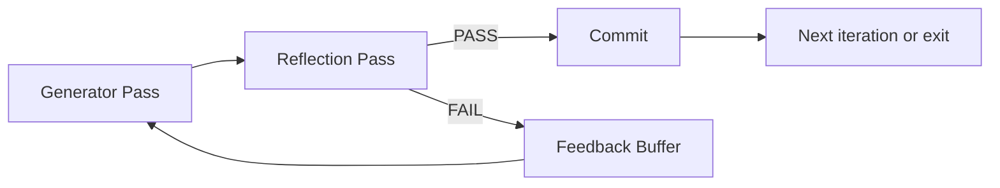

# Reflection Loop

## Problem

Single-step agents commit the first plausible output. Errors propagate because nothing forces the agent to **compare output against intent** before state mutation. Users see confident wrong answers, partial fixes, or premature "done" signals without evidence.

Common symptoms: hallucinated API usage, incomplete edge-case handling, and answers that sound correct but fail under scrutiny.

## Solution

After each candidate output, run a **reflection phase** where the same agent (with a distinct prompt slice) assesses alignment with goals, constraints, and available evidence. Only passing outputs proceed; failures produce structured self-feedback fed into the next generation pass.

**Invariant**: no external side effect (write, deploy, send, charge) until reflection returns `PASS` or an explicit human override.

## Architecture



| Component | Role |
|-----------|------|
| Goal spec | Immutable task definition + acceptance criteria |
| Candidate | Draft code, text, plan, or tool sequence |
| Reflector prompt | Checklist-driven; must cite concrete evidence |
| Feedback buffer | Blocking issues only; length-capped per round |
| Termination guard | Max rounds, stagnation detector, quality floor |

## Workflow

1. Load goal spec and current environment state (files, test results, prior context).
2. Generate candidate artifact (code, answer, action list).
3. Reflect: answer structured questions—What could be wrong? What wasn't verified? What's missing against the rubric?
4. If blocking issues exist → append to feedback buffer; return to step 2 until `max_reflect` or pass.
5. On pass → commit candidate to durable state; optionally invoke external verification.
6. Terminate when goal spec satisfied or budget exhausted; emit partial result with audit trail.

## Pseudocode

```
function reflection_loop(goal, state, max_reflect=3):
    feedback = []
    for round in 1..max_reflect:
        candidate = generate(state, goal, feedback)
        if hash(candidate) == hash(prev_candidate):
            escalate("stagnation")
        review = reflect(candidate, goal, evidence=state.tools)
        if review.verdict == PASS:
            commit(candidate)
            return SUCCESS(candidate)
        feedback = merge(feedback, review.blocking_issues)
    return PARTIAL(candidate, feedback)
```

## Implementation Notes

- Use a **different system preamble** for the reflect pass ("You are a skeptical reviewer, not the author").
- Require reflect output schema: `{verdict, blocking_issues[], advisory_notes[], confidence}`.
- Scope reflection to **delta** on revisions ("review only changed sections") to control token cost.
- Pair with tool verification when available—reflection is not a substitute for tests or linters.
- Detect **identical candidate hash** across rounds → escalate, widen temperature, or abort.
- Log each reflect verdict for later calibration against human labels or automated checks.

## Tradeoffs

| Pros | Cons |
|------|------|
| No extra agent infrastructure | Same-model blind spots persist |
| Flexible, domain-specific rubrics | ~2× latency per round |
| Works well for subjective quality | Token-heavy on long drafts |
| Easy to compose with verification | Can over-correct into verbosity |

## Failure Modes

| Mode | Signal | Mitigation |
|------|--------|------------|
| Rubber stamp | Always PASS | Adversarial checklist; random spot checks |
| Nit loop | FAIL on style only | Separate blocking vs. advisory dimensions |
| Oscillation | Alternating contradictory edits | Require monotonic metric or diff-based merge |
| False humility | Excessive self-FAIL, no progress | Cap reflect rounds; human gate on final |
| Context bleed | Reflector sees draft CoT and rationalizes | Strip chain-of-thought from reflect context |

## Taxonomy Level

**Level 2** — Reflective Loops. Combine with `verification-loop` for code tasks and `critique-loop` when independent judgment is required.
