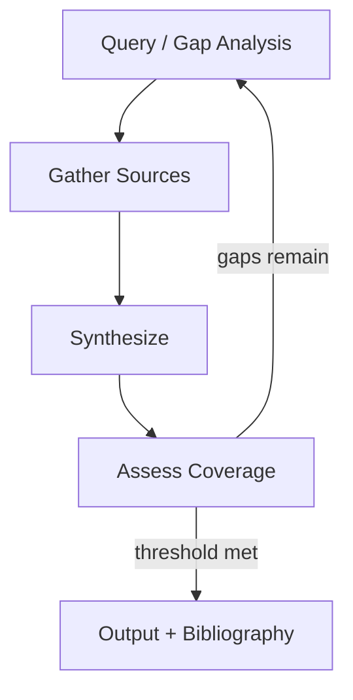

# Research Loop

## Problem

Agents answer from stale parametric knowledge and confabulate citations. Single retrieval calls miss coverage gaps, contradicting sources, and questions that only emerge **after partial synthesis**. Users receive confident summaries without provenance or completeness guarantees.

## Solution

Iterate **gather → synthesize → assess coverage → refine query** until evidence thresholds are met. Each cycle expands the evidence set, updates the working synthesis, and measures gaps (missing facets, low-confidence claims, uncited assertions) that drive the next gather phase.

**Invariant**: factual claims in the synthesis must trace to source IDs in the evidence store; uncited claims block commit.

## Architecture



| Component | Role |
|-----------|------|
| Evidence store | Deduped sources with metadata and excerpts |
| Gatherer | Search, scrape, API calls, file reads |
| Synthesizer | Merges findings into structured draft |
| Coverage assessor | Scores facet completeness and citation density |
| Query refiner | Generates targeted follow-up queries from gaps |

## Workflow

1. Parse research question into facets (entities, time range, comparison dimensions).
2. Gather initial sources via search tools; dedupe and rank by relevance and recency.
3. Synthesize working answer with inline source references.
4. Assess coverage: which facets lack evidence? Which claims lack citations?
5. If below threshold → refine queries from gaps; goto 2.
6. Emit final report with bibliography, confidence per section, and explicit unknowns.

## Pseudocode

```
function research_loop(question, facets, max_cycles=5):
    evidence = EvidenceStore()
    for cycle in 1..max_cycles:
        queries = gap_analyzer(queries_or_initial=question, facets, evidence)
        new_sources = gather(queries, budget=per_cycle_budget)
        evidence.merge(new_sources)
        draft = synthesize(question, evidence)
        report = assess(draft, facets, evidence)
        if report.coverage >= threshold and report.uncited == 0:
            return SUCCESS(draft, evidence.citations())
        if evidence.stagnant():
            return PARTIAL(draft, report.gaps)
    return PARTIAL(draft, report.gaps)
```

## Implementation Notes

- Cap sources per cycle to control cost; prioritize **diverse** domains over redundant hits.
- Store raw excerpts, not just summaries—synthesis must quote or paraphrase with pointers.
- Run lightweight **contradiction detection** across sources; surface conflicts explicitly.
- Use recency filters for fast-moving topics; version-stamp all retrieved content.
- Separate **gather** and **synthesize** roles (prompts or models) to reduce confirmation bias.
- For code/API research, prefer official docs and primary repos over blog aggregators.

## Tradeoffs

| Pros | Cons |
|------|------|
| Higher factual grounding | Latency scales with source count |
| Explicit provenance | Search API costs and rate limits |
| Adaptive depth via gap analysis | Still vulnerable to bad sources |
| Handles evolving questions mid-loop | Synthesis can mismerge conflicting facts |

## Failure Modes

| Mode | Signal | Mitigation |
|------|--------|------------|
| Source spam | Many low-quality hits | Rank by authority; dedupe aggressively |
| Citation theater | IDs present but don't support claim | Automated entailment or spot-check quotes |
| Query drift | Facets abandoned for tangents | Facet checklist enforced each cycle |
| Premature stop | Threshold met with thin evidence | Minimum source count per facet |
| Echo chamber | Same narrative from mirrored sites | Require independent domain diversity |

## Taxonomy Level

**Level 1–2** — Single-step gather extended into reflective coverage loops. Compose with `verification-loop` for URL validity and `critique-loop` for synthesis quality.
