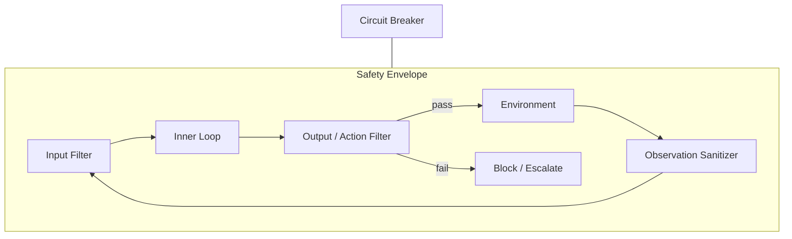

# Safety-Constrained Loop

## Problem

Inner cognitive loops—debate, optimization, self-improvement—can produce actions that violate policy, leak secrets, or cause harm if execution is unconstrained. **Capability without envelope** scales mistakes as fast as it scales intelligence.

Safety cannot be an afterthought bolted on after a loop already committed damage.

## Solution

Wrap any inner loop in a **policy envelope**: input filters, tool allowlists, output scanners, rate limits, and kill switches evaluated every tick. The envelope runs before actions leave the agent and after observations enter it. Failed checks block, sanitize, or escalate—never silently continue.

**Invariant**: no inner loop step bypasses the envelope; envelope failures are logged and counted toward circuit-breaker thresholds.

## Architecture



| Component | Role |
|-----------|------|
| Input filter | Prompt injection detection, PII redaction |
| Tool guard | Allowlist, argument validation, spend caps |
| Output filter | Secret scan, policy classifiers, schema bounds |
| Observation sanitizer | Strip untrusted content from tool returns |
| Circuit breaker | Halts loop on repeated violations |

## Workflow

1. Sanitize and classify incoming user/task input; reject or quarantine on policy hit.
2. Inner loop proposes action or artifact.
3. Pre-execution scan: tool choice, arguments, estimated blast radius.
4. On pass → execute in sandbox tier appropriate to risk class.
5. Sanitize observations before re-entering inner loop context.
6. Increment violation counters; trip circuit breaker or human escalation on threshold.

## Pseudocode

```
function safety_wrapped_loop(inner_loop, policy, max_violations=3):
    violations = 0
    state = init()
    while not terminated(state):
        obs = sanitize(policy, state.last_observation)
        if policy.input_blocked(obs):
            return BLOCKED("input")
        proposal = inner_loop.step(state, obs)
        check = policy.pre_exec_scan(proposal)
        if not check.ok:
            violations += 1
            if violations >= max_violations:
                return HALT("circuit_breaker")
            state = inner_loop.feedback(state, check.reason)
            continue
        result = execute_sandboxed(proposal, tier=check.risk_tier)
        state = inner_loop.update(state, sanitize(policy, result))
    return state
```

## Implementation Notes

- **Defense in depth**: regex secret scan + classifier + tool argument validators.
- Tier sandboxes: read-only → writable temp → production with HITL gate.
- Policy as versioned code or config—not prose in system prompt alone.
- Log all blocks with rule ID for false-positive tuning.
- Separate **block** (hard stop) from **redact** (continue with sanitized content).
- Test envelope with red-team prompts in CI; treat policy changes like schema migrations.

## Tradeoffs

| Pros | Cons |
|------|------|
| Bounds worst-case harm | False positives frustrate legitimate tasks |
| Composable around any pattern | Policy maintenance overhead |
| Audit-friendly violation logs | Adversaries adapt to known rules |
| Enables higher autonomy safely | Latency from scanning layers |

## Failure Modes

| Mode | Signal | Mitigation |
|------|--------|------------|
| Security theater | Rules never trigger on real attacks | Red-team eval suite |
| Over-blocking | Benign tasks constantly blocked | Tiered policies; appeal/HITL path |
| Bypass via tool chain | Indirect exfil through allowed tools | Composite action analysis |
| Policy drift | Inner loop evolves, envelope stale | Joint versioning; regression tests |
| Silent redact | User unaware content was stripped | Explicit notifications in output |

## Taxonomy Level

**All levels** — Outer wrapper. Should envelope `debate-loop`, `optimization-loop`, and especially `recursive-improvement-loop`.
