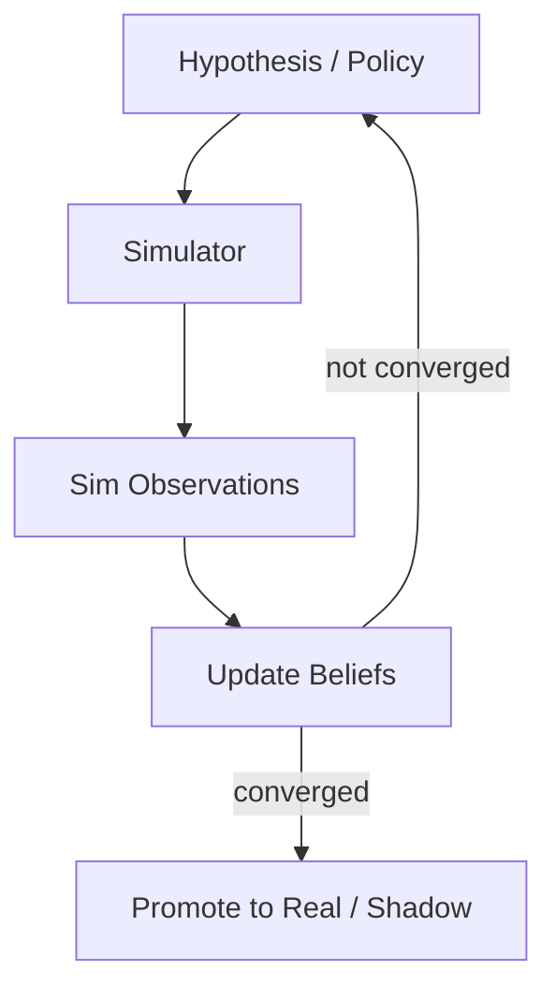

# Simulation Loop

## Problem

Agents act on the real world when outcomes are **expensive, irreversible, or slow** to observe. Deploying every candidate policy, trading strategy, or configuration change directly wastes resources and risks harm. Pure reasoning without grounded dynamics produces plans that collapse on contact with reality.

## Solution

Maintain an internal **world model** (code sandbox, physics engine, market replay, digital twin) where hypotheses are executed safely. Each loop cycle proposes an action or parameter set, simulates forward, compares simulated observations to goals, and updates beliefs or policies before any production commit.

**Invariant**: production mutators are disabled until simulation metrics meet thresholds across multiple seeds or scenarios.

## Architecture



| Component | Role |
|-----------|------|
| Simulator | Executable model of environment dynamics |
| Hypothesis generator | Proposes actions, parameters, or strategies |
| Scenario suite | Representative initial conditions and shocks |
| Metrics aggregator | Compares sim trajectories to goal function |
| Belief updater | Bayesian, bandit, or gradient-based adjustment |

## Workflow

1. Define goal metrics and acceptable uncertainty bounds.
2. Sample or propose candidate from current belief state.
3. Run simulation across scenario suite; record trajectories and metric distributions.
4. Update beliefs: reject dominated candidates; refine promising regions.
5. Repeat until convergence, budget cap, or Pareto frontier identified.
6. Promote best candidate to shadow test, canary, or human approval gate.

## Pseudocode

```
function simulation_loop(goal, scenarios, max_iters=100):
    beliefs = init_prior()
    best = None
    for t in 1..max_iters:
        candidate = sample(beliefs)
        outcomes = [sim.run(candidate, s) for s in scenarios]
        score = aggregate(outcomes, goal)
        beliefs.update(candidate, score, outcomes)
        best = argmax(best, candidate, score)
        if converged(beliefs) or score >= goal.threshold:
            break
    return promote(best, shadow=True)
```

## Implementation Notes

- **Sim fidelity matters**: document known sim-to-real gaps; never treat sim PASS as production PASS alone.
- Use multiple random seeds and adversarial scenarios (stress tests) to avoid overfitting to nominal conditions.
- Keep simulator **versioned** alongside promoted policies for reproducibility.
- Separate fast approximate sim for inner loop from high-fidelity sim for final validation.
- Log full trajectories, not just scalar scores—enables debugging wrong dynamics assumptions.
- For LLM agents: simulate tool responses with recorded fixtures or mock servers before live APIs.

## Tradeoffs

| Pros | Cons |
|------|------|
| Safe exploration of risky actions | Sim may diverge from reality |
| Parallelizable scenario runs | Building faithful sims is expensive |
| Supports optimization at scale | False confidence from overfit sim |
| Reduces production incident rate | Maintenance burden on twin models |

## Failure Modes

| Mode | Signal | Mitigation |
|------|--------|------------|
| Sim-to-real gap | Shadow fails after sim PASS | Calibration runs; domain randomization |
| Overfit to sim | Great in sim, poor live | Holdout scenarios; periodic sim refresh |
| Wrong dynamics | Systematic metric bias | Expert review of model assumptions |
| Cheap sim artifacts | Numerical instability | Sanity checks on conservation laws/invariants |
| Promotion bypass | Skips shadow due to urgency | Enforce safety-constrained promotion gate |

## Taxonomy Level

**Level 2–4** — Reflective through evolutionary loops depending on search breadth. Pairs with `optimization-loop` for candidate search and `verification-loop` on sim code itself.
